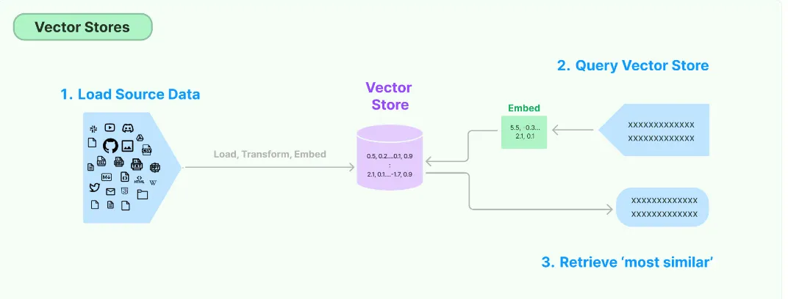

# 📘 Vector Stores in LLM Workflows

## 🔹 Definition
A **vector store** is a specialized system designed to **store** and **retrieve** data represented as **numerical vectors**. These vectors are typically generated from text, images, or other data using embedding models, allowing efficient similarity-based operations.

---


## 🔹 Key Features

1. **Storage**
   - Retains vectors and their associated metadata.
   - Can be in-memory (fast lookups) or on-disk (durable, large-scale use).

2. **Similarity Search**
   - Retrieves vectors most similar to a query vector.
   - Enables semantic search and contextual retrieval.

3. **Indexing**
   - Provides data structures for fast similarity searches.
   - Often uses **Approximate Nearest Neighbor (ANN)** algorithms for high-dimensional vectors.

4. **CRUD Operations**
   - Supports adding new vectors, reading them, updating existing entries, and removing outdated ones.

---

## 🔹 Use Cases

1. **Semantic Search**
   - Retrieve text passages or documents based on meaning, not just keywords.

2. **RAG (Retrieval-Augmented Generation)**
   - Supply relevant context to LLMs for more accurate answers.

3. **Recommender Systems**
   - Suggest products, movies, or content based on vector similarity.

4. **Image/Multimedia Search**
   - Find visually or semantically similar images, audio, or video clips.

---
# 📘 Vector Store vs Vector Database

## 🔹 Vector Store
- A **lightweight library or service** focused on storing vectors (embeddings) and performing similarity search.  
- Typically does **not** include full database features like transactions, query languages, or role-based access control.  
- Best suited for **prototyping** or **smaller-scale applications**.  
- Example: **FAISS** – allows similarity search but persistence and scaling must be handled separately.

---

## 🔹 Vector Database
- A **full-fledged database system** designed to store and query vectors.  
- Provides additional **database-like features**:
  - Distributed architecture for horizontal scaling  
  - Durability and persistence (replication, backup/restore)  
  - Metadata handling (schemas, filters)  
  - ACID or near-ACID guarantees  
  - Authentication/authorization and advanced security  
- Geared for **production environments** with large datasets and scaling needs.  
- Examples: **Milvus**, **Qdrant**, **Weaviate**, **Pinecone**

---

## 📊 Conceptual Comparison

| Aspect              | Vector Store                     | Vector Database                          |
|---------------------|----------------------------------|------------------------------------------|
| **Focus**           | Store embeddings + similarity search | Full database features + vector operations |
| **Scale**           | Small-scale, prototyping         | Large-scale, production-ready             |
| **Features**        | Basic storage + search           | Indexing, durability, metadata, security  |
| **Examples**        | FAISS                            | Milvus, Qdrant, Weaviate, Pinecone        |

---

✅ **Summary**:  
A **vector database** is essentially a **vector store with extra database features**—adding durability, scaling, metadata filtering, and security. Use vector stores for quick experiments or small projects, and vector databases when building robust, production-grade systems.

# 📘 Vector Stores in LangChain

## 🔹 Overview
LangChain provides a **common interface** to work with multiple vector stores. This makes it easy to swap between backends (like FAISS, Pinecone, or Qdrant) without rewriting your application logic.

---

## 🔹 Supported Stores
- **FAISS** – lightweight, in-memory similarity search library.  
- **Pinecone** – managed vector database with scalability and durability.  
- **Chroma** – open-source vector database with metadata filtering.  
- **Qdrant** – production-ready vector database with distributed architecture.  
- **Weaviate** – semantic vector database with schema and hybrid search.

---

## 🔹 Common Interface
LangChain exposes a **uniform API** for vector stores:
```python
# Creating a vector store
from_documents(...) or from_texts(...)

# Adding new data
add_documents(...) or add_texts(...)

# Querying
similarity_search(query, k=...)

# Metadata filtering
similarity_search(query, k=..., filter={"author": "Ravi"})


# 📘 Vector Stores in LangChain

## 🔹 Overview
LangChain provides a **common interface** to work with multiple vector stores. This makes it easy to swap between backends (like FAISS, Pinecone, or Qdrant) without rewriting your application logic.

---

## 🔹 Supported Stores
- **FAISS** – lightweight, in-memory similarity search library.  
- **Pinecone** – managed vector database with scalability and durability.  
- **Chroma** – open-source vector database with metadata filtering.  
- **Qdrant** – production-ready vector database with distributed architecture.  
- **Weaviate** – semantic vector database with schema and hybrid search.  
- **Milvus** – enterprise-grade vector database for large-scale workloads.  

---

## 🔹 Common Interface
LangChain exposes a **uniform API** for vector stores:
```python
# Creating a vector store
from_documents(...) or from_texts(...)

# Adding new data
add_documents(...) or add_texts(...)

# Querying
similarity_search(query, k=...)

# Metadata filtering
similarity_search(query, k=..., filter={"author": "Ravi"})
```

This means you can switch from FAISS to Pinecone with minimal code changes.

---

## 🔹 Metadata Handling
- Each document can store **metadata** (e.g., author, timestamp, tags).  
- Metadata enables **filter-based retrieval**, so you can query not just by similarity but also by attributes.

---

## 🔹 Why Vector Stores Matter
- **Semantic Search**: Finds information based on meaning, not keywords.  
- **RAG (Retrieval-Augmented Generation)**: Supplies LLMs with relevant context for fact-based answers.  
- **Scalability**: ANN algorithms allow handling millions of records efficiently.  
- **Flexibility**: Swap FAISS for Pinecone or Qdrant with minimal code changes.  

---

## 📊 Comparison of Popular Vector Stores

| Store       | Type            | Best Use Case                  | Strengths                                  | Limitations |
|-------------|-----------------|--------------------------------|--------------------------------------------|-------------|
| **FAISS**   | Library         | Prototyping, local experiments | Fast, lightweight, open-source             | No built-in persistence/scaling |
| **Chroma**  | Vector DB       | Local + small production apps  | Metadata filtering, easy integration       | Less mature for enterprise scale |
| **Pinecone**| Managed DB      | Enterprise production          | Fully managed, scalable, secure            | Paid service |
| **Qdrant**  | Vector DB       | Production, open-source        | Distributed, metadata filtering, ANN       | Requires infra setup |
| **Weaviate**| Vector DB       | Semantic + hybrid search       | Schema support, hybrid keyword+vector      | More complex setup |
| **Milvus**  | Vector DB       | Large-scale enterprise         | High performance, distributed architecture | Higher operational overhead |

---

✅ **Summary**:  
LangChain integrates seamlessly with multiple vector stores, offering a **common interface** for storage, similarity search, and metadata filtering. This flexibility allows you to start with lightweight options like FAISS and Chroma, and scale up to production-ready databases like Pinecone, Qdrant, or Milvus without major code changes.

# 📘 Chroma Vector Store

## 🔹 Overview
**Chroma** is a lightweight, open-source vector database that is especially friendly for **local development** and **small- to medium-scale production needs**. It is widely used in LangChain projects because of its simplicity, metadata support, and ease of integration.

---

## 🔹 Key Features
- **Open Source**: Free to use and community-driven.  
- **Local-first**: Ideal for prototyping and running on personal machines.  
- **Metadata Support**: Each document can store embeddings along with metadata (author, timestamp, tags).  
- **Collections**: Organizes documents into logical groups for efficient retrieval.  
- **Persistence**: Can run in-memory for speed or persist data to disk for durability.  
- **Integration**: Works seamlessly with LangChain’s `VectorStore` API.

---

## 🔹 Chroma Hierarchy
Chroma organizes data in a **multi-level hierarchy**:

# 🔢 Vector Systems

Vector systems can be broadly divided into **lightweight vector stores** and **full‑featured vector databases**.  
Here’s a structured breakdown:

---

## ⚡ Vector Store (Lightweight)
- 🧠 **In-Memory Storage**
- 🔎 **Embedding Support**
- 📐 **Similarity Indexing**
  - 🗂 FAISS
  - 🧭 HNSW (via FAISS)
- ⚡ **Fast Retrieval**
- 🚫 **No Persistence / No Metadata Filters**

👉 Best for **quick prototyping** or **small-scale projects** where speed matters more than durability.

---

## 🗄️ Vector Database (Full-featured)
- 💾 **Persistent Storage**
- ✍️ **CRUD Operations**
  - ➕ Add Vectors
  - 📖 Read by ID / Similarity
  - ✏️ Update Vectors
  - ❌ Delete Vectors
- 🏷️ **Metadata Filtering** (tags, fields)
- 🌐 **Distributed Architecture**
- 🔒 **Durability** (Backup/Restore)
- 🔑 **Authentication & Authorization**
- 📚 **Examples**
  - 🟢 Pinecone
  - 🟣 Weaviate
  - 🟠 Qdrant
  - 🔵 Milvus

👉 Best for **production systems**, **enterprise workloads**, and **applications needing scale, security, and metadata filtering**.

---

## 📊 Quick Comparison

| Feature                | Vector Store ⚡ | Vector Database 🗄️ |
|-------------------------|----------------|--------------------|
| Storage                | In-memory only | Persistent, durable |
| CRUD Support           | ❌             | ✅ Full CRUD        |
| Metadata Filtering     | ❌             | ✅ Supported        |
| Scalability            | Limited        | Distributed, scalable |
| Authentication         | ❌             | ✅ Yes              |
| Examples               | FAISS, HNSW    | Pinecone, Weaviate, Qdrant, Milvus |

---

✨ Use **Vector Stores** for speed and experimentation.  
✨ Use **Vector Databases** when you need reliability, filtering, and production‑grade features.

# 📘 **LANGCHAIN EMBEDDING ON GOOGLE COLLAB + GEMINI**

This section provides an **in-depth explanation** of the functions, classes, and APIs used in the notebook langchain chroma.  
It covers **Python utilities**, **Google Generative AI**, and **LangChain with Chroma vector stores**.

---

## 🐍 Core Python Libraries & Functions

### 🔑 `os.environ.get(key)`
- **Purpose**: Retrieve environment variable values (e.g., API keys).
- **Parameters**:
  - `key` → Name of the variable
  - `default` → Value if not found
- **Usage**: `os.environ.get('GOOGLE_API_KEY')`
- **Best Practice**: Use platform-specific secret managers in cloud (e.g., Colab `userdata`).

---

### 📂 `os.path.exists(path)`
- **Purpose**: Check if a file/directory exists.
- **Returns**: `True` / `False`
- **Usage**: `if os.path.exists('my_folder'): print("Exists!")`

---

### 🗑️ `shutil.rmtree(path)`
- **Purpose**: Recursively delete a directory and its contents.
- ⚠️ **Caution**: Permanent deletion, no confirmation.
- **Usage**: Clean Chroma DB before re-initialization.

---

### 🔐 `google.colab.userdata.get(key)`
- **Purpose**: Securely access secrets in Colab.
- **Usage**: `userdata.get('GOOGLE_API_KEY')`
- **Benefit**: Prevents accidental exposure of sensitive keys.

---

## 🤖 Google Generative AI (`google.generativeai`)

### ⚙️ `genai.configure(api_key)`
- **Purpose**: Authenticate with Google AI services.
- **Usage**: `genai.configure(api_key=api_key)`

---

### 📋 `genai.list_models()`
- **Purpose**: List available models.
- **Usage**: Identify embedding models like `models/gemini-embedding-001`.
- **Benefit**: Avoids errors from unsupported model names.

---

## 🔗 LangChain Library

LangChain simplifies building **LLM-powered applications** with components for documents, embeddings, and vector stores.

---

### 📄 `langchain_core.documents.Document`
- **Purpose**: Encapsulates text + metadata.
- **Parameters**:
  - `page_content` → Text content
  - `metadata` → Contextual info (e.g., tags, team)
- **Usage**: Store IPL player descriptions with team metadata.

---

### 🧩 `langchain_google_genai.GoogleGenerativeAIEmbeddings`
- **Purpose**: Generate embeddings using Google AI.
- **Parameters**:
  - `model` → e.g., `models/gemini-embedding-001`
  - `api_key` → Google API key
- **Usage**: Pass embeddings to Chroma for similarity search.

---

### 🗄️ `langchain_community.vectorstores.Chroma`

#### 🏗️ Constructor
`Chroma(embedding_function, collection_name, persist_directory=None)`
- **embedding_function** → Defines how text is embedded
- **collection_name** → Logical grouping of documents
- **persist_directory** → Persistent (disk) vs In-memory (RAM)

👉 In-memory avoids disk errors but loses data after session.

---

#### ➕ `vector_store.add_documents(documents)`
- Adds `Document` objects → embeds + stores them.

#### 📥 `vector_store.get(include=[...])`
- Retrieve stored embeddings, documents, metadata, or IDs.

#### 🔎 `vector_store.similarity_search(query, k)`
- Finds top‑k semantically similar documents.

#### 📊 `vector_store.similarity_search_with_score(query, k, filter)`
- Same as above, but returns similarity scores + supports metadata filters.

#### ✏️ `vector_store.update_document(document_id, document)`
- Update existing document → re-embeds new content.

#### ❌ `vector_store.delete(ids)`
- Remove documents by ID.

---

## 🌟 Key Takeaways
- **Python utilities** → Manage environment, files, and secrets.
- **Google Generative AI** → Provides embeddings and models.
- **LangChain + Chroma** → Store, query, and manage embeddings with metadata filtering.
- **In-memory vs Persistent** → Trade-off between speed and durability.
