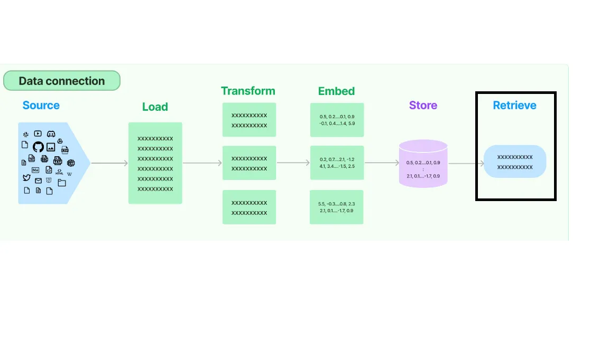

# 🔎 Retriever in LLMs

## What is a Retriever?
- A **retriever** is a component in retrieval-augmented generation (RAG) systems.
- It searches external knowledge sources (databases, documents, embeddings) to find the most relevant information for a query.
- Acts as the "memory lookup" mechanism for LLMs, ensuring responses are grounded in factual context.

- A retriever is an interface that returns documents given an unstructured query. It does not have to store documents like Vector Store. Retrievers accept a string query as an input and return a list of Documents as an output. I talked about Vector-Store retriever and BM-25 Retriever in the previous article. Let’s explore few other retrievers.

## How It Works
1. **Query Encoding**  
   - The user’s input is converted into a vector representation.
2. **Similarity Search**  
   - The retriever compares this vector against a knowledge base (often stored in a vector database).
3. **Top-k Results**  
   - It returns the most relevant passages/documents.
4. **LLM Integration**  
   - The LLM uses these retrieved results as context to generate a more accurate and grounded answer.

## Types of Retrievers
- **Sparse retrievers** (e.g., BM25): keyword-based search.
- **Dense retrievers** (e.g., DPR, embedding-based): semantic similarity using neural embeddings.
- **Hybrid retrievers**: combine sparse + dense for better coverage.

## Why Retrievers Matter
- Enhance factual accuracy.
- Reduce hallucinations.
- Allow LLMs to access domain-specific or up-to-date knowledge.
- Enable scalable knowledge integration without retraining the model.

## Example Use Case
- **Medical QA system**:  
  - User asks: *“What are the latest treatments for type 2 diabetes?”*  
  - Retriever fetches recent medical papers.  
  - LLM generates an answer grounded in those sources.

---

### 💡 Key Insight
Retrievers transform LLMs from static text generators into **dynamic knowledge systems**, bridging the gap between stored knowledge and real-world information.

# 📚 Retrievers

A **retriever** is an interface that returns documents given an unstructured query.  
Unlike a vector store, it does not need to store documents itself.  
Retrievers accept a string query as input and return a list of `Documents` as output.

---

## 🔎 Vector Store-backed Retriever

This retriever uses a **vector store** to fetch documents.  
Here’s how to construct one using an existing **ChromaDB** vector store:

```python
retriever = db.as_retriever()
retriever
# VectorStoreRetriever(tags=['Chroma', 'HuggingFaceBgeEmbeddings'], vectorstore=<langchain_community.vectorstores.chroma.Chroma object at 0x...>)


### Querying the retriever

```python
query = "Who is elon musk's father?"
matched_docs = retriever.get_relevant_documents(query=query)
matched_docs
```

**Example output:**

- Document about Elon Musk’s family history  
- Metadata: source, summary, title

---

### ⚙️ Configuring retrieval

You can adjust how documents are retrieved:

- **MMR (Maximum Marginal Relevance)** with `k=1`:

```python
retriever = db.as_retriever(search_type='mmr', search_kwargs={"k": 1})
matched_docs = retriever.get_relevant_documents(query=query)
```

- **Similarity search** with a minimum threshold:

```python
retriever = db.as_retriever(
    search_type="similarity_score_threshold",
    search_kwargs={"score_threshold": 0.5, "k": 2}
)
matched_docs = retriever.get_relevant_documents(query=query)
```

---

## 📖 BM25 Retriever

The **BM25 retriever** uses the BM25 ranking function to retrieve documents based on term matching.  
Think of it as a **bag-of-words** approach.

### Installation

```bash
pip install rank_bm25
```

### Usage

```python
from langchain.retrievers import BM25Retriever
bm25_retriever = BM25Retriever.from_documents(docs)
```

### Querying

```python
matched_docs = bm25_retriever.get_relevant_documents('Musk')
matched_docs
```

**Example output:**  
Documents containing matched terms (e.g., *Acquisition of Twitter by Elon Musk*, *Views of Elon Musk*, etc.)

---



# 📚 Semantic Retrievers in LangChain

Semantic Retrievers focus on understanding the **underlying context** of a query and documents in order to retrieve relevant information from a database.  
They leverage **word embeddings** and **sentence encoders** to capture semantic meaning.  

This guide explores some of the most important retrievers.

---

## 🔎 Multi Query Retriever

**MultiQueryRetriever** automates prompt tuning.  
It uses an LLM to generate multiple queries for a given input, retrieves documents for each, and takes the union across all queries to form a larger set of relevant documents.

### Import dependencies

```python
import chromadb
from dotenv import load_dotenv
from langchain.chat_models import ChatOpenAI
from langchain_community.document_loaders import WikipediaLoader
from langchain.text_splitter import RecursiveCharacterTextSplitter
from langchain.embeddings import HuggingFaceBgeEmbeddings
from langchain.vectorstores import Chroma

chunk_size = 400
chunk_overlap = 100

import os
with open('../../openai_api_key.txt') as f:
    api_key = f.read()
os.environ['OPENAI_API_KEY'] = api_key

chat = ChatOpenAI()
loader = WikipediaLoader(query="Steve Jobs", load_max_docs=5)
documents = loader.load()

text_splitter = RecursiveCharacterTextSplitter(chunk_size=chunk_size, chunk_overlap=chunk_overlap)
docs = text_splitter.split_documents(documents=documents)

embedding_function = HuggingFaceBgeEmbeddings(
    model_name="BAAI/bge-large-en-v1.5",
    model_kwargs={'device': 'cpu'},
    encode_kwargs={'normalize_embeddings': True}
)

db = Chroma.from_documents(docs, embedding_function, persist_directory="output/steve_jobs.db")
from langchain.retrievers.multi_query import MultiQueryRetriever

mq_retriever = MultiQueryRetriever.from_llm(retriever=db.as_retriever(), llm=chat)
query = "When was Steve Jobs fired from Apple?"
retrieved_docs = mq_retriever.get_relevant_documents(query=query)
retrieved_docs

[Document(page_content='On October 5, 2011, at the age of 56, Steve Jobs...'),
 Document(page_content="Apple CEO John Sculley demands to know why the world believes he fired Jobs..."),
 Document(page_content="In 1985, Jobs departed Apple after a long power struggle...")]

## ✂️ Contextual Compression

Retrieval often returns long documents with irrelevant text.  
**Contextual Compression** reduces documents to only query-relevant content, saving cost and improving accuracy.

### LLMChainExtractor

```python
from langchain.retrievers.document_compressors import LLMChainExtractor
from langchain.retrievers import ContextualCompressionRetriever

retriever = db.as_retriever()
chat = ChatOpenAI(temperature=0)
compressor = LLMChainExtractor.from_llm(chat)

compression_retriever = ContextualCompressionRetriever(base_compressor=compressor, base_retriever=retriever)
compressed_docs = compression_retriever.get_relevant_documents(query=query)
print(compressed_docs[0].page_content)
```

**Output:**
```
In 1985, Jobs departed Apple after a long power struggle with the company's board and CEO John Sculley.
```

---

### LLMChainFilter

```python
from langchain.retrievers.document_compressors import LLMChainFilter

compressor = LLMChainFilter.from_llm(chat)
compression_retriever = ContextualCompressionRetriever(base_compressor=compressor, base_retriever=retriever)
compressed_docs = compression_retriever.get_relevant_documents(query=query)
print(compressed_docs[0].page_content)
```

---

### EmbeddingsFilter

```python
from langchain.retrievers.document_compressors import EmbeddingsFilter

embeddings_filter = EmbeddingsFilter(embeddings=embedding_function, similarity_threshold=0.6)
compression_retriever = ContextualCompressionRetriever(base_compressor=embeddings_filter, base_retriever=retriever)
compressed_docs = compression_retriever.get_relevant_documents(query=query)
print(compressed_docs[0].page_content)
```

---

## 🧩 Parent Document Retriever

Trade-offs in chunking:
- **Small chunks** → precise embeddings, less context.
- **Large chunks** → more context, less precision.

**ParentDocumentRetriever** indexes small chunks but retrieves larger parent docs.

```python
from langchain.text_splitter import CharacterTextSplitter
from langchain.retrievers import ParentDocumentRetriever
from langchain.storage import InMemoryStore

parent_splitter = CharacterTextSplitter(separator="\n\n", chunk_size=1000, chunk_overlap=100)
child_splitter = CharacterTextSplitter(separator="\n", chunk_size=200, chunk_overlap=50)

store = InMemoryStore()

par_doc_retriever = ParentDocumentRetriever(
    vectorstore=db,
    docstore=store,
    child_splitter=child_splitter,
    parent_splitter=parent_splitter
)

par_doc_retriever.add_documents(docs)
par_doc_retriever.get_relevant_documents(query=query)
```

---

## ⏳ Time Weighted Vector Store Retriever

Combines **semantic similarity** with **time decay**:

\[
score = semantic\_similarity + (1.0 - decay\_rate)^{hours\_passed}
\]

### Example with FAISS

```python
import faiss
from langchain.vectorstores import FAISS
from langchain.docstore import InMemoryDocstore
from langchain.retrievers import TimeWeightedVectorStoreRetriever
from langchain_community.embeddings import FakeEmbeddings
from langchain_core.documents import Document
from datetime import datetime, timedelta

embedding_function = FakeEmbeddings(size=300)
emb_size = 1024
index = faiss.IndexFlatL2(emb_size)
vector_store = FAISS(embedding_function, index, docstore=InMemoryDocstore({}), index_to_docstore_id={})

tw_retriever = TimeWeightedVectorStoreRetriever(vectorstore=vector_store, decay_rate=1e-30, k=1)
tw_retriever.add_documents([Document(page_content="hello world")])
tw_retriever.add_documents([Document(page_content="hello foo")])
tw_retriever.get_relevant_documents("hello world")
```

---

# ✅ Conclusion

We explored key retrievers in **LangChain**:
- Multi Query Retriever  
- Contextual Compression (Extractor, Filter, EmbeddingsFilter)  
- Parent Document Retriever  
- Time Weighted Vector Store Retriever  

These are essential components in building effective **RAG pipelines**.