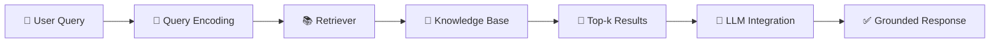
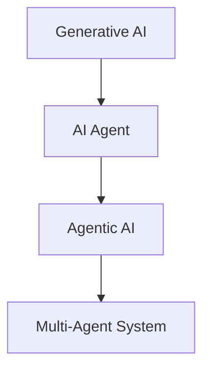

# 🤖 What is LLM?
A **Large Language Model (LLM)** is an advanced AI system trained on massive amounts of text data.  
It can understand, generate, and reason with human language at scale.

## ✨ Key Features
- **Text Understanding**: Processes natural language input.  
- **Text Generation**: Produces coherent, context-aware responses.  
- **Knowledge Representation**: Encodes patterns, facts, and reasoning.  
- **Applications**: Chatbots, summarization, translation, coding assistance, and more.

An **LLM**, or **Large Language Model**, is an artificial intelligence program trained on massive amounts of text to understand, process, and generate human-like language.

Think of it like a super-powered version of the predictive text on your phone—but instead of just guessing the next word, it can predict the next sentence, paragraph, or entire page of code based on the context you give it.

---

### How Do They Work?

At their core, LLMs don't actually "know" facts or think the way humans do. Instead, they operate on complex statistical probabilities using a specific architecture called a **Transformer**.

1. **Training (Reading the Internet):** They are fed billions of pages of text—books, articles, websites, and code. From this, they learn how words relate to each other, grammar, facts about the world, and even nuances like humor or professional tone.
2. **Tokenization:** When you type a prompt, the model breaks your words down into smaller chunks called **tokens** (which can be whole words or parts of words).
3. **Prediction:** It runs these tokens through billions of mathematical parameters to calculate what the most logical and helpful response should be, generating it word by word.

---

### Common Everyday Uses

LLMs are the engine behind many modern AI applications. Because they are flexible, they can handle a wide variety of tasks:

* **Text Generation:** Writing emails, essays, stories, or code.
* **Summarization:** Condensing a 50-page report or a long article into a few bullet points.
* **Translation:** Converting text smoothly between dozens of languages while keeping the original context and tone.
* **Answering Questions:** Acting as a conversational search engine or a tutor to explain complex topics simply.

> **What makes them "Large"?**
> The "Large" refers to two things: the colossal size of their training datasets, and the number of **parameters** (the internal "dials" and weights the model adjusts during learning). Modern LLMs often have tens or hundreds of billions of parameters, allowing them to capture incredibly complex patterns in language.

---

### Key Limitations to Keep in Mind

While they seem incredibly smart, LLMs have a few major blind spots:

* **Hallucinations:** Sometimes, a model will confidently generate information that sounds completely real but is entirely fabricated.
* **No Real-World Awareness:** Standard LLMs only know what was in their training data up to a specific cutoff date, unless they are connected to a live web search tool.
* **Bias:** Because they learn from human-written text on the internet, they can inadvertently inherit and repeat human biases.

---

# 🔎 What is RAG?
**Retrieval-Augmented Generation (RAG)** is a technique that combines LLMs with external knowledge sources.  
Instead of relying only on what the model has memorized, RAG retrieves relevant information and uses it to generate grounded answers.

## ⚙️ How RAG Works
1. **Query Encoding** → User input is converted into a vector.  
2. **Retriever** → Searches a knowledge base (e.g., vector database, documents).  
3. **Top-k Results** → Most relevant passages are selected.  
4. **LLM Integration** → The model uses retrieved context to generate accurate responses.

---

## 🧩 Why RAG Matters
- ✅ Reduces hallucinations  
- ✅ Provides up-to-date knowledge  
- ✅ Enables domain-specific expertise  
- ✅ Scales without retraining the LLM  

---

# 📊 Example
**Medical QA System**  
- User asks: *“What are the latest treatments for type 2 diabetes?”*  
- Retriever fetches recent medical papers.  
- LLM generates an answer grounded in those sources.

---

## 💡 Key Takeaway
- **LLM** = Powerful language engine.  
- **RAG** = Enhances LLM with real-world knowledge.  
Together, they transform AI into a **dynamic, reliable knowledge system**.

# 🔄 LLM + RAG Workflow


---

## 📊 Explanation
- **User Query** → Input from the user.  
- **Query Encoding** → Converts text into vector representation.  
- **Retriever** → Searches external knowledge sources.  
- **Knowledge Base** → Stores documents, embeddings, or domain-specific data.  
- **Top-k Results** → Selects the most relevant passages.  
- **LLM Integration** → Combines retrieved context with language generation.  
- **Grounded Response** → Final output that is accurate, contextual, and reliable.

---

## 🎯 Key Insight
- **LLM** provides language fluency.  
- **RAG** ensures factual grounding.  
Together, they deliver **trustworthy AI answers**.


# 📊 LLM vs RAG Comparison

| Aspect                | 🧠 LLM (Large Language Model) | 🔎 RAG (Retrieval-Augmented Generation) |
|------------------------|-------------------------------|-----------------------------------------|
| **Definition**         | AI model trained on massive text data to understand and generate language | Technique that combines LLMs with external knowledge retrieval |
| **Knowledge Source**   | Relies on pre-trained parameters (static knowledge) | Dynamically retrieves information from external databases or documents |
| **Strengths**          | Fluent language generation, reasoning, summarization | Grounded, factual, up-to-date responses |
| **Limitations**        | May hallucinate or provide outdated info | Dependent on quality of retriever and knowledge base |
| **Use Cases**          | Chatbots, translation, summarization, coding | Domain-specific QA, medical/legal assistants, enterprise search |
| **Example**            | Writes a poem or explains physics concepts | Answers “latest diabetes treatments” using recent medical papers |

---

## 🎯 Key Insight
- **LLM** = Language fluency engine.  
- **RAG** = Knowledge grounding mechanism.  
Together, they create **accurate, reliable, and context-aware AI systems**.


Since we just looked at how LLMs work, **RAG**—which stands for **Retrieval-Augmented Generation**—is the ultimate fix for an LLM's biggest flaws: its training cutoff date and its habit of hallucinating (making things up).

Think of a standard LLM as a student taking an exam strictly from memory. **RAG turns it into an open-book exam.**

Instead of relying only on what it learned during training, the LLM is given an automated search tool to look up live, specific documents right before it answers you.

---

## How It Works: The 3-Step Process

Imagine you ask an LLM, *"What were my company's Q2 sales in Gaya?"* A standard LLM doesn't know your private data and will fail. A RAG setup solves it like this:

```
[Your Query] ──> 1. RETRIEVE (Search Private Database) ──> 2. AUGMENT (Stuff Data into Prompt) ──> 3. GENERATE (LLM writes clean answer)

```

1. **Retrieval:** The system takes your question and instantly searches a private database, internal company files, or a live web index to find the most relevant paragraphs or documents.
2. **Augmentation:** The system takes those retrieved paragraphs and neatly pastes them into a hidden prompt alongside your original question (e.g., *"Based on this attached spreadsheet snippet, answer the user..."*).
3. **Generation:** The LLM reads the freshly provided text and writes a perfectly formed, accurate response based *strictly* on that proof.

---

## Why RAG is a Game-Changer

Most companies deploying AI today use RAG because it solves three massive problems:

* **Zero Hallucinations:** Because the LLM is forced to cite its sources from the retrieved text, it rarely invents facts. If the answer isn't in the documents, it simply says, "I can't find that in the provided files."
* **No Expensive Re-training:** Training a massive model like Llama 4 or GPT-5 takes millions of dollars and weeks of computing time. With RAG, you never touch the model's core brain; you just update the folder of documents it searches through.
* **Strict Data Security:** You can connect an open-weight model (like Gemma 4) to a RAG pipeline entirely on a private local server. Your sensitive data never leaves your system or travels to an external cloud.

---

## Memory vs. Open-Book

| Feature | Standard LLM (Closed-Book) | LLM + RAG (Open-Book) |
| --- | --- | --- |
| **Knowledge Source** | Internal training memory only. | External databases, PDFs, APIs, or live web pages. |
| **Data Timeliness** | Stuck at its training cutoff date. | Always up-to-the-minute (whatever is in your files). |
| **Best Used For** | Creative writing, general coding, brainstorming. | Customer support bots, analyzing private financial reports, legal document search. |

# 🤖 Generative AI vs AI Agents vs Agentic AI vs Multi-Agent Systems

---

## 1️⃣ Generative AI
**Definition**: AI models that *generate* new content (text, images, audio, code) based on patterns learned from large datasets.  
Think of it as a **creative engine**.

- **Examples**: ChatGPT, Gemini, DALL·E, Stable Diffusion  
- **Strengths**: Produces human-like text, realistic images, music, code.  
- **Limitations**: Can hallucinate, lacks grounding in external knowledge.  

---

## 2️⃣ AI Agents
**Definition**: An **AI system that acts on behalf of a user** to achieve goals.  
It doesn’t just generate — it **perceives, reasons, and takes actions** in an environment.

- **Examples**:  
  - A shopping bot that finds the best deals.  
  - A scheduling agent that books meetings.  
- **Key Traits**: Autonomy, goal-directed behavior, ability to interact with tools/APIs.  

---

## 3️⃣ Agentic AI
**Definition**: A more advanced form of AI agents — **LLM-powered agents** with reasoning, planning, and tool-use abilities.  
They don’t just respond; they **decide, plan, and act** like digital co-workers.

- **Examples**:  
  - LangChain agents that call APIs, run code, and chain tasks.  
  - Copilot agents that manage workflows end-to-end.  
- **Key Traits**:  
  - Uses **LLMs for reasoning**.  
  - Can break tasks into steps.  
  - Executes actions autonomously.  

---

## 4️⃣ Multi-Agent Systems
**Definition**: A network of **multiple agents working together (or competing)** to solve complex problems.  
Each agent has specialized roles, and they coordinate like a team.

- **Examples**:  
  - Research agents collaborating to write a paper.  
  - Trading bots negotiating in a financial market.  
- **Key Traits**:  
  - Collaboration or competition.  
  - Emergent behavior (system intelligence > individual agent).  
  - Scalable problem-solving.  

---

# 🔄 Visual Flow



- **Generative AI** → Creates content.  
- **AI Agent** → Acts with goals.  
- **Agentic AI** → Plans + reasons + uses tools.  
- **Multi-Agent** → Many agents collaborating.  

---

# 📊 Comparison Table

| Concept            | Definition | Key Ability | Example |
|--------------------|------------|-------------|---------|
| **Generative AI**  | Creates new content | Text, image, code generation | ChatGPT, DALL·E |
| **AI Agent**       | Acts on behalf of user | Autonomy, goal-directed | Shopping bot |
| **Agentic AI**     | LLM-powered agent | Reasoning, planning, tool use | LangChain agent |
| **Multi-Agent**    | Multiple agents working together | Collaboration, emergent intelligence | Research team of AI bots |

---

# 🎯 Crystal-Clear Takeaway
- **Generative AI** = Creative engine.  
- **AI Agent** = Goal-driven assistant.  
- **Agentic AI** = Smarter agent with reasoning + tools.  
- **Multi-Agent** = Team of agents collaborating.  

The AI landscape has evolved rapidly over the last few years, moving from systems that simply *write text* to systems that can *take action* and *work together*.

Because terms like "AI Agents" and "Agentic AI" are often used interchangeably, it is easy to get confused. Let's break down exactly how these four concepts fit together, from the foundational engine to complex, multi-layered systems.

---

## The AI Hierarchy at a Glance

The easiest way to understand the relationship is as a progression of autonomy and complexity:

```
[ Generative AI ]  ──> The core engine (can generate content)
       │
       ▼
[ Agentic AI ]     ──> The design philosophy (adds goals and reasoning)
       │
       ▼
[ AI Agent ]       ──> The standalone worker (uses tools to execute a goal)
       │
       ▼
[ Multi-Agent ]    ──> The corporate team (multiple specialized workers collaborating)

```

---

## 1. Generative AI: The Core Engine

Generative AI is the underlying technology capable of creating new content—text, images, code, or audio—by predicting the most logical next step based on its training.

* **How it behaves:** It is purely **reactive** and **stateless**. You give it a prompt, it gives you an answer, and it stops. It doesn’t "plan" ahead or verify if its output is correct unless you tell it to.
* **Example:** You ask ChatGPT or Gemini to write an email template or explain a piece of code.

## 2. Agentic AI: The Design Philosophy

Agentic AI is not a specific software program; it is a **property** or **architectural style**. It refers to AI systems that display agency—meaning they are goal-oriented, can perceive their environment, make decisions, and take actions over time without a human constantly clicking "next."

* **How it behaves:** Instead of just responding to a prompt, an agentic system is given an objective (e.g., *"Find the cheapest flight"*). It determines its own sub-tasks, loops through them, handles errors, and works until the objective is met.
* **Example:** An AI assistant that doesn't just draft an email, but actively monitors your inbox, decides which emails are urgent, and drafts replies autonomously based on your schedule.

## 3. AI Agents: The Standalone Worker

An AI Agent is a **software entity** built using Agentic AI principles, typically powered by a Generative AI model (like a Large Language Model) acting as its central brain. To be a true agent, it must have access to **Tools** (APIs, web browsers, databases) and a **Memory** loop.

* **How it behaves:** It follows an internal **ReAct** (Reason + Action) loop. It thinks about what to do, calls an external tool (like a Python compiler or a calendar API), looks at the result, and adjusts its plan.
* **Example:** A coding agent like Devin or an open-source framework script (using LangGraph or CrewAI) that is told to *"Find bugs in this repository and fix them."* It clones the code, runs tests, reads the error logs, rewrites the code, and commits the fix entirely on its own.

## 4. Multi-Agent Systems: The Corporate Team

When a task is too massive or complex for a single AI agent to handle (because the LLM brain gets overwhelmed by too many instructions), developers use a **Multi-Agent System (MAS)**. This divides the big task among multiple specialized agents that communicate with one another.

* **How they behave:** Just like a real company, you have different agents with distinct roles, personas, and system prompts. One agent’s output becomes another agent’s input. A manager agent often coordinates the workflow.
* **Example (Building a Software App):**
1. **Product Manager Agent:** Takes the user request and writes technical requirements.
2. **Coder Agent:** Reads the requirements and generates the source code.
3. **QA Tester Agent:** Reviews the code, writes tests, and sends bugs back to the Coder Agent if something fails.


---

## Structural Comparison

| Attribute | Generative AI | Agentic AI / AI Agent | Multi-Agent Systems |
| --- | --- | --- | --- |
| **Core Nature** | Text/Content Generation engine. | Autonomous, tool-using entity. | Network of collaborating autonomous entities. |
| **Human Interaction** | Turn-by-turn (Requires a prompt for every single response). | High-level (Give it a goal, let it run autonomously). | High-level (Give the team a project, let them coordinate). |
| **Action Capability** | Read and write text only. | Can browse the web, execute code, edit files, call APIs. | Agents can call tools *and* assign tasks to peer agents. |
| **Error Handling** | If it makes a mistake, it prints the mistake. | Can run a script, read the error log, and try a different approach. | One agent can critique and catch the errors of another agent before final delivery. |
| **Best Used For** | Brainstorming, summarization, draft writing. | Automated data scraping, local code execution, single-goal tasks. | Complex enterprise software pipelines, market research desks, end-to-end app creation. |

# Master LLM
---

If you want to master Large Language Models from the ground up—especially moving toward engineering applications like RAG and Agentic AI—the learning path is best tackled in stages.

Here is the structured roadmap of core concepts you should study, organized from the fundamental math/architecture to advanced system design.

---

## 1. Foundational Architecture (The Core Engine)

Before building systems, you need to understand how the "brain" actually processes language.

* **The Transformer Architecture:** This is the foundational paper (*"Attention Is All You Need"*, 2017) that powers every modern LLM.
* **Self-Attention Mechanisms:** How a model weighs the importance of different words in a sentence relative to each other (e.g., matching the word "it" to the correct noun earlier in a paragraph).
* **Tokenization & Embeddings:** How words are split into pieces (tokens) and converted into dense mathematical coordinate vectors.
* **Context Window:** The maximum number of tokens a model can read and write in a single turn, and how performance degrades or changes as that window expands.

---

## 2. Model Training Stages (How LLMs Learn)

Understanding how a raw model becomes a helpful assistant prevents you from treating AI like magic.

* **Pre-training (Base Models):** Learning grammar and patterns by predicting the next token across massive web datasets.
* **Instruction Fine-Tuning (SFT):** Training a base model to behave like a conversational assistant that answers prompts instead of just completing text blocks.
* **Alignment (RLHF & DPO):** *Reinforcement Learning from Human Feedback* and *Direct Preference Optimization*—the methods used to make models safer, less toxic, and more helpful.
* **Reasoning Models (Compute-at-Test-Time):** Studying how models like OpenAI's "o" series or DeepSeek-R1 use internal "Chain-of-Thought" processing loops to think *before* they output a final response.

---

## 3. Data Ingestion & Retrieval (The RAG Pipeline)

This is where frameworks like LangChain come into play to connect models to data.

* **Chunking Strategies:** How to logically chop text documents using Recursive, Fixed, or Semantic boundaries without losing context.
* **Vector Databases & Indexing:** Storing coordinate vectors in purpose-built systems (Pinecone, Chroma, Milvus) and searching them using distance math (Cosine Similarity).
* **Advanced RAG (Re-ranking & Query Transformation):**
* *Re-ranking:* Using a secondary model to sort retrieved documents by true relevance before handing them to the LLM.
* *Small-to-Large (Parent-Child) Retrieval:* Searching tiny, highly specific text chunks but feeding the wider surrounding paragraph to the LLM.


---

## 4. Agentic AI & Systems Engineering (Taking Action)

Moving past static text generation into building autonomous software tools.

* **Tool Use / Function Calling:** How an LLM parses a prompt, detects that it needs an external tool (like a calendar API), and generates a structured payload (like JSON) to run that tool.
* **The ReAct Framework (Reason + Action):** The mental loop of *Thought $\rightarrow$ Action $\rightarrow$ Observation $\rightarrow$ Repeat* that allows an agent to complete complex multi-step goals.
* **State Management:** Tracking variables, history, and memory across complex, looping workflows (this is the core concept behind **LangGraph**).
* **Multi-Agent Communication Patterns:** Designing systems where specialized agents hand off tasks to one another (Hierarchical, Sequential, or Router networks).

---

## Recommended Learning Sequence

```
[ Step 1: Tokenization & Attention ] 
                 │
                 ▼
[ Step 2: Prompting & Function Calling ] 
                 │
                 ▼
[ Step 3: Vector DBs & Naive RAG Pipelines ] 
                 │
                 ▼
[ Step 4: State Machines & Agentic Loops (LangGraph) ]

```