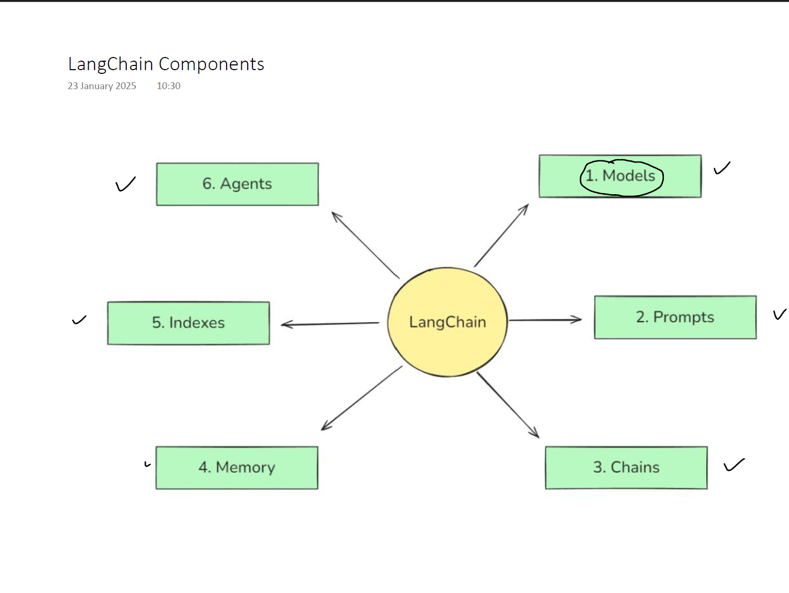
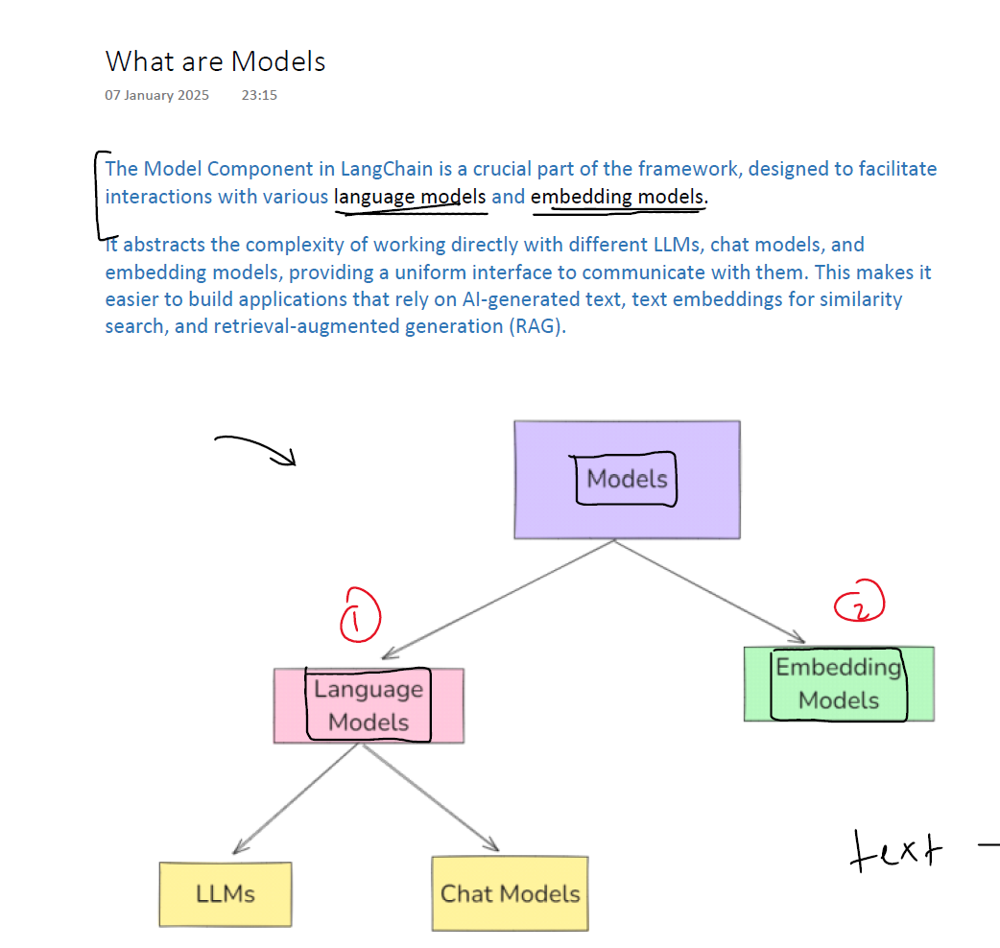
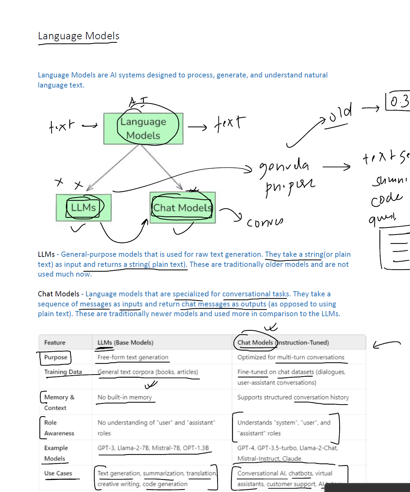

# Topic Covered
1) Model
    - Language Model
    - Embedding Model
2) Prompt
    - Prompt Template
    - Role Based Prompt
    - Few-Shot Prompting
    - Output Parser #TODO
3) Chain
    - LLMChain
    - Sequential Chain
    - Parallel Chain
    - Conditional Chain
    - RetreivalQA Chain
    - ConversationalRetreival Chain
4) Runnable
    - Runnable Sequence
    - Runnable Parallel
    - Runnable Branch (Conditional)
    - Runnable Lambda
    - Runnable Map
    - Runnable PassThrough
5) Document Loader
    - TextLoader
    - PyPDFLoader
    - DirectoryLoader
    - WebBasedLoader
    - CSVLoader
    - Load VS LazyLoad()

6) TextSPlitting
    - Length-Based Splitting
    - Text-Structure Based Splitters
    - Document Structure Based Splitters
    - Semantic Meaning Based SPlitters

7) Chunking

8) Embedding
    - OpenAIEmbedding

9) Vector Store

10) Vector Database

11) Retriever
    - Wikipedia Retriever
    - Vector Store Retriever
    - Maximum Margin Relevance (MMR) Retriever
    - Multi - Query Retriever
    - Contextual Compression Retriever

12) Augmentation
    - Prompt Templating
    - Answer grounding
    - Context Window optimization


# Q) What are LangChain Componenets

## 🧩 Core LangChain Components



### 1. **Models**
- **LLMs** → Large language models (OpenAI, Azure, Anthropic, etc.).
- **Chat Models** → Conversational variants of LLMs.
- **Embeddings** → Convert text into numerical vectors for similarity search.

---

### 2. **Data Connectors**
- **Document Loaders** → Import data from PDFs, web pages, SQL, APIs, etc.
- **Text Splitters** → Chunk large documents into smaller pieces for embedding.
- **Vector Stores** → Databases for embeddings (Chroma, FAISS, Pinecone, Weaviate).

---

### 3. **Retrievers**
- **VectorStoreRetriever** → Fetches relevant chunks from embeddings.
- **BM25Retriever** → Keyword‑based retrieval.
- **Advanced retrievers** → MultiQuery, ContextualCompression, ParentDocument, TimeWeighted, etc.

👉 These are the backbone of **RAG**.

---

### 4. **Chains**
- **LLMChain** → Simple prompt + LLM.
- **RetrievalQAChain** → Classic RAG pipeline (retriever + LLM).
- **ConversationalRetrievalChain** → RAG with chat history.
- **Custom Chains** → Combine multiple steps (summarization, filtering, etc.).

---

### 5. **Agents**
- **Tools** → External functions/APIs (search, calculator, SQL, calendar).
- **Agent Executors** → Decide which tool to call, in what order.
- **Planning & Memory** → Break tasks into steps, remember context.

👉 This is where **Agentic AI** comes in — RAG can be one tool inside an agent.

---

### 6. **Memory**
- **ConversationBufferMemory** → Stores past dialogue.
- **VectorStoreRetrieverMemory** → Uses embeddings for long‑term recall.
- **Combined Memory** → Mixes short‑term and long‑term memory.

---

### 7. **Evaluation & Monitoring**
- **LangSmith / DeepEval** → Debugging, tracing, and evaluating LLM outputs.
- **Callbacks** → Hook into execution for logging/monitoring.

---

## 📊 Quick Map

| Component | Role | Example |
|-----------|------|---------|
| **Models** | Generate text/embeddings | `OpenAI`, `GoogleGenerativeAIEmbeddings` |
| **Data Connectors** | Load + chunk data | `PyPDFLoader`, `RecursiveTextSplitter` |
| **Vector Stores** | Store embeddings | `Chroma`, `FAISS` |
| **Retrievers** | Fetch relevant docs | `VectorStoreRetriever` |
| **Chains** | Orchestrate steps | `RetrievalQA` |
| **Agents** | Plan + act | `AgentExecutor` with tools |
| **Memory** | Maintain context | `ConversationBufferMemory` |

---

# Q) Models in LangChain
---

In LangChain, **Models** are one of the core building blocks — they’re the engines that actually generate text or embeddings. Let’s break them down clearly:


---

Language Model


## 🧩 Types of Models in LangChain

### 1. **LLMs (Large Language Models)**
- General text generation models.
- Examples: `OpenAI`, `Anthropic`, `Cohere`, `AzureOpenAI`.
- Used for tasks like summarization, Q&A, reasoning, creative writing.

---

### 2. **Chat Models**
- Specialized LLMs designed for conversational interactions.
- Examples: `ChatOpenAI`, `ChatAnthropic`.
- Handle multi‑turn dialogue with structured input/output.

```python
from langchain_google_genai import ChatGoogleGenerativeAI
from dotenv import load_dotenv

load_dotenv()

model = ChatGoogleGenerativeAI(model='gemini-3.1-flash-lite')

result = model.invoke('What is the capital of India')

print(result.content)
```
Hugging Face

```python
from langchain_huggingface import ChatHuggingFace, HuggingFaceEndpoint
from dotenv import load_dotenv

load_dotenv()

llm = HuggingFaceEndpoint(
    repo_id="deepseek-ai/DeepSeek-V4-Pro",
    task="text-generation"
)

model = ChatHuggingFace(llm=llm)

result = model.invoke("What is the capital of India")

print(result.content)

```
---

### 3. **Embeddings Models**
- Convert text into numerical vectors for similarity search.
- Examples: `OpenAIEmbeddings`, `GoogleGenerativeAIEmbeddings`, `HuggingFaceEmbeddings`.
- Used in **RAG pipelines** with vector stores (Chroma, FAISS, Pinecone).

```python
from langchain_huggingface import HuggingFaceEndpointEmbeddings
from dotenv import load_dotenv
from sklearn.metrics.pairwise import cosine_similarity
import numpy as np

load_dotenv()

embedding = HuggingFaceEndpointEmbeddings(repo_id='sentence-transformers/all-MiniLM-L6-v2')

documents = [
    "Virat Kohli is an Indian cricketer known for his aggressive batting and leadership.",
    "MS Dhoni is a former Indian captain famous for his calm demeanor and finishing skills.",
    "Sachin Tendulkar, also known as the 'God of Cricket', holds many batting records.",
    "Rohit Sharma is known for his elegant batting and record-breaking double centuries.",
    "Jasprit Bumrah is an Indian fast bowler known for his unorthodox action and yorkers."
]

query = 'tell me about msdhoni'

doc_embeddings = embedding.embed_documents(documents)
query_embedding = embedding.embed_query(query)

scores = cosine_similarity([query_embedding], doc_embeddings)[0]

index, score = sorted(list(enumerate(scores)),key=lambda x:x[1])[-1]

print(query)
print(documents[index])
print("similarity score is:", score)

```
---

### 4. **Other Specialized Models**
- **Text-to-Image / Multimodal** (via integrations, though less common in LangChain core).
- **Function Calling Models** → LLMs that can call tools or APIs.
- **Custom Models** → Wrap any API or local model into LangChain’s `LLM` interface.

---

## 📊 Quick Table

| Model Type | Purpose | Example |
|------------|---------|---------|
| **LLM** | General text generation | `OpenAI`, `Cohere` |
| **Chat Model** | Dialogue, multi‑turn | `ChatOpenAI`, `ChatAnthropic` |
| **Embeddings** | Vector representation for retrieval | `OpenAIEmbeddings`, `FAISS` |
| **Custom/Other** | Specialized tasks | HuggingFace models, local LLMs |

---

## 🎯 Key Insight
- **LLMs** → Generate answers.  
- **Embeddings** → Enable retrieval (RAG).  
- **Chat Models** → Handle conversations.  
- Together, they form the **foundation of LangChain pipelines** — whether you’re building a simple RAG system or a full Agentic AI.

In LangChain, **prompts** are the structured instructions you give to a model — they define *what the model should do* and *how it should respond*. Think of them as the **bridge between your intent and the LLM’s output**.

---

## 🧩 Prompt Components in LangChain

### 1. **PromptTemplate** or **Dynamic & Reusable Prompts**
- A reusable template for prompts with placeholders.  
- Example:  
  ```python
  from langchain.prompts import PromptTemplate

  template = "Translate the following text to French: {text}"
  prompt = PromptTemplate.from_template(template)
  prompt.format(text="Hello, how are you?")
  ```
- Output: `"Translate the following text to French: Hello, how are you?"`

---

### 2. **ChatPromptTemplate** / **Role Based Prompts**
- Designed for **multi‑turn conversations**.  
- Lets you structure prompts as a sequence of messages (system, human, AI).  
- Example:  
  ```python
  from langchain.prompts import ChatPromptTemplate

  chat_prompt = ChatPromptTemplate.from_messages([
      ("system", "You are a helpful assistant."),
      ("human", "Summarize this text: {text}")
  ])
  ```
- Output: A structured chat prompt ready for a chat model.

---

### 3. **Few‑Shot Prompting**
- You can embed **examples** in the prompt to guide the model.  
- Example:  
  ```python
  from langchain.prompts import FewShotPromptTemplate

  examples = [
      {"word": "happy", "antonym": "sad"},
      {"word": "tall", "antonym": "short"},
  ]

  example_prompt = PromptTemplate(
      input_variables=["word", "antonym"],
      template="Word: {word}, Antonym: {antonym}"
  )

  few_shot_prompt = FewShotPromptTemplate(
      examples=examples,
      example_prompt=example_prompt,
      prefix="Give antonyms for the following words.",
      suffix="Word: {input}, Antonym:",
      input_variables=["input"]
  )
  ```
- This teaches the model by showing patterns.

---

### 4. **Output Parsers**
- Define how the model’s response should be structured (JSON, list, etc.).  
- Example: `StructuredOutputParser` ensures the model outputs valid JSON.

---

## 📊 Summary Table

| Prompt Type | Purpose | Example Use |
|-------------|---------|-------------|
| **PromptTemplate** | Single‑shot template | Translation, summarization |
| **ChatPromptTemplate** | Multi‑turn dialogue | Chatbots, assistants |
| **FewShotPromptTemplate** | Guide with examples | Classification, Q&A |
| **Output Parsers** | Control response format | JSON, tables, lists |

---

## 🎯 Key Insight
- Prompts in LangChain aren’t just text — they’re **structured, reusable, and composable**.  
- They let you **control the behavior of LLMs** in RAG pipelines or Agentic AI workflows.  

---

# 🧩 Types of Chains in LangChain
---

## 1. 🔹 **LLMChain**
Simplest chain: prompt + LLM.

```python
from langchain.chains import LLMChain
from langchain.prompts import PromptTemplate
from langchain_openai import OpenAI

prompt = PromptTemplate.from_template("Translate this text to French: {text}")
llm = OpenAI()
chain = LLMChain(llm=llm, prompt=prompt)

result = chain.run(text="Hello, how are you?")
print(result)  # → "Bonjour, comment ça va?"
```

---

## 2. 🔹 **SequentialChain**
Runs multiple chains one after another.

```python
from langchain.chains import SequentialChain

# Chain 1: Summarize
summarize_prompt = PromptTemplate.from_template("Summarize: {text}")
summarize_chain = LLMChain(llm=OpenAI(), prompt=summarize_prompt)

# Chain 2: Translate
translate_prompt = PromptTemplate.from_template("Translate to Spanish: {summary}")
translate_chain = LLMChain(llm=OpenAI(), prompt=translate_prompt)

# Sequential pipeline
overall_chain = SequentialChain(
    chains=[summarize_chain, translate_chain],
    input_variables=["text"],
    output_variables=["summary", "translation"]
)

result = overall_chain.run(text="LangChain helps build LLM-powered apps.")
print(result["translation"])
```

---

## 3.🔹 ParallelChain Overview
- **SequentialChain** → runs one chain after another (step‑by‑step).  
- **ParallelChain** → runs multiple chains simultaneously (side‑by‑side).  
- **Use case:** When you want multiple independent outputs from the same input, without waiting for one to finish before starting the next.

---

## 🧩 Example: ParallelChain

```python
from langchain.chains import LLMChain, ParallelChain
from langchain.prompts import PromptTemplate
from langchain_openai import OpenAI

llm = OpenAI()

# Chain 1: Summarize
summarize_prompt = PromptTemplate.from_template("Summarize this text: {text}")
summarize_chain = LLMChain(llm=llm, prompt=summarize_prompt)

# Chain 2: Translate
translate_prompt = PromptTemplate.from_template("Translate this text to Spanish: {text}")
translate_chain = LLMChain(llm=llm, prompt=translate_prompt)

# Run both chains in parallel
parallel_chain = ParallelChain(
    chains={
        "summary": summarize_chain,
        "translation": translate_chain
    }
)

result = parallel_chain.run(text="LangChain helps build LLM-powered applications.")
print(result["summary"])      # → "LangChain builds apps with LLMs."
print(result["translation"])  # → "LangChain ayuda a crear aplicaciones con LLMs."
```

Hands-On Exmaple

```python
from dotenv import load_dotenv
from langchain_google_genai import ChatGoogleGenerativeAI
from pydantic import BaseModel, EmailStr, Field
from langchain_core.prompts import PromptTemplate
from langchain_core.output_parsers import StrOutputParser
from langchain_huggingface import ChatHuggingFace, HuggingFaceEndpoint
from langchain_core.runnables import RunnableParallel

load_dotenv()

#Model 1
model1 = ChatGoogleGenerativeAI(model='gemini-3.1-flash-lite')

llm = HuggingFaceEndpoint(
    repo_id="deepseek-ai/DeepSeek-V4-Pro",
    task="text-generation"
)

#Model 2
model2 = ChatHuggingFace(llm=llm)

#Prompts and parser
prompt1 = PromptTemplate(
    template='Generate short and simple notes from the following text \n {text}',
    input_variables=['text']
)

# quiz generation prompt
prompt2 = PromptTemplate(
    template='Generate 5 short question answers from the following text \n {text}',
    input_variables=['text']
)

# merge prompt
prompt3 = PromptTemplate(
    template='Merge the provided notes and quiz into a single document \n notes -> {notes} and quiz -> {quiz}',
    input_variables=['notes', 'quiz']
)

parser = StrOutputParser()

# parallel chain
parallel_chain = RunnableParallel({
    'notes': prompt1 | model1 | parser,
    'quiz': prompt2 | model2 | parser
})

# Merge chain
merge_chain = prompt3 | model1 | parser

# Final chain
chain = parallel_chain | merge_chain

text = """
Support vector machines (SVMs) are a set of supervised learning methods used for classification, regression and outliers detection.

The advantages of support vector machines are:

Effective in high dimensional spaces.

Still effective in cases where number of dimensions is greater than the number of samples.

Uses a subset of training points in the decision function (called support vectors), so it is also memory efficient.

Versatile: different Kernel functions can be specified for the decision function. Common kernels are provided, but it is also possible to specify custom kernels.

The disadvantages of support vector machines include:

If the number of features is much greater than the number of samples, avoid over-fitting in choosing Kernel functions and regularization term is crucial.

SVMs do not directly provide probability estimates, these are calculated using an expensive five-fold cross-validation (see Scores and probabilities, below).

The support vector machines in scikit-learn support both dense (numpy.ndarray and convertible to that by numpy.asarray) and sparse (any scipy.sparse) sample vectors as input. However, to use an SVM to make predictions for sparse data, it must have been fit on such data. For optimal performance, use C-ordered numpy.ndarray (dense) or scipy.sparse.csr_matrix (sparse) with dtype=float64.
"""


result = chain.invoke({'text':text})

print(result)

chain.get_graph().print_ascii()

#  +---------------------------+                 
#                    | Parallel<notes,quiz>Input |                 
#                    +---------------------------+                 
#                       ***                 ****                   
#                   ****                        ***                
#                 **                               **              
#     +----------------+                      +----------------+   
#     | PromptTemplate |                      | PromptTemplate |   
#     +----------------+                      +----------------+   
#              *                                        *          
#              *                                        *          
#              *                                        *          
# +------------------------+                  +-----------------+  
# | ChatGoogleGenerativeAI |                  | ChatHuggingFace |  
# +------------------------+                  +-----------------+  
#              *                                        *          
#              *                                        *          
#              *                                        *          
#     +-----------------+                     +-----------------+  
#     | StrOutputParser |                     | StrOutputParser |  
#     +-----------------+                     +-----------------+  
#                       ***                 ****                   
#                          ****          ***                       
#                              **      **                          
#                   +----------------------------+                 
#                   | Parallel<notes,quiz>Output |                 
#                   +----------------------------+                 
#                                  *                               
#                                  *                               
#                                  *                               
#                         +----------------+                       
#                         | PromptTemplate |                       
#                         +----------------+                       
#                                  *                               
#                                  *                               
#                                  *                               
#                     +------------------------+                   
#                     | ChatGoogleGenerativeAI |                   
#                     +------------------------+                   
#                                  *                               
#                                  *                               
#                                  *                               
#                         +-----------------+                      
#                         | StrOutputParser |                      
#                         +-----------------+                      
#                                  *                               
#                                  *                               
#                                  *                               
#                      +-----------------------+                   
#                      | StrOutputParserOutput |                   
#                      +-----------------------+                   

```
---

## 📊 When to Use ParallelChain
- ✅ Multiple independent tasks on the same input (summarize + sentiment analysis + translation).  
- ✅ Speed: avoids waiting for sequential execution.  
- ✅ Aggregating diverse outputs for richer pipelines.  

---

## 🎯 Key Insight
- **SequentialChain** = step‑by‑step pipeline.  
- **ParallelChain** = simultaneous tasks.  
- Both are orchestration tools, but **ParallelChain shines when tasks don’t depend on each other**.

---

## 4. 🔹 **RouterChain** or **Conditional Chain**
- Routes input to different chains depending on conditions.
- Dynamically route input to different chains depending on conditions.
- Example: If input is a math problem → send to calculator chain; if it’s a Q&A → send to RAG chain.

```python
from langchain.chains.router import MultiPromptChain

prompts = {
    "math": PromptTemplate.from_template("Solve this math problem: {input}"),
    "qa": PromptTemplate.from_template("Answer this question: {input}")
}

chain = MultiPromptChain.from_prompts(prompts, default_chain=LLMChain(llm=OpenAI(), prompt=prompts["qa"]))

print(chain.run("2+2"))       # → "4"
print(chain.run("Who is Einstein?"))  # → factual answer
```

```python
from dotenv import load_dotenv
from langchain_google_genai import ChatGoogleGenerativeAI
from pydantic import BaseModel, EmailStr, Field
from langchain_core.prompts import PromptTemplate
from langchain_core.output_parsers import StrOutputParser
from langchain_huggingface import ChatHuggingFace, HuggingFaceEndpoint
from langchain_core.runnables import RunnableParallel
from langchain_core.output_parsers import PydanticOutputParser
from langchain_core.runnables import RunnableBranch, RunnableLambda
from typing import Literal

load_dotenv()

#Model 1
model = ChatGoogleGenerativeAI(model='gemini-3.1-flash-lite')

parser = StrOutputParser()

class Feedback(BaseModel):

    sentiment: Literal['positive', 'negative'] = Field(description='Give the sentiment of the feedback')

parser2 = PydanticOutputParser(pydantic_object=Feedback)

prompt1 = PromptTemplate(
    template='Classify the sentiment of the following feedback text into postive or negative \n {feedback} \n {format_instruction}',
    input_variables=['feedback'],
    partial_variables={'format_instruction':parser2.get_format_instructions()}
)

classifier_chain = prompt1 | model | parser2

prompt2 = PromptTemplate(
    template='Write an appropriate response to this positive feedback \n {feedback}',
    input_variables=['feedback']
)

prompt3 = PromptTemplate(
    template='Write an appropriate response to this negative feedback \n {feedback}',
    input_variables=['feedback']
)

branch_chain = RunnableBranch(
    (lambda x:x.sentiment == 'positive', prompt2 | model | parser),
    (lambda x:x.sentiment == 'negative', prompt3 | model | parser),
    RunnableLambda(lambda x: "could not find sentiment")
)

chain = classifier_chain | branch_chain

print(chain.invoke({'feedback': 'This is a beautiful phone'}))

chain.get_graph().print_ascii()
```

---

## 5. 🔹 **RetrievalQAChain**
Classic **RAG pipeline**.

```python
from langchain.chains import RetrievalQA

qa_chain = RetrievalQA.from_chain_type(
    llm=OpenAI(),
    retriever=vectorstore.as_retriever()
)

result = qa_chain.run("What are LangChain components?")
print(result)
```

---

## 6. 🔹 **ConversationalRetrievalChain**
RAG + chat history (memory).

```python
from langchain.chains import ConversationalRetrievalChain

chat_chain = ConversationalRetrievalChain.from_llm(
    llm=OpenAI(),
    retriever=vectorstore.as_retriever()
)

chat_history = []
query = "Explain LangChain agents."
result = chat_chain({"question": query, "chat_history": chat_history})
print(result["answer"])
```

---

## 🎯 Takeaway
- **LLMChain** → single prompt + LLM.  
- **SequentialChain** → multi‑step pipeline.  
- **RouterChain** → conditional routing.  
- **RetrievalQAChain** → RAG pipeline.  
- **ConversationalRetrievalChain** → RAG + memory for chatbots.  

---

# 🧩 What is Runnables

Runnables are the new unified abstraction that power chains, agents, and pipelines. Instead of having separate classes for everything, LangChain now treats most components as Runnables — meaning they can be executed, composed, and connected in flexible ways.

### 🧩 Runnables Types

Got it — let’s go through **each type of Runnable in LangChain with concrete examples** so you can see how they work in practice.  

---

## 1. 🔹 **RunnableSequence**
Runs tasks **step by step** (like a pipeline).

```python
from langchain.schema import RunnableSequence
from langchain.prompts import PromptTemplate
from langchain_openai import OpenAI

llm = OpenAI()

# Step 1: Summarize
summarize_prompt = PromptTemplate.from_template("Summarize: {text}")
summarize = summarize_prompt | llm

# Step 2: Translate
translate_prompt = PromptTemplate.from_template("Translate to Spanish: {summary}")
translate = translate_prompt | llm

# Sequence pipeline
sequence = RunnableSequence(first=summarize, last=translate)

result = sequence.invoke({"text": "LangChain helps build LLM-powered applications."})
print(result)
```

---

## 2. 🔹 **RunnableParallel**
Runs tasks **simultaneously** and returns a dictionary of outputs.

```python
from langchain.schema import RunnableParallel

llm = OpenAI()

summarize_prompt = PromptTemplate.from_template("Summarize: {text}")
translate_prompt = PromptTemplate.from_template("Translate to Spanish: {text}")

parallel = RunnableParallel({
    "summary": summarize_prompt | llm,
    "translation": translate_prompt | llm
})

result = parallel.invoke({"text": "LangChain helps build LLM-powered applications."})
print(result["summary"])
print(result["translation"])
```
Hand-On Exmaple

```python
from dotenv import load_dotenv
from langchain_google_genai import ChatGoogleGenerativeAI
from pydantic import BaseModel, EmailStr, Field
from langchain_core.prompts import PromptTemplate
from langchain_core.output_parsers import StrOutputParser
from langchain_huggingface import ChatHuggingFace, HuggingFaceEndpoint
from langchain_core.runnables import RunnableBranch, RunnableParallel, RunnablePassthrough, RunnableSequence

load_dotenv()

#Model
model = ChatGoogleGenerativeAI(model='gemini-3.1-flash-lite')

parser = StrOutputParser()

prompt1 = PromptTemplate(
    template='Generate a tweet about {topic}',
    input_variables=['topic']
)

prompt2 = PromptTemplate(
    template='Generate a Linkedin post about {topic}',
    input_variables=['topic']
)

parallel_chain = RunnableParallel({
    'tweet': RunnableSequence(prompt1, model, parser),
    'linkedin': RunnableSequence(prompt2, model, parser)
})

result = parallel_chain.invoke({'topic':'AI'})

print(result['tweet'])
print(result['linkedin'])

```
---

## 3. 🔹 **RunnableBranch**
Routes input to different pipelines depending on conditions.

- RunnableBranchis a control flow componentin LangChain that allows you to conditionally route input data to different chains or runnablesbased on custom logic.
- It functions like an if/elif/elseblock for chains —where you define a set of condition functions, each associated with a runnable (e.g., LLM call, prompt chain, or tool). The first matching condition is executed.
- If no condition matches ,a default runnable is used (if provided)

```python
from langchain.schema import RunnableBranch

llm = OpenAI()

math_prompt = PromptTemplate.from_template("Solve: {input}") | llm
qa_prompt = PromptTemplate.from_template("Answer: {input}") | llm

branch = RunnableBranch(
    branches=[
        (lambda x: x["input"].isdigit(), math_prompt),
        (lambda x: True, qa_prompt)  # default
    ]
)

print(branch.invoke({"input": "2+2"}))       # → "4"
print(branch.invoke({"input": "Who is Einstein?"}))  # → factual answer
```

- It’s a **conditional pipeline**: you define multiple branches, each with a condition and a runnable.  
- When invoked, the input is tested against each condition in order.  
- The first condition that evaluates to `True` determines which runnable executes.  
- If none match, you can set a **default branch**.

Think of it like an **if/elif/else** statement, but inside LangChain’s runnable ecosystem.

---

## 🧩 Example 2: Sentiment Routing
```python
from langchain.schema import RunnableBranch, RunnableLambda

llm = OpenAI()

positive_chain = PromptTemplate.from_template("Write a happy poem about: {input}") | llm
negative_chain = PromptTemplate.from_template("Write a motivational message for: {input}") | llm

branch = RunnableBranch(
    branches=[
        (lambda x: "good" in x["input"].lower(), positive_chain),
        (lambda x: "bad" in x["input"].lower(), negative_chain),
        (lambda x: True, llm)  # fallback
    ]
)

print(branch.invoke({"input": "I had a good day"}))  
print(branch.invoke({"input": "I had a bad day"}))  
```

---

## 📊 When to Use `RunnableBranch`
- ✅ **Routing tasks** → Different prompts/models depending on input type.  
- ✅ **Multi‑modal workflows** → Text vs image vs structured data.  
- ✅ **Fallback logic** → Default runnable if no condition matches.  

---

## 🎯 Key Insight
- `RunnableBranch` = **conditional routing** in LangChain pipelines.  
- It’s the equivalent of an **if/else decision tree**, but integrated with LLMs, retrievers, and other runnables.  
- This makes it powerful for building **adaptive workflows** where the system decides how to process input dynamically.

---

## 4. 🔹 **RunnableLambda**
Wraps a Python function as a runnable.

```python
from langchain.schema import RunnableLambda

def clean_text(x):
    return x["text"].lower()

clean_runnable = RunnableLambda(clean_text)

print(clean_runnable.invoke({"text": "HELLO WORLD"}))  # → "hello world"
```

In LangChain, **`RunnableLambda`** is a way to wrap a **custom Python function** into the runnable ecosystem. It lets you insert your own logic into a pipeline — so you can preprocess inputs, transform outputs, or add custom steps alongside LLMs, retrievers, and other components.

---

## 🔹 What `RunnableLambda` Does
- Takes a Python function (`lambda` or normal function).  
- Expects the function to accept a dictionary (the input) and return a value.  
- Can be composed with other runnables using the `|` operator.  
- Useful for **custom transformations** like cleaning text, formatting JSON, or applying business rules.

---

## 🧩 Example 1: Simple Transformation
```python
from langchain.schema import RunnableLambda

# Define a custom function
def clean_text(x):
    return {"cleaned": x["text"].lower()}

# Wrap it as a runnable
clean_runnable = RunnableLambda(clean_text)

result = clean_runnable.invoke({"text": "HELLO WORLD"})
print(result)  # → {"cleaned": "hello world"}
```

---

## 🧩 Example 2: Combine with LLM
```python
from langchain.prompts import PromptTemplate
from langchain_openai import OpenAI

llm = OpenAI()

# Custom preprocessing step
preprocess = RunnableLambda(lambda x: {"text": x["text"].strip()})

# Prompt + LLM
prompt = PromptTemplate.from_template("Translate to French: {text}")
translation = prompt | llm

# Pipeline: preprocess → translate
pipeline = preprocess | translation

result = pipeline.invoke({"text": "   Hello, how are you?   "})
print(result)  # → "Bonjour, comment ça va?"
```

Hand-On Example

```python
from dotenv import load_dotenv
from langchain_google_genai import ChatGoogleGenerativeAI
from pydantic import BaseModel, EmailStr, Field
from langchain_core.prompts import PromptTemplate
from langchain_core.output_parsers import StrOutputParser
from langchain_huggingface import ChatHuggingFace, HuggingFaceEndpoint
from langchain_core.runnables import RunnableBranch, RunnableLambda, RunnableParallel, RunnablePassthrough, RunnableSequence

load_dotenv()

#Model
model = ChatGoogleGenerativeAI(model='gemini-3.1-flash-lite')

parser = StrOutputParser()

def word_count(text):
    return len(text.split())

prompt = PromptTemplate(
    template='Write in detail about {topic}',
    input_variables=['topic']
)

joke_gen_chain = RunnableSequence(prompt, model, parser)

parallel_chain = RunnableParallel({
    'joke': RunnablePassthrough(),
    'word_count': RunnableLambda(word_count)
})

final_chain = RunnableSequence(joke_gen_chain, parallel_chain)

result = final_chain.invoke({'topic':'RunnableLambda langchain'})

final_result = """{} \n word count - {}""".format(result['joke'], result['word_count'])

print(final_result)
# ### Summary
# `RunnableLambda` is the "glue" of LangChain. It allows you to bridge the gap between structured AI components (models/retrievers) and your custom Python logic, turning your code into a first-class citizen within the LangChain ecosystem. 
#  word count - 603
```
---

## 🧩 Example 3: Post‑processing
```python
# Add a post-processing step
postprocess = RunnableLambda(lambda x: {"length": len(x)})

pipeline = translation | postprocess

result = pipeline.invoke({"text": "Hello world"})
print(result)  # → {"length": 23}  (length of translated string)
```

---

## 📊 When to Use `RunnableLambda`
- ✅ Preprocessing inputs (cleaning, normalizing, formatting).  
- ✅ Postprocessing outputs (extracting values, enforcing structure).  
- ✅ Injecting custom logic into a chain without writing a new class.  

---

## 🎯 Key Insight
`RunnableLambda` is the **glue** that lets you mix your own Python logic with LangChain’s built‑in components. It’s lightweight, flexible, and perfect for tailoring pipelines to your exact needs.

---

## 5. 🔹 **RunnableMap**
Applies the same runnable to multiple inputs.

```python
from langchain.schema import RunnableMap

llm = OpenAI()
summarize_prompt = PromptTemplate.from_template("Summarize: {doc}") | llm

map_runnable = RunnableMap({"summary": summarize_prompt})

docs = [{"doc": "LangChain helps build LLM-powered apps."},
        {"doc": "RAG improves factual accuracy."}]

results = [map_runnable.invoke(doc) for doc in docs]
print(results)
```

---

## 🔹 RunnableMap in LangChain
- Think of it as a **fan‑out operator**: it applies one or more runnables to the input(s) and returns a dictionary of results.  
- Each key in the map corresponds to a runnable.  
- It’s great for **multi‑tasking** (run different tasks on the same input) or **batching** (apply the same task to multiple inputs).

---

## 🧩 Example 1: Multi‑Tasking on Same Input
```python
from langchain.schema import RunnableMap
from langchain.prompts import PromptTemplate
from langchain_openai import OpenAI

llm = OpenAI()

# Define tasks
summarize_prompt = PromptTemplate.from_template("Summarize: {text}") | llm
translate_prompt = PromptTemplate.from_template("Translate to Spanish: {text}") | llm

# Map both tasks
map_runnable = RunnableMap({
    "summary": summarize_prompt,
    "translation": translate_prompt
})

result = map_runnable.invoke({"text": "LangChain helps build LLM-powered applications."})
print(result["summary"])      # → "LangChain builds apps with LLMs."
print(result["translation"])  # → "LangChain ayuda a crear aplicaciones con LLMs."
```

---

## 🧩 Example 2: Batch Processing Multiple Docs
```python
from langchain.schema import RunnableMap

llm = OpenAI()
summarize_prompt = PromptTemplate.from_template("Summarize: {doc}") | llm

# Map summarization
map_runnable = RunnableMap({"summary": summarize_prompt})

docs = [
    {"doc": "LangChain helps build LLM-powered applications."},
    {"doc": "RAG improves factual accuracy in AI systems."}
]

results = [map_runnable.invoke(doc) for doc in docs]
print(results)
# → [{'summary': 'LangChain builds apps with LLMs.'}, 
#    {'summary': 'RAG makes AI answers more accurate.'}]
```

---

## 📊 When to Use RunnableMap
- ✅ **Multi‑tasking** → Run multiple independent tasks on the same input.  
- ✅ **Batching** → Apply the same task to a list of inputs.  
- ✅ **Parallel pipelines** → Collect diverse outputs at once.  

---

## 🎯 Key Insight
- `RunnableMap` is like saying: *“Take this input, run it through multiple tasks, and give me all the results together.”*  
- It complements `RunnableSequence` (step‑by‑step) and `RunnableParallel` (side‑by‑side) by focusing on **mapping tasks to keys or inputs**.

---

## 🧩 RunnableParallel
👉 **One input → many tasks at the same time.**

**Example:**  
You give me **one sentence**:  
`"LangChain helps build LLM-powered apps."`

- Task 1: Summarize it.  
- Task 2: Translate it.  
- Task 3: Check sentiment.  

All three tasks run **side‑by‑side** on the **same sentence**.  
Result:  
```json
{
  "summary": "LangChain builds apps with LLMs.",
  "translation": "LangChain ayuda a crear aplicaciones con LLMs.",
  "sentiment": "Positive"
}
```

---

## 🧩 RunnableMap
👉 **Many inputs → each gets processed by the same task(s).**

**Example:**  
You give me **two sentences**:  
1. `"LangChain helps build LLM-powered apps."`  
2. `"RAG improves factual accuracy."`

- Task: Summarize each sentence.  

Result:  
```json
[
  {"summary": "LangChain builds apps with LLMs."},
  {"summary": "RAG makes AI answers more accurate."}
]
```

---

## 📊 Quick Analogy
- **Parallel** = One essay, three reviewers working at the same time (different tasks on the same essay).  
- **Map** = A stack of essays, one reviewer summarizes each essay (same task applied to multiple inputs).  

---

## 🎯 Takeaway
- Use **Parallel** when you want **different tasks on one input**.  
- Use **Map** when you want to **apply tasks across multiple inputs**.  

---

## 6. 🔹 **RunnablePassthrough**
Passes input through unchanged (useful for debugging or merging).

```python
from langchain.schema import RunnablePassthrough

passthrough = RunnablePassthrough()
print(passthrough.invoke({"text": "Keep this as is"}))
# → {"text": "Keep this as is"}
```
In LangChain, **`RunnablePassthrough`** is the simplest runnable — it just **returns whatever input you give it, unchanged**. Think of it as a “do nothing” step in a pipeline. It’s mainly useful for debugging, merging raw inputs with processed outputs, or when you want to keep the original data alongside transformed results.

---

## 🔹 How `RunnablePassthrough` Works
- **Input → Output** (no modification).  
- Often combined with other runnables to preserve the original input while also generating something new.  
- Helpful when you want both the **raw input** and the **LLM output** in the same result.

---

## 🧩 Example

```python
from langchain.schema import RunnablePassthrough
from langchain.prompts import PromptTemplate
from langchain_openai import OpenAI
from langchain.schema import RunnableParallel

llm = OpenAI()

# Create a summarization runnable
summarize_prompt = PromptTemplate.from_template("Summarize: {text}")
summarize = summarize_prompt | llm

# Passthrough keeps the original input
passthrough = RunnablePassthrough()

# Run both in parallel
parallel = RunnableParallel({
    "original": passthrough,
    "summary": summarize
})

result = parallel.invoke({"text": "LangChain helps build LLM-powered applications."})
print(result["original"])   # → {"text": "LangChain helps build LLM-powered applications."}
print(result["summary"])    # → "LangChain builds apps with LLMs."
```

---

## 📊 When to Use
- ✅ **Debugging** → See both raw input and processed output.  
- ✅ **Merging** → Keep original data alongside transformations.  
- ✅ **Pipelines** → Pass through values unchanged while other runnables act on them.  

---

## 🎯 Key Insight
`RunnablePassthrough` is like a transparent pipe — it doesn’t alter the data but ensures you can **carry the original input forward** in complex workflows.  

---

## 📊 Summary

| Runnable Type       | Purpose | Example |
|---------------------|---------|---------|
| **Sequence**        | Step‑by‑step pipeline | Summarize → Translate |
| **Parallel**        | Run tasks simultaneously | Summary + Translation |
| **Branch**          | Conditional routing | Math vs Q&A |
| **Lambda**          | Custom Python function | Clean text |
| **Map**             | Apply to multiple inputs | Summarize docs list |
| **Passthrough**     | Keep input unchanged | Debugging |

---

## 🎯 Key Insight
- **Runnables unify chains, agents, and pipelines.**  
- You can compose them like Lego blocks: **Sequence for workflows, Parallel for multi‑outputs, Branch for routing, Lambda for custom logic, Map for batch processing, Passthrough for debugging.**

---

# 🔹 Components in a RAG Workflow

### 1. **Document Loading**
- Bring raw data into the system (PDFs, text files, SQL, APIs).
- In LangChain: `PyPDFLoader`, `TextLoader`, `UnstructuredFileLoader`.

---

### 2. **Text Splitting**
- Break large documents into smaller chunks for better retrieval.
- In LangChain: `RecursiveCharacterTextSplitter`, `TokenTextSplitter`.

---

### 3. **Embedding**
- Convert chunks into numerical vectors that capture semantic meaning.
- In LangChain: `OpenAIEmbeddings`, `SentenceTransformersEmbeddings`.

---

### 4. **Vector Store (Knowledge Base)**
- Store embeddings in a searchable database.
- Examples: FAISS, Pinecone, Weaviate, Chroma.

---

### 5. **Retriever**
- Query the vector store to fetch relevant chunks based on similarity.
- In LangChain: `VectorStoreRetriever`, `BM25Retriever`, `MultiQueryRetriever`.

---

### 6. **LLM (Generator)**
- Takes the retrieved context + user query and generates a grounded answer.
- In LangChain: `OpenAI`, `ChatOpenAI`, `LLMChain`.

---

### 7. **Prompt / Chain**
- Defines how the retrieved context is combined with the query.
- In LangChain: `RetrievalQAChain`, `ConversationalRetrievalChain`.

---

### 8. **Orchestration**
- Connects all components into a workflow.
- Ensures: **Retrieve → Augment → Generate** happens smoothly.

---

## 📊 Quick Table

| Stage              | LangChain Component | RAG Role |
|--------------------|---------------------|----------|
| Document Loading   | Document Loaders    | Ingest raw data |
| Text Splitting     | Text Splitters      | Chunk docs |
| Embedding          | Embedding Models    | Vectorize chunks |
| Vector Store       | FAISS, Pinecone     | Knowledge base |
| Retriever          | VectorStoreRetriever | Fetch context |
| LLM (Generator)    | LLMChain / ChatModel | Generate answer |
| Prompt / Chain     | RetrievalQAChain    | Combine context + query |
| Orchestration      | Chains / Agents     | Manage workflow |

---
# 🔹 Document Loaders
- They **read raw files or sources** (PDFs, text files, Word docs, HTML, databases, APIs).  
- They convert that raw content into a **LangChain `Document` object** (basically text + metadata).  
- This makes the data ready for downstream steps like **splitting, embedding, and storing in a vector database**.

- Document loadersare components in LangChain used to load data from various sourcesinto a standardized format (usually as Documentobjects), which can then be used for chunking, embedding, retrieval, and generation.

---

## 🧩 Examples of Document Loaders
- **File loaders**  
  - `TextLoader` → plain `.txt` files  
  - `PyPDFLoader` → PDFs  
  - `UnstructuredFileLoader` → Word, PowerPoint, HTML, etc.  

- **Web loaders**  
  - `WebBaseLoader` → scrape content from a URL  
  - `SitemapLoader` → crawl a site via its sitemap  

- **Database/API loaders**  
  - `SQLDatabaseLoader` → pull rows from a SQL database  
  - `NotionDBLoader` → load pages from Notion  

---

## 🔹 Example Code
```python
from langchain.document_loaders import PyPDFLoader, TextLoader

# Load a PDF
pdf_loader = PyPDFLoader("sample.pdf")
pdf_docs = pdf_loader.load()

# Load a text file
text_loader = TextLoader("notes.txt")
text_docs = text_loader.load()

print(pdf_docs[0].page_content[:200])  # first 200 chars of PDF
print(text_docs[0].page_content[:200]) # first 200 chars of text file
```

---

## 1. 📄 **TextLoader**
- **Purpose:** Load plain `.txt` files into LangChain.  
- **Use case:** Notes, logs, or any raw text file.

```python
from langchain.document_loaders import TextLoader

# Load a text file
loader = TextLoader("notes.txt")
docs = loader.load()

print(docs[0].page_content[:200])  # First 200 characters
```

---

## 2. 📑 **PyPDFLoader**
- **Purpose:** Load PDF files, page by page.  
- **Use case:** Research papers, reports, eBooks.

```python
from langchain.document_loaders import PyPDFLoader

# Load a PDF file
loader = PyPDFLoader("sample.pdf")
docs = loader.load()

print(len(docs))  # Number of pages loaded
print(docs[0].page_content[:200])  # First 200 chars of page 1
```

---

## 3. 📂 **DirectoryLoader**
- **Purpose:** Load all files from a directory.  
- **Use case:** Bulk ingestion of documents.  
- **Supports:** Filtering by file type.

```python
from langchain.document_loaders import DirectoryLoader
from langchain.document_loaders import TextLoader

# Load all .txt files in a folder
loader = DirectoryLoader("data/", glob="**/*.txt", loader_cls=TextLoader)
docs = loader.load()

print(f"Loaded {len(docs)} documents")
print(docs[0].page_content[:200])
```

Example 2 
```python
from langchain_community.document_loaders import DirectoryLoader, PyPDFLoader

loader = DirectoryLoader(
    path=r'E:\\Udemy Course\\LangChain',
    glob='*.pdf',
    loader_cls=PyPDFLoader
)

#docs = loader.lazy_load()
docs=loader.load()

print(docs[0].page_content)
print(docs[0].metadata)
# for document in docs:
#     print(document.metadata)

```
---

## 4. 🌐 **WebBaseLoader**
- **Purpose:** Load content directly from a webpage (scraping).  
- **Use case:** Blogs, articles, documentation sites.

```python
from langchain.document_loaders import WebBaseLoader

# Load content from a URL
loader = WebBaseLoader("https://example.com/article")
docs = loader.load()

print(docs[0].page_content[:200])  # First 200 chars of the webpage
```

Hands-On Example

```Python
from langchain_community.document_loaders import WebBaseLoader
from langchain_google_genai import ChatGoogleGenerativeAI
from langchain_openai import ChatOpenAI
from langchain_core.output_parsers import StrOutputParser
from langchain_core.prompts import PromptTemplate
from dotenv import load_dotenv


load_dotenv()

model = ChatGoogleGenerativeAI(model='gemini-3.1-flash-lite')

prompt = PromptTemplate(
    template='Answer the following question \n {question} from the following text - \n {text}',
    input_variables=['question','text']
)

parser = StrOutputParser()

#you can give list of urls as well in WebBaseLoader
url = 'https://www.flipkart.com/apple-macbook-air-m2-16-gb-256-gb-ssd-macos-sequoia-mc7x4hn-a/p/itmdc5308fa78421'
loader = WebBaseLoader(url)

docs = loader.load()


chain = prompt | model | parser

print(chain.invoke({'question':'What is the product that we are talking about?', 'text':docs[0].page_content}))

```

---

## 5. 📊 **CSVLoader**
- **Purpose:** Load CSV files into LangChain.  
- **Use case:** Tabular data, datasets, structured logs.  
- Each row becomes a `Document` with metadata.

```python
from langchain.document_loaders import CSVLoader

# Load a CSV file
loader = CSVLoader(file_path="data.csv")
docs = loader.load()

print(len(docs))  # Number of rows loaded
print(docs[0].page_content)  # Content of first row
print(docs[0].metadata)      # Metadata (column info)
```

---

## 📊 Summary Table

| Loader            | Input Type | Example Use Case |
|-------------------|------------|------------------|
| **TextLoader**    | `.txt` files | Notes, logs |
| **PyPDFLoader**   | `.pdf` files | Research papers |
| **DirectoryLoader** | Folder of files | Bulk ingestion |
| **WebBaseLoader** | Web pages | Articles, blogs |
| **CSVLoader**     | `.csv` files | Tabular datasets |

---

## 🎯 Key Insight
- All loaders output **LangChain `Document` objects** → `{page_content, metadata}`.  
- These documents then flow into **splitters → embeddings → vector stores → retrievers → LLM** in the RAG pipeline.  
- Choosing the right loader depends on your **data source**.

---

## **`load()` vs `lazy_load()`**

---

## 🔹 `load()`
- **What it does:** Reads the entire document (or dataset) immediately and returns a list of `Document` objects.  
- **When to use:**  
  - Small/medium files where loading everything at once is fine.  
  - You want the whole content in memory right away.  
- **Example:**
```python
from langchain.document_loaders import PyPDFLoader

loader = PyPDFLoader("sample.pdf")

# Loads all pages at once
docs = loader.load()

print(len(docs))  # number of pages
print(docs[0].page_content[:200])  # first 200 chars of page 1
```

---

## 🔹 `lazy_load()`
- **What it does:** Returns a **generator** instead of a list.  
  - Documents are loaded **one by one, on demand** (lazy evaluation).  
- **When to use:**  
  - Large files or directories where loading everything at once would be memory‑heavy.  
  - You want to stream/process documents incrementally.  
- **Example:**
```python
from langchain.document_loaders import DirectoryLoader, TextLoader

loader = DirectoryLoader("data/", glob="**/*.txt", loader_cls=TextLoader)

# Lazy load returns a generator
docs_iter = loader.lazy_load()

for doc in docs_iter:
    print(doc.page_content[:100])  # process each doc as it loads
```

---

## 📊 Comparison

| Feature        | `load()`                  | `lazy_load()`                  |
|----------------|---------------------------|--------------------------------|
| **Return type** | List of `Document` objects | Generator (yields documents)   |
| **Memory use** | Loads everything at once   | Loads one at a time (efficient)|
| **Best for**   | Small/medium datasets      | Large datasets / streaming     |
| **Processing** | Immediate                  | On‑demand / iterative          |

---

## 🎯 Key Insight
- Use **`load()`** when you want everything upfront.  
- Use **`lazy_load()`** when you want to **stream documents** or handle **large datasets efficiently**.  

---

# 🔹 Why Text Splitting?
- LLMs have **context window limits** (e.g., 4k, 8k, 32k tokens).  
- Large documents must be broken into smaller pieces.  
- Splitting ensures **efficient retrieval** and **better embeddings**.

---

## 📊 Types of Text Splitters

### 1. **Length‑Based Splitters**
- **Logic:** Split text by character count or token length.  
- **Use case:** Simple, fast, works for raw text.  
- **Example:**
```python
from langchain.text_splitter import CharacterTextSplitter

splitter = CharacterTextSplitter(chunk_size=500, chunk_overlap=50)
chunks = splitter.split_text("Long text goes here...")
print(chunks[:2])  # first two chunks
```

---

### 2. **Text Structure‑Based Splitters**
- **Logic:** Split by natural text boundaries (paragraphs, sentences, lines).  
- **Use case:** Articles, essays, structured text.  
- **Example:**
```python
from langchain.text_splitter import RecursiveCharacterTextSplitter

splitter = RecursiveCharacterTextSplitter(
    chunk_size=500,
    chunk_overlap=50,
    separators=["\n\n", "\n", ".", " "]
)
chunks = splitter.split_text("Document with paragraphs and sentences...")
```

---

### 3. **Document Structure‑Based Splitters**
- **Logic:** Respect document formats (Markdown, HTML, code, etc.).  
- **Use case:** Technical docs, codebases, structured reports.  
- **Example:**
```python
from langchain.text_splitter import MarkdownHeaderTextSplitter

markdown_text = "# Title\n\n## Section\nContent here..."
splitter = MarkdownHeaderTextSplitter(headers_to_split_on=[("#", "Header1"), ("##", "Header2")])
docs = splitter.split_text(markdown_text)

for d in docs:
    print(d.page_content)
```

---

### 4. **Semantic Meaning‑Based Splitters**
- **Logic:** Split text based on semantic similarity, not just length.  
- **Use case:** Preserve meaning in embeddings, avoid cutting mid‑thought.  
- **Example:**
```python
from langchain_experimental.text_splitter import SemanticChunker
from langchain_openai import OpenAIEmbeddings

embeddings = OpenAIEmbeddings()
splitter = SemanticChunker(embeddings, breakpoint_threshold_type="percentile")

chunks = splitter.split_text("Long text with multiple ideas...")
```

---

## 📊 Comparison Table

| Splitter Type          | How it Splits | Best For |
|------------------------|---------------|----------|
| **Length‑Based**       | Fixed size chunks | Raw text, simple use cases |
| **Text Structure‑Based** | Paragraphs, sentences | Articles, essays |
| **Document Structure‑Based** | Respect format (Markdown, HTML, code) | Technical docs |
| **Semantic Meaning‑Based** | Semantic similarity | Preserving context & meaning |

---

## 🎯 Key Insight
- **Length‑based** = brute force, fast.  
- **Structure‑based** = respects natural boundaries.  
- **Document‑based** = respects formatting.  
- **Semantic‑based** = preserves meaning.  

Together, they give you flexibility depending on your **data type** and **retrieval needs**.

---

# Chunking
---
## 🔹 What is Chunking And Overlap?
- **Chunking** = breaking large documents into smaller, manageable pieces (chunks).  
- Each chunk is then embedded into a vector, stored in a vector store, and retrieved later.  
- Without chunking, embeddings would be created for entire documents, which:
  - Lose fine‑grained context.
  - Exceed LLM token limits.
  - Make retrieval less precise.

---

## 🔹 Why Chunking Matters
1. **Efficiency** → Smaller chunks = faster similarity search.  
2. **Accuracy** → Retrieval is more fine‑grained (you get the exact passage, not the whole doc).  
3. **Context Control** → Prevents exceeding LLM’s context window.  
4. **Semantic Precision** → Embeddings capture meaning at the right granularity.

---

## 🔹 Chunking Strategies
Chunking is closely tied to **text splitters**. The main approaches are:

1. **Length‑Based Chunking**  
   - Split by fixed size (characters/tokens).  
   - Example: 500 characters per chunk.  
   ```python
   from langchain.text_splitter import CharacterTextSplitter

   splitter = CharacterTextSplitter(chunk_size=500, chunk_overlap=50)
   chunks = splitter.split_text("Long IPL article...")
   ```

2. **Text Structure‑Based Chunking**  
   - Split by natural boundaries (paragraphs, sentences).  
   - Example: RecursiveCharacterTextSplitter with separators.  

3. **Document Structure‑Based Chunking**  
   - Respect formatting (Markdown, HTML, code blocks).  
   - Example: MarkdownHeaderTextSplitter.  

4. **Semantic Chunking**  
   - Use embeddings to split by meaning.  
   - Example: SemanticChunker ensures chunks align with semantic boundaries.  
   ```python
   from langchain_experimental.text_splitter import SemanticChunker
   from langchain_openai import OpenAIEmbeddings

   embeddings = OpenAIEmbeddings()
   splitter = SemanticChunker(embeddings)
   chunks = splitter.split_text("Detailed IPL analysis...")
   ```

---

## 🔹 Chunk Size & Overlap
- **Chunk Size:** How big each chunk is (e.g., 200–1000 tokens).  
- **Chunk Overlap:** Overlap between chunks to preserve context across boundaries.  
  - Example: If chunk size = 500, overlap = 50 → each chunk shares 50 tokens with the next.  
  - Prevents cutting off mid‑sentence or losing continuity.

---

## 📊 Example Workflow (IPL Dataset)
```python
from langchain.text_splitter import CharacterTextSplitter
from langchain_openai import OpenAIEmbeddings
from langchain.vectorstores import Chroma

# 1. Split IPL docs into chunks
splitter = CharacterTextSplitter(chunk_size=300, chunk_overlap=50)
chunks = splitter.split_documents(docs)

# 2. Embed chunks
embeddings = OpenAIEmbeddings()

# 3. Store in Chroma
db = Chroma.from_documents(chunks, embeddings, persist_directory="./ipl_db")

# 4. Query
retriever = db.as_retriever()
results = retriever.get_relevant_documents("Who are IPL captains?")
```

---

## 🎯 Key Insight
- **Chunking = the foundation of retrieval.**  
- It ensures embeddings are meaningful, retrieval is precise, and LLM answers are grounded.  
- The choice of chunking strategy depends on your data type:
  - Raw text → length‑based.  
  - Articles → structure‑based.  
  - Technical docs → document‑based.  
  - Complex semantic content → semantic chunking.

---

## How do you evaluate the Chunking
---

## 🔹 1. Quantitative Evaluation
These are measurable metrics you can track:

- **Chunk Size Distribution**  
  - Check if chunks are within the desired token/character range.  
  - Too small → embeddings lose context.  
  - Too large → exceed LLM context window.  
  - Ideal: 200–1000 tokens depending on use case.

- **Overlap Effectiveness**  
  - Evaluate if overlap preserves continuity across chunks.  
  - Example: If a sentence is cut mid‑way, overlap should ensure context isn’t lost.

- **Retrieval Precision/Recall**  
  - Precision: % of retrieved chunks that are actually relevant.  
  - Recall: % of relevant chunks that were retrieved.  
  - Compare different chunking strategies (length vs semantic) using these metrics.

---

## 🔹 2. Qualitative Evaluation
Human‑driven or LLM‑assisted checks:

- **Context Preservation**  
  - Does each chunk contain a complete thought?  
  - Avoid cutting mid‑sentence or mid‑paragraph.

- **Semantic Coherence**  
  - Are chunks semantically meaningful?  
  - Semantic chunking should keep related ideas together.

- **Answer Grounding**  
  - Run queries and check if the retrieved chunks provide enough context for the LLM to answer correctly.  
  - If answers are vague or hallucinated, chunking may be too coarse or too fine.

---

## 🔹 3. Practical Testing Workflow
1. **Baseline:** Start with length‑based chunking (e.g., 500 tokens, 50 overlap).  
2. **Experiment:** Try structure‑based and semantic chunking.  
3. **Query Set:** Prepare a set of representative queries.  
4. **Evaluate:** For each query, measure:
   - Retrieval relevance (precision/recall).  
   - LLM answer accuracy.  
   - Token usage (cost efficiency).  
5. **Compare:** Choose the chunking strategy that balances accuracy, efficiency, and context preservation.

---

## 📊 Example Evaluation (IPL Dataset)
Suppose you chunk IPL player bios:

- **Length‑based (300 tokens):**  
  - Query: “Who is a bowler?”  
  - Retrieved: Bumrah chunk → ✅ relevant.  
  - Kohli chunk → ❌ irrelevant.  
  - Precision = 50%, Recall = 100%.

- **Semantic chunking:**  
  - Query: “Who is a bowler?”  
  - Retrieved: Bumrah chunk only → ✅ relevant.  
  - Precision = 100%, Recall = 100%.  
  - Better than length‑based.

---

## 🎯 Key Insight
- **Evaluation = balance between retrieval quality and efficiency.**  
- Good chunking ensures:
  - Chunks are neither too small nor too large.  
  - Context is preserved.  
  - Retrieval is precise and diverse.  
- The best way is to **experiment with multiple strategies** and measure retrieval + answer quality.

---
# 🔹 What Are Embeddings?
- An **embedding** is a numerical vector representation of text.  
- It captures **semantic meaning** — so phrases with similar meaning end up close together in vector space.  
- Example:  
  - “blood sugar level high”  
  - “elevated glucose”  
  → Their embeddings will be very similar.

🔹 Embeddings
Purpose: Convert each text chunk into a numerical vector that captures its semantic meaning.

Why: Vectors allow similarity search — so when you ask a question, the system can find chunks that are semantically close to your query.

In LangChain:
- OpenAIEmbeddings
- SentenceTransformersEmbeddings
- HuggingFaceEmbeddings

---

## 🔹 Why Do We Need Embeddings?
1. **Semantic Search**  
   - Instead of keyword matching, embeddings allow you to find text chunks that *mean* the same thing.  
   - This is why RAG can retrieve relevant context even if the wording is different.

2. **Efficient Retrieval**  
   - Embeddings are stored in a **vector database** (FAISS, Pinecone, Weaviate, Chroma).  
   - Queries are converted into embeddings → nearest neighbor search finds the closest chunks.

3. **Grounded Answers**  
   - The LLM gets the most relevant chunks as context.  
   - Reduces hallucinations and improves factual accuracy.

---

## 🔹 Example in LangChain
```python
from langchain_openai import OpenAIEmbeddings
from langchain.vectorstores import FAISS
from langchain.text_splitter import CharacterTextSplitter
from langchain.document_loaders import TextLoader

# 1. Load document
loader = TextLoader("notes.txt")
docs = loader.load()

# 2. Split into chunks
splitter = CharacterTextSplitter(chunk_size=200, chunk_overlap=20)
chunks = splitter.split_documents(docs)

# 3. Create embeddings
embeddings = OpenAIEmbeddings()

# 4. Store in vector DB
db = FAISS.from_documents(chunks, embeddings)

# 5. Query
retriever = db.as_retriever()
query = "What does LangChain do?"
results = retriever.get_relevant_documents(query)

print(results[0].page_content)
```

---

## 📊 Workflow Recap
1. **Document Loading** → bring in raw data.  
2. **Text Splitting** → break into chunks.  
3. **Embeddings** → convert chunks into vectors.  
4. **Vector Store** → store vectors for retrieval.  
5. **Retriever** → fetch relevant chunks.  
6. **LLM (Generator)** → produce grounded answer.  

---

## 🔹 What is a Vector Store?
A **vector store** is a specialized database that stores text embeddings (numerical vectors) and allows you to **search by similarity**.  
Instead of keyword search, it finds chunks of text that are *semantically close* to your query.

Think of it as the **library shelf** where all your document chunks (converted into vectors) are organized for fast retrieval.

A vector storeis a system designed to store and retrieve data represented as numerical vectors.

Key Features
1. Storage–Ensures that vectors and their associated metadata are retained, whether in-memoryfor quick lookups or on-diskfor durability and large-scale use.
2. Similarity Search-Helps retrieve the vectors most similar to a query vector.
3. Indexing-Provide a data structure or method that enables fast similarity searcheson high-dimensional vectors (e.g., approximate nearest neighbor lookups).
4. CRUD Operations-Manage the lifecycle of data—adding new vectors, reading them, updating existing entries, removing outdated vectors.

Use-cases
1. Semantic Search
2. RAG
3. Recommender Systems
4. Image/Multimedia search

---

## 🧩 Key Features
- **Storage** → Keeps embeddings + metadata.  
- **Similarity Search** → Finds nearest neighbors to a query vector.  
- **Metadata Filtering** → Search by tags, fields (e.g., author, date).  
- **Scalability** → Some vector stores are lightweight (in‑memory), others are distributed and production‑ready.  

---

## 🔹 Types of Vector Stores

### 1. **Lightweight (Vector Store Libraries)**
- Examples: **FAISS**, **Annoy**, **HNSWlib**.  
- Run locally, fast, but limited persistence.  
- Best for prototyping.

### 2. **Full‑Featured Vector Databases**
- Examples: **Pinecone**, **Weaviate**, **Qdrant**, **Milvus**.  
- Offer persistence, metadata filtering, distributed scaling, authentication.  
- Best for production systems.

---

## 🔹 Example in LangChain (FAISS)
```python
from langchain_openai import OpenAIEmbeddings
from langchain.vectorstores import FAISS
from langchain.text_splitter import CharacterTextSplitter
from langchain.document_loaders import TextLoader

# 1. Load and split
loader = TextLoader("notes.txt")
docs = loader.load()
splitter = CharacterTextSplitter(chunk_size=200, chunk_overlap=20)
chunks = splitter.split_documents(docs)

# 2. Create embeddings
embeddings = OpenAIEmbeddings()

# 3. Store in FAISS vector store
db = FAISS.from_documents(chunks, embeddings)

# 4. Query
retriever = db.as_retriever()
query = "What does LangChain do?"
results = retriever.get_relevant_documents(query)

print(results[0].page_content)
```

---

## 📊 Quick Comparison

| Feature              | Vector Store (FAISS, Annoy) | Vector Database (Pinecone, Weaviate) |
|----------------------|-----------------------------|--------------------------------------|
| Storage              | In‑memory                  | Persistent, distributed              |
| Metadata Filtering   | ❌                          | ✅ Yes                               |
| Scalability          | Limited                    | High (cloud‑scale)                   |
| Best Use             | Prototyping, local dev     | Production workloads                 |

---

## 🎯 Key Insight
- **Vector Store = where embeddings live.**  
- It’s the backbone of RAG retrieval.  
- Choice depends on whether you’re prototyping (FAISS) or building enterprise‑scale systems (Pinecone, Weaviate, Qdrant, Milvus).

```python
import os
os.environ["OPENAI_API_KEY"] = "sk-proj-"

!pip install langchain chromadb openai tiktoken pypdf langchain_openai langchain-community

from langchain_openai import OpenAIEmbeddings
from langchain.vectorstores import Chroma

from langchain.schema import Document

# Create LangChain documents for IPL players

doc1 = Document(
        page_content="Virat Kohli is one of the most successful and consistent batsmen in IPL history. Known for his aggressive batting style and fitness, he has led the Royal Challengers Bangalore in multiple seasons.",
        metadata={"team": "Royal Challengers Bangalore"}
    )
doc2 = Document(
        page_content="Rohit Sharma is the most successful captain in IPL history, leading Mumbai Indians to five titles. He's known for his calm demeanor and ability to play big innings under pressure.",
        metadata={"team": "Mumbai Indians"}
    )
doc3 = Document(
        page_content="MS Dhoni, famously known as Captain Cool, has led Chennai Super Kings to multiple IPL titles. His finishing skills, wicketkeeping, and leadership are legendary.",
        metadata={"team": "Chennai Super Kings"}
    )
doc4 = Document(
        page_content="Jasprit Bumrah is considered one of the best fast bowlers in T20 cricket. Playing for Mumbai Indians, he is known for his yorkers and death-over expertise.",
        metadata={"team": "Mumbai Indians"}
    )
doc5 = Document(
        page_content="Ravindra Jadeja is a dynamic all-rounder who contributes with both bat and ball. Representing Chennai Super Kings, his quick fielding and match-winning performances make him a key player.",
        metadata={"team": "Chennai Super Kings"}
    )


docs = [doc1, doc2, doc3, doc4, doc5]

vector_store = Chroma(
    embedding_function=OpenAIEmbeddings(),
    persist_directory='my_chroma_db',
    collection_name='sample'
)

# add documents
vector_store.add_documents(docs)

# view documents
vector_store.get(include=['embeddings','documents', 'metadatas'])

# search documents
vector_store.similarity_search(
    query='Who among these are a bowler?',
    k=2
)

# search with similarity score
vector_store.similarity_search_with_score(
    query='Who among these are a bowler?',
    k=2
)

# meta-data filtering
vector_store.similarity_search_with_score(
    query="",
    filter={"team": "Chennai Super Kings"}
)


# update documents
updated_doc1 = Document(
    page_content="Virat Kohli, the former captain of Royal Challengers Bangalore (RCB), is renowned for his aggressive leadership and consistent batting performances. He holds the record for the most runs in IPL history, including multiple centuries in a single season. Despite RCB not winning an IPL title under his captaincy, Kohli's passion and fitness set a benchmark for the league. His ability to chase targets and anchor innings has made him one of the most dependable players in T20 cricket.",
    metadata={"team": "Royal Challengers Bangalore"}
)

vector_store.update_document(document_id='09a39dc6-3ba6-4ea7-927e-fdda591da5e4', document=updated_doc1)


# view documents
vector_store.get(include=['embeddings','documents', 'metadatas'])


# delete document
vector_store.delete(ids=['09a39dc6-3ba6-4ea7-927e-fdda591da5e4'])

```
---
# Distinction between **Vector Store** and **Vector Database** 
---

## 🔹 Vector Store
- **Definition:** A lightweight library or service that stores embeddings (vectors) and performs similarity search.  
- **Features:**
  - Focused on **vector indexing + retrieval** only.  
  - Usually **in‑memory** or simple disk persistence.  
  - Lacks advanced database features (transactions, role‑based access, replication).  
- **Best For:**  
  - Prototyping  
  - Small‑scale applications  
  - Fast experimentation  
- **Examples:**  
  - **FAISS** (Facebook AI Similarity Search)  
  - **Annoy**  
  - **HNSWlib**

---

## 🔹 Vector Database
- **Definition:** A full‑fledged database system designed to store and query vectors at scale.  
- **Features:**
  - **Distributed architecture** → horizontal scaling.  
  - **Durability & persistence** → replication, backup/restore.  
  - **Metadata handling** → schemas, filters, hybrid search (vector + keyword).  
  - **Security** → authentication, authorization, role‑based access.  
  - Often supports **ACID or near‑ACID guarantees**.  
- **Best For:**  
  - Production environments  
  - Large datasets  
  - Enterprise workloads needing scale, security, and reliability  
- **Examples:**  
  - **Milvus**  
  - **Qdrant**  
  - **Weaviate**  
  - **Pinecone**

---

## 📊 Side‑by‑Side Comparison

| Feature                | Vector Store ⚡ | Vector Database 🗄️ |
|-------------------------|----------------|--------------------|
| **Scope**              | Embedding storage + similarity search | Full database system for vectors |
| **Persistence**        | Limited / manual | Built‑in durability & backup |
| **Scalability**        | Local / single machine | Distributed, cloud‑scale |
| **Metadata Filtering** | ❌ Not supported | ✅ Supported |
| **Security**           | ❌ None | ✅ Authentication & RBAC |
| **Best Use**           | Prototyping, small apps | Production, enterprise workloads |
| **Examples**           | FAISS, Annoy, HNSWlib | Milvus, Qdrant, Weaviate, Pinecone |

---

## 🎯 Key Insight
- A **Vector Database** is essentially a **Vector Store + extra database features** (scaling, durability, metadata filtering, security).  
- Use **Vector Store** for quick experiments.  
- Use **Vector Database** when you need **production‑grade reliability and scale**.

---

# 🔹 What is a Retriever?
- A **retriever** is the component that takes your query, embeds it, and searches the vector store (or other knowledge sources) for the most relevant chunks.  
- It’s the **“librarian”** of the RAG pipeline — finding the right passages for the LLM to use.

---

## 🧩 Types of Retrievers in LangChain

Alright Ravi, let’s go deep into **retrievers in LangChain** — covering the ones you asked about: **Wikipedia Retriever, Vector Store Retriever, MMR Retriever, Multi‑Query Retriever, and Contextual Compression Retriever**. I’ll explain each in detail, show how they work, and give you practical examples.

---

## 🔹 1. Wikipedia Retriever
- **What it does:**  
  Pulls information directly from Wikipedia articles.  
- **Use case:**  
  When you want quick factual context from a public knowledge source without building your own vector store.  
- **Example:**
```python
from langchain.retrievers import WikipediaRetriever

retriever = WikipediaRetriever()
results = retriever.get_relevant_documents("MS Dhoni IPL career")

for r in results:
    print(r.page_content[:200])
```
👉 This fetches relevant Wikipedia passages about Dhoni’s IPL career.

---

## 🔹 2. Vector Store Retriever
- **What it does:**  
  Uses embeddings + similarity search from your **vector store** (FAISS, Chroma, Pinecone, etc.).  
- **Use case:**  
  General semantic search over your custom corpus.  
- **Example:**
```python
retriever = vector_store.as_retriever(search_type="similarity", search_kwargs={"k":3})
results = retriever.get_relevant_documents("Who are IPL captains?")
```
👉 This queries your IPL player embeddings stored in Chroma.

---

## 🔹 3. Maximum Marginal Relevance (MMR) Retriever
- **What it does:**  
  Balances **relevance** and **diversity**. Prevents redundant results by ensuring variety in retrieved chunks.  
- **Use case:**  
  When your dataset has overlapping content (e.g., multiple docs about Mumbai Indians).  
- **Example:**
```python
retriever = vector_store.as_retriever(
    search_type="mmr",
    search_kwargs={"k":3, "fetch_k":10, "lambda_mult":0.5}
)
results = retriever.get_relevant_documents("Who are IPL captains?")
```
👉 Ensures you don’t just get Rohit Sharma + Bumrah repeatedly, but also Dhoni or Kohli.

---

## 🔹 4. Multi‑Query Retriever
- **What it does:**  
  Expands the query into multiple variations using an LLM. Improves recall by covering synonyms and paraphrases.  
- **Use case:**  
  When queries can be phrased differently (e.g., “skipper”, “captain”, “leader”).  
- **Example:**
```python
from langchain.retrievers.multi_query import MultiQueryRetriever
from langchain.chat_models import ChatOpenAI

retriever = MultiQueryRetriever.from_llm(
    retriever=vector_store.as_retriever(),
    llm=ChatOpenAI()
)
results = retriever.get_relevant_documents("Who are IPL captains?")
```
👉 The LLM generates variations like “team leaders in IPL”, “skippers in IPL”, and retrieves across all.

---

## 🔹 5. Contextual Compression Retriever
- **What it does:**  
  Compresses or filters retrieved docs using another LLM or embedding filter.  
- **Use case:**  
  When retrieved chunks are too long or noisy, and you want only the most relevant sentences.  
- **Example:**
```python
from langchain.retrievers import ContextualCompressionRetriever
from langchain.retrievers.document_compressors import LLMChainFilter
from langchain.chat_models import ChatOpenAI

base_retriever = vector_store.as_retriever()
compressor = LLMChainFilter.from_llm(ChatOpenAI())
retriever = ContextualCompressionRetriever(base_retriever=base_retriever, compressor=compressor)

results = retriever.get_relevant_documents("Who are IPL captains?")
```
👉 This ensures only the most relevant parts of each doc are passed to the LLM.

---

## 📊 Comparison Table

| Retriever Type              | How It Works | Best Use Case |
|------------------------------|--------------|---------------|
| **Wikipedia Retriever**      | Pulls from Wikipedia | Public knowledge, general facts |
| **Vector Store Retriever**   | Embedding similarity | Custom corpus, semantic search |
| **MMR Retriever**            | Relevance + diversity | Avoid redundancy in results |
| **Multi‑Query Retriever**    | Query expansion via LLM | Cover synonyms/paraphrases |
| **Contextual Compression**   | Filters/compresses docs | Reduce noise, keep only relevant context |

---

## 🎯 Key Insight
- **Wikipedia Retriever** → external knowledge.  
- **Vector Store Retriever** → your own knowledge base.  
- **MMR** → balances relevance + diversity.  
- **Multi‑Query** → expands queries for better recall.  
- **Contextual Compression** → trims down noisy results.  

Together, these retrievers give you flexibility to tailor retrieval depending on your **data type, query style, and context needs**.

# **Full Retrieval Pipeline** (**Pre‑Retrieval, During Retrieval, Post‑Retrieval**). 
---

## 🔹 Retrieval Pipeline Stages

### 1. **Pre‑Retrieval**
This stage improves the **query itself** before hitting the vector store.

- **Query Rewriting using LLM**  
  - The LLM reformulates the user’s query to make it clearer or more effective.  
  - Example: User asks *“Who’s the skipper in IPL?”* → rewritten as *“Who are the captains in IPL?”*.

- **Multi‑Query Generation**  
  - LLM generates multiple variations of the query.  
  - Ensures synonyms/paraphrases are covered.  
  - Example: “IPL captains”, “team leaders in IPL”, “skippers in IPL”.

- **Domain‑Aware Routing**  
  - If you have multiple knowledge bases (finance, healthcare, sports), the system routes the query to the right domain.  
  - Example: “What is EBITDA?” → goes to finance DB, not sports DB.

---

### 2. **During Retrieval**
This stage controls *how documents are selected* from the vector store.

- **MMR (Maximum Marginal Relevance)**  
  - Balances relevance + diversity.  
  - Prevents redundant chunks.  
  - Example: Query “IPL captains” → returns Dhoni, Rohit, Kohli (not just multiple docs about Rohit).

- **Hybrid Retrieval**  
  - Combines **dense (embeddings)** + **sparse (keywords)** search.  
  - Example: Use FAISS (semantic) + BM25 (keyword) together.  
  - Ensures both semantic meaning and exact keyword matches are captured.

- **Reranking**  
  - Retrieved docs are re‑scored (using LLM or another model).  
  - Ensures the most relevant doc is ranked highest.  
  - Example: Query “Who is a bowler?” → Bumrah bio ranked above Kohli bio.

---

### 3. **Post‑Retrieval**
This stage refines the retrieved docs before sending them to the LLM.

- **Contextual Compression**  
  - Compresses or filters docs to keep only the most relevant sentences.  
  - Example: Bumrah’s bio → only keep “fast bowler, yorkers, death overs” instead of the whole paragraph.  
  - Reduces token usage and noise.

---

## 📊 End‑to‑End Flow

1. **User Query** → “Who is a bowler in IPL?”  
2. **Pre‑Retrieval** → Query rewritten, synonyms generated.  
3. **Retriever (During Retrieval)** → Vector store search with MMR + hybrid + reranking.  
4. **Post‑Retrieval** → Contextual compression trims docs.  
5. **Chain (Stuff/Map‑Reduce/Refine)** → Decides how to feed docs into LLM.  
6. **LLM Answer** → “Jasprit Bumrah is a bowler in IPL.”

---

## 🎯 Key Insight
- **Pre‑Retrieval** = make the query smarter.  
- **During Retrieval** = make the selection smarter.  
- **Post‑Retrieval** = make the context cleaner.  
- Together, they ensure the LLM gets **precise, diverse, and concise context**, which leads to accurate answers.

---

## 🔹 What is a Chain?
- A **Chain** is a workflow that connects multiple components (LLMs, retrievers, prompts, tools).  
- Instead of calling an LLM with a single prompt, a chain lets you **sequence multiple steps**.  
- Think of it as a **pipeline**: Input → Processing → Output.

---

## 🧩 Major Chain Types in LangChain

### 1. **Stuff Chain**
- **How it works:**  
  Takes all retrieved documents, “stuffs” them into the prompt, and sends to the LLM.  
- **Best for:** Small number of short docs.  
- **Example:**
```python
from langchain.chains import RetrievalQA
from langchain.chat_models import ChatOpenAI

qa_chain = RetrievalQA.from_chain_type(
    llm=ChatOpenAI(),
    retriever=vector_store.as_retriever(),
    chain_type="stuff"
)

response = qa_chain.run("Who is the most successful IPL captain?")
print(response)
```

---

### 2. **Map‑Reduce Chain**
- **How it works:**  
  - **Map step:** Each doc is processed individually (summarized/answered).  
  - **Reduce step:** Combine results into a final answer.  
- **Best for:** Large corpora where stuffing all docs would exceed token limits.  
- **Example:**
```python
qa_chain = RetrievalQA.from_chain_type(
    llm=ChatOpenAI(),
    retriever=vector_store.as_retriever(),
    chain_type="map_reduce"
)
```

---

### 3. **Refine Chain**
- **How it works:**  
  - Start with one doc → generate initial answer.  
  - Iteratively refine the answer with each additional doc.  
- **Best for:** When each doc adds incremental context.  
- **Example:**
```python
qa_chain = RetrievalQA.from_chain_type(
    llm=ChatOpenAI(),
    retriever=vector_store.as_retriever(),
    chain_type="refine"
)
```

---

### 4. **Map‑Rerank Chain**
- **How it works:**  
  - Each doc is scored individually.  
  - The best scoring doc is chosen for the final answer.  
- **Best for:** Factoid questions where precision matters.  
- **Example:**
```python
qa_chain = RetrievalQA.from_chain_type(
    llm=ChatOpenAI(),
    retriever=vector_store.as_retriever(),
    chain_type="map_rerank"
)
```

---

## 📊 Comparison Table

| Chain Type     | How It Works | Best Use Case |
|----------------|--------------|---------------|
| **Stuff**      | All docs stuffed into prompt | Few short docs |
| **Map‑Reduce** | Summarize each → combine | Large corpora |
| **Refine**     | Iteratively improve answer | Incremental context |
| **Map‑Rerank** | Score docs → pick best | Factoid precision |

---

## 🔹 Example Workflow (IPL Dataset)
Suppose you ask: *“Who is a bowler in IPL?”*

- **Stuff Chain:**  
  All player bios stuffed → LLM answers “Jasprit Bumrah is a bowler.”  
- **Map‑Reduce Chain:**  
  Each bio processed → Bumrah identified → combined into final answer.  
- **Refine Chain:**  
  Start with Kohli bio (no bowler info) → refine with Bumrah bio → final answer.  
- **Map‑Rerank Chain:**  
  Each bio scored → Bumrah bio ranked highest → answer returned.

---

## 🎯 Key Insight
- **Chains = orchestration.**  
- They decide *how retrieved chunks are fed into the LLM*.  
- Choice depends on:
  - **Data size** (few docs → Stuff, many docs → Map‑Reduce).  
  - **Answer type** (factoid → Map‑Rerank, narrative → Refine).  
---

## 🔹 Augmentation in RAG
- **Definition:** Augmentation is the process of injecting retrieved documents (chunks) into the LLM prompt so the model can generate answers based on external knowledge.  
- **Goal:** Prevent hallucinations, maximize relevance, and fit within the LLM’s token limits.

---

### 1. **Prompt Templating**
- **What it is:** A structured way of combining the query + retrieved docs into a prompt.  
- **Why it matters:** Keeps prompts consistent, reusable, and optimized for different tasks (Q&A, summarization, reasoning).  
- **Example Template (Q&A):**
```text
You are an expert assistant. Use the context below to answer the question.

Context:
{retrieved_docs}

Question:
{user_query}

Answer concisely and factually:
```
👉 This ensures the LLM always sees context first, then the question.

---

### 2. **Answer Grounding**
- **What it is:** Forcing the LLM to base its answer strictly on retrieved docs.  
- **Why it matters:** Prevents hallucinations and ensures factual accuracy.  
- **Example Template:**
```text
Answer the question strictly using the provided context.
If the context does not contain the answer, say "I don’t know."

Context:
{retrieved_docs}

Question:
{user_query}
```
👉 This makes the LLM admit when the answer isn’t in the data, instead of guessing.

---

### 3. **Context Window Optimization**
- **What it is:** Managing the limited token window of the LLM (e.g., 4k, 8k, 32k tokens).  
- **Strategies:**
  - **Top‑k filtering:** Only pass the most relevant chunks.  
  - **Summarization:** Compress long docs before injection.  
  - **Map‑Reduce chains:** Process docs individually, then combine summaries.  
  - **Contextual Compression:** Use an LLM or embedding filter to trim irrelevant sentences.  
- **Example (Map‑Reduce Chain):**
```python
qa_chain = RetrievalQA.from_chain_type(
    llm=ChatOpenAI(),
    retriever=vector_store.as_retriever(),
    chain_type="map_reduce"
)
```
👉 Ensures large corpora don’t overflow the context window.

---

## 📊 How These Fit in RAG
1. **Retrieval** → Get relevant chunks from vector DB.  
2. **Augmentation** → Inject chunks into prompt using templates.  
   - Prompt Templating → structure.  
   - Answer Grounding → accuracy.  
   - Context Window Optimization → efficiency.  
3. **Generation** → LLM produces grounded answer.  
4. **Evaluation** → Measure factuality, precision, recall.

---

## 🎯 Key Insight
- **Prompt Templating** = structure.  
- **Answer Grounding** = truthfulness.  
- **Context Window Optimization** = efficiency.  
Together, they make augmentation the **bridge between retrieval and generation** in RAG.

---

## 🧩 Step‑by‑Step Example

### 1. Retrieval from Vector DB
We start by fetching relevant chunks from Chroma:
```python
retriever = vector_store.as_retriever(search_kwargs={"k": 3})
docs = retriever.get_relevant_documents("Who is a bowler in IPL?")
```
👉 Suppose it returns chunks about Jasprit Bumrah, Bhuvneshwar Kumar, and Virat Kohli.

---

### 2. Augmentation with Prompt Template
We inject retrieved docs into a **structured prompt**:
```python
from langchain.prompts import PromptTemplate

template = """
You are a cricket expert. Use the context below to answer the question.
Answer strictly from the context. If the answer is not in the context, say "I don’t know."

Context:
{context}

Question:
{question}

Answer:
"""

prompt = PromptTemplate(
    input_variables=["context", "question"],
    template=template
)
```
👉 This ensures **answer grounding** — the LLM cannot hallucinate outside the docs.

---

### 3. Context Window Optimization
If docs are too long, we compress or summarize before injection:
```python
from langchain.retrievers import ContextualCompressionRetriever
from langchain.retrievers.document_compressors import LLMChainFilter
from langchain.chat_models import ChatOpenAI

compressor = LLMChainFilter.from_llm(ChatOpenAI())
compression_retriever = ContextualCompressionRetriever(
    base_retriever=retriever,
    compressor=compressor
)

compressed_docs = compression_retriever.get_relevant_documents("Who is a bowler in IPL?")
```
👉 This trims irrelevant sentences, keeping only “Bumrah is a fast bowler” instead of his full biography.

---

### 4. Final Chain Execution
We combine everything into a RetrievalQA chain:
```python
from langchain.chains import RetrievalQA
from langchain.chat_models import ChatOpenAI

qa_chain = RetrievalQA.from_chain_type(
    llm=ChatOpenAI(),
    retriever=compression_retriever,
    chain_type="stuff",
    chain_type_kwargs={"prompt": prompt}
)

response = qa_chain.run("Who is a bowler in IPL?")
print(response)
```

---

## 📊 Example Output
```
Jasprit Bumrah is a bowler in IPL, known for his yorkers and death‑over expertise.
```

---

## 🎯 Key Takeaways
- **Augmentation** → retrieved docs injected into the LLM prompt.  
- **Prompt Templating** → structured format ensures clarity.  
- **Answer Grounding** → prevents hallucinations, forces “I don’t know” if context missing.  
- **Context Window Optimization** → compresses/summarizes docs to fit within token limits.  

Together, these make the **Generation stage of RAG** robust, accurate, and efficient.

---