## Topic

1) Mean, Media, Mode
2) Variance
3) Standard Deviation
4) Variance VS Standard Deviation
5) Covariance
6) Correlation
7) Conditional Probability
8) Baye's Theorem
9) Independent Event and Mutually Exclusive Events
10) Law Of Total Probability
11) Center Limit Theory
12) Gaussian Distribution ( Normal Distribution )
12) Hypothesis and Hypothesis Testing
    - Null Hypothesis
    - Alternative Hypothesis
13) Null Hypothesis Vs Alternative Hypothesis
14) Likelihood
15) Probability Distribution
    - Discrete Distribution **(PMF)**
        - Bernouli Distribution
        - Binomial Distribution
        - Poission Distribution
        - Discrete Uniform
    - Continuous Distirbution **(PDF)**
        - Normal
        - Uniform
        - Exponential
16) PDF and PMF
17) Hypothesis Testing
    - Parametric Test
        - Z Test (mean comparison (large sample, known σ).)
        - T Test (mean comparison (small sample, unknown σ).)
        - ANOVA (F‑Test) → comparing means across 3+ groups.
        - Regression analysis → testing relationships between variables.
    - Non-Parametric Test
        - Chi‑Square Test → independence or goodness‑of‑fit for categorical data.
        - Mann‑Whitney U Test → compare medians of two independent groups.
        - Wilcoxon Signed‑Rank Test → compare paired samples.
        - Kruskal‑Wallis Test → non‑parametric alternative to ANOVA.
18) Random Variable and Discrete Random Variable
19) Central Limit Theoram
20) Confidence Interval

# **mean, median, and mode**

## 📊 Concepts

- **Mean (Average):**  
  Sum of all values divided by the number of values.  
  Example: For {1, 2, 3, 4, 5}, mean = (1+2+3+4+5)/5 = 3.

- **Median (Middle Value):**  
  The middle value when data is sorted.  
  - Odd count → middle element.  
  - Even count → average of two middle elements.  
  Example: For {1, 2, 3, 4}, median = (2+3)/2 = 2.5.

- **Mode (Most Frequent Value):**  
  The value(s) that occur most often.  
  Example: For {1, 2, 2, 3, 4}, mode = 2.  
  For {1, 1, 2, 3, 3}, modes = 1 and 3 (bimodal). 

---

## 🧮 Step‑by‑Step Logic

- **Mean:**  
  Add all numbers → divide by count.

- **Median:**  
  Sort the list →  
  - If odd length → middle element.  
  - If even length → average of two middle elements.

- **Mode:**  
  Count frequency of each number → return the one(s) with highest frequency.

---

## 🐍 Python Implementation (No Built‑ins)

```python
# Custom functions for mean, median, mode

def calc_mean(data):
    total = 0
    count = 0
    for num in data:
        total += num
        count += 1
    return total / count

def calc_median(data):
    # Sort manually (simple bubble sort for clarity)
    arr = data[:]
    n = len(arr)
    for i in range(n):
        for j in range(0, n-i-1):
            if arr[j] > arr[j+1]:
                arr[j], arr[j+1] = arr[j+1], arr[j]
    
    mid = n // 2
    if n % 2 == 0:
        return (arr[mid-1] + arr[mid]) / 2
    else:
        return arr[mid]

def calc_mode(data):
    freq = {}
    for num in data:
        if num in freq:
            freq[num] += 1
        else:
            freq[num] = 1
    
    max_count = 0
    modes = []
    for num, count in freq.items():
        if count > max_count:
            max_count = count
            modes = [num]
        elif count == max_count:
            modes.append(num)
    
    return modes

# Example usage
data = [1, 2, 2, 3, 4, 5, 5]

print("Mean:", calc_mean(data))
print("Median:", calc_median(data))
print("Mode:", calc_mode(data))
```

---

## 🔎 Sample Output
For `data = [1, 2, 2, 3, 4, 5, 5]`:
- **Mean:** 3.14  
- **Median:** 3  
- **Mode:** [2, 5] (bimodal)

---

# Variance

Variance is a **measure of how spread out the data is** around the mean. It tells you how much the values differ from the average.  

---

## 📊 Concept

- **Mean (μ):** Average of the data.  
- **Deviation:** Difference between each value and the mean.  
- **Variance (σ²):** Average of squared deviations.  

\[
\sigma^2 = \frac{\sum (x_i - \mu)^2}{n}
\]

- If variance is **small**, data points are close to the mean.  
- If variance is **large**, data points are spread out.  

---

## 🐍 Python Code (Without Built‑ins)

```python
def calc_mean(data):
    total = 0
    count = 0
    for num in data:
        total += num
        count += 1
    return total / count

def calc_variance(data):
    mean = calc_mean(data)
    squared_diff_sum = 0
    count = 0
    for num in data:
        squared_diff_sum += (num - mean) ** 2
        count += 1
    return squared_diff_sum / count   # Population variance

# Example usage
data = [2, 4, 6, 8, 10]

print("Mean:", calc_mean(data))
print("Variance:", calc_variance(data))
```

---

## 🔎 Example Output
For `data = [2, 4, 6, 8, 10]`:
- **Mean = 6**  
- **Variance = 8**  

---

# Standard Deviation

## 📊 Concept

- **Variance (σ²):** Average of squared deviations from the mean.  
- **Standard Deviation (σ):** Square root of variance.  

\[
\sigma = \sqrt{\sigma^2}
\]

It’s more intuitive than variance because it’s in the **same units** as the original data.  
Example: If your dataset is in kilograms, variance is in kg², but standard deviation is back in kg.

---

## 🐍 Python Code (Without Built‑ins)

```python
def calc_mean(data):
    total = 0
    count = 0
    for num in data:
        total += num
        count += 1
    return total / count

def calc_variance(data):
    mean = calc_mean(data)
    squared_diff_sum = 0
    count = 0
    for num in data:
        squared_diff_sum += (num - mean) ** 2
        count += 1
    return squared_diff_sum / count   # Population variance

def calc_std_dev(data):
    variance = calc_variance(data)
    return variance ** 0.5   # Square root of variance

# Example usage
data = [2, 4, 6, 8, 10]

print("Mean:", calc_mean(data))
print("Variance:", calc_variance(data))
print("Standard Deviation:", calc_std_dev(data))
```

---

## 🔎 Example Output
For `data = [2, 4, 6, 8, 10]`:
- **Mean = 6**  
- **Variance = 8**  
- **Standard Deviation ≈ 2.828**

---

👉 Quick note:  
- Divide by `n` → **Population standard deviation**.  
- Divide by `n-1` → **Sample standard deviation** (used when data is a sample of a larger population).  

---
Standard deviation tells you **how much the data values deviate from the mean on average**. It’s essentially a measure of **spread or dispersion** in the same units as your data.  

---

## 📊 Intuition
- **Small standard deviation:** Data points are tightly clustered around the mean.  
  Example: Exam scores {49, 50, 51} → mean ≈ 50, std. dev. ≈ 1.  
- **Large standard deviation:** Data points are widely spread out.  
  Example: Exam scores {10, 50, 90} → mean ≈ 50, std. dev. ≈ 40.  

So, it tells you whether your dataset is **consistent** or **variable**.  

---

## 🧠 Why It Matters
- In statistics: Helps understand variability in experiments.  
- In finance: Used to measure risk (volatility of returns).  
- In machine learning: Guides normalization and feature scaling.  

---

# Variance Vs Standard Deviation

Standard deviation tells you **how much the data values deviate from the mean on average**. It’s essentially a measure of **spread or dispersion** in the same units as your data.  

---

## 📊 Intuition
- **Small standard deviation:** Data points are tightly clustered around the mean.  
  Example: Exam scores {49, 50, 51} → mean ≈ 50, std. dev. ≈ 1.  
- **Large standard deviation:** Data points are widely spread out.  
  Example: Exam scores {10, 50, 90} → mean ≈ 50, std. dev. ≈ 40.  

So, it tells you whether your dataset is **consistent** or **variable**.  

---

## 🧠 Why It Matters
- In statistics: Helps understand variability in experiments.  
- In finance: Used to measure risk (volatility of returns).  
- In machine learning: Guides normalization and feature scaling.  

---

## 🐍 Python Example (No Built‑ins)

```python
def calc_mean(data):
    total = 0
    for num in data:
        total += num
    return total / len(data)

def calc_variance(data):
    mean = calc_mean(data)
    squared_diff_sum = 0
    for num in data:
        squared_diff_sum += (num - mean) ** 2
    return squared_diff_sum / len(data)   # Population variance

def calc_std_dev(data):
    variance = calc_variance(data)
    return variance ** 0.5   # Square root of variance

# Example usage
data = [10, 50, 90]

print("Mean:", calc_mean(data))
print("Variance:", calc_variance(data))
print("Standard Deviation:", calc_std_dev(data))
```

---

## 🔎 Output
For `data = [10, 50, 90]`:
- **Mean = 50**  
- **Variance = 1066.67**  
- **Standard Deviation ≈ 32.68**  

This shows the scores are **widely spread** around the mean.  

---

## 📊 What Variance (1066.67) Represents
- Variance is the **average of squared deviations** from the mean.  
- In your dataset `{10, 50, 90}`, the mean is **50**.  
- Each point’s deviation from the mean is:  
  - \(10 - 50 = -40\)  
  - \(50 - 50 = 0\)  
  - \(90 - 50 = 40\)  
- Squaring those deviations:  
  - \((-40)^2 = 1600\)  
  - \(0^2 = 0\)  
  - \(40^2 = 1600\)  
- Average of these = \(\frac{1600 + 0 + 1600}{3} = 1066.67\).  

---

## 🧠 Interpretation
- That **1066.67** is telling you: *“On average, the squared distance of each data point from the mean is about 1066.67.”*  
- It’s a **mathematical measure of spread**.  
- The squaring makes sure deviations don’t cancel out (negative vs positive), but it also makes the number less intuitive.  

That’s why we take the square root → **standard deviation ≈ 32.68**.  
Now we can say: *“On average, each data point lies about 33 units away from the mean.”*  

---

## 🎯 Key Takeaway
- **Variance (1066.67):** Spread in squared units, useful for math/statistics.  
- **Standard deviation (32.68):** Spread in original units, useful for interpretation.  

---

# Covariance

Covariance is a statistical measure that tells you **how two variables change together**.  

---

## 📊 Concept
- If two variables **increase together**, covariance is **positive**.  
- If one increases while the other decreases, covariance is **negative**.  
- If they are independent, covariance is close to **zero**.  

Mathematically:

\[
\text{Cov}(X, Y) = \frac{\sum (x_i - \bar{x})(y_i - \bar{y})}{n}
\]

Where:  
- \(x_i, y_i\) = data points  
- \(\bar{x}, \bar{y}\) = means of X and Y  
- \(n\) = number of data points  

---

## 🧠 Intuition
- **Positive covariance:** Taller people tend to weigh more → height ↑, weight ↑.  
- **Negative covariance:** More hours partying → lower exam scores → hours ↑, scores ↓.  
- **Zero covariance:** Shoe size and salary → no relationship.  

---

## 🐍 Python Code (Without Built‑ins)

```python
def calc_mean(data):
    return sum(data) / len(data)

def calc_covariance(x, y):
    if len(x) != len(y):
        raise ValueError("Datasets must be same length")
    
    mean_x = calc_mean(x)
    mean_y = calc_mean(y)
    
    cov_sum = 0
    for i in range(len(x)):
        cov_sum += (x[i] - mean_x) * (y[i] - mean_y)
    
    return cov_sum / len(x)   # Population covariance

# Example usage
X = [2, 4, 6, 8]
Y = [5, 10, 15, 20]

print("Covariance:", calc_covariance(X, Y))
```

---

## 🔎 Example Output
For `X = [2,4,6,8]` and `Y = [5,10,15,20]`:  
- Covariance = **12.5** (positive → they increase together).  

# Correlation

**Correlation** is a statistical measure that describes the **strength and direction of a relationship between two variables**.  

---

## 📊 Definition
Correlation is quantified by the **correlation coefficient** (often denoted as \(r\)):

\[
r = \frac{\text{Cov}(X,Y)}{\sigma_X \cdot \sigma_Y}
\]

Where:  
- \(\text{Cov}(X,Y)\) = covariance between X and Y  
- \(\sigma_X, \sigma_Y\) = standard deviations of X and Y  

---

## 🧠 Intuition
- **Positive correlation (\(r > 0\))** → As one variable increases, the other tends to increase.  
  Example: Height and weight.  
- **Negative correlation (\(r < 0\))** → As one variable increases, the other tends to decrease.  
  Example: Hours spent partying vs exam scores.  
- **Zero correlation (\(r \approx 0\))** → No linear relationship.  
  Example: Shoe size and salary.  

---

## 🎯 Key Properties
- \(r\) ranges between **-1 and +1**.  
  - \(r = +1\): Perfect positive linear relationship.  
  - \(r = -1\): Perfect negative linear relationship.  
  - \(r = 0\): No linear relationship.  
- Correlation only measures **linear relationships**. Nonlinear patterns may exist even if \(r = 0\).  

---

## 🔑 Difference from Covariance
- **Covariance**: Tells you the direction of the relationship (positive/negative), but its magnitude depends on the units of measurement.  
- **Correlation**: Standardizes covariance, giving a unit‑free measure between -1 and +1, making it easier to interpret.  

---
# Conditional probability 

Conditional probability is the probability of an event **A** happening given that another event **B** has already occurred.  

---

## 📊 Definition

\[
P(A|B) = \frac{P(A \cap B)}{P(B)}
\]

Where:  
- \(P(A|B)\) → Probability of A given B  
- \(P(A \cap B)\) → Probability that both A and B occur  
- \(P(B)\) → Probability of B  

---

## 🧠 Intuition
- It answers: *“What’s the chance of A happening, knowing that B has already happened?”*  
- Example:  
  - Probability of drawing a red card = 26/52 = 0.5  
  - Probability of drawing a face card = 12/52 ≈ 0.23  
  - Probability of drawing a red face card = 6/52 ≈ 0.115  
  - Then:  
    \[
    P(\text{Red | Face}) = \frac{6/52}{12/52} = 0.5
    \]  
  So, given the card is a face card, the chance it’s red is **50%**.

---

## 🐍 Python Code (Without Built‑ins)

```python
def conditional_probability(event_a, event_b, sample_space):
    # event_a, event_b, sample_space are sets
    intersection = event_a.intersection(event_b)
    prob_b = len(event_b) / len(sample_space)
    prob_a_given_b = len(intersection) / len(event_b)
    return prob_a_given_b

# Example: Deck of cards simplified
sample_space = set(range(1, 53))  # 52 cards
red_cards = set(range(1, 27))     # first 26 = red
face_cards = {11, 12, 13, 24, 25, 26, 37, 38, 39, 50, 51, 52}  # 12 face cards

print("P(Red | Face):", conditional_probability(red_cards, face_cards, sample_space))
```

---

## 🔎 Output
- **P(Red | Face) = 0.5**  
Meaning: If you already know the card is a face card, there’s a 50% chance it’s red.  

---

# Bayes’ Theorem

---

## 📊 Bayes’ Theorem Formula

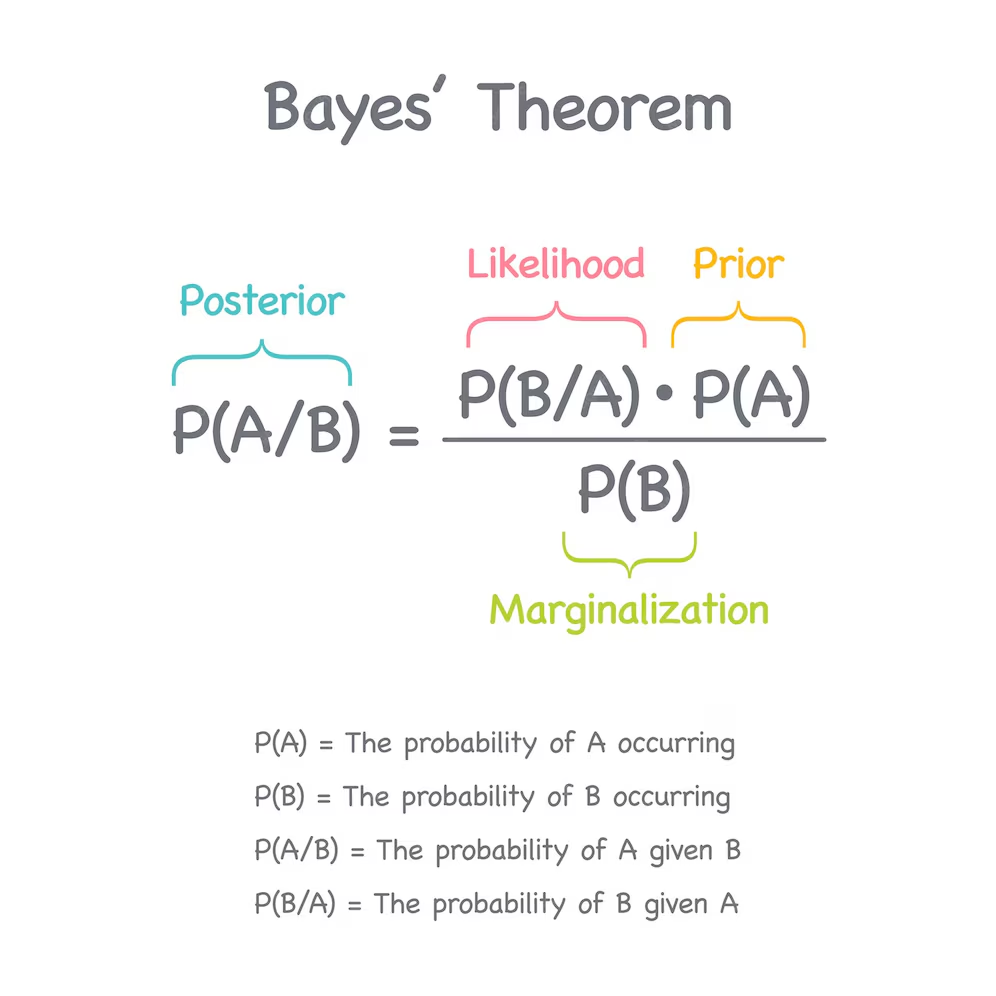

\[
P(A|B) = \frac{P(B|A) \cdot P(A)}{P(B)}
\]

Where:  
- \(P(A|B)\) → Probability of A given B (posterior)  
- \(P(B|A)\) → Probability of B given A (likelihood)  
- \(P(A)\) → Prior probability of A  
- \(P(B)\) → Marginal probability of B  

---

proof Bayes Theoram

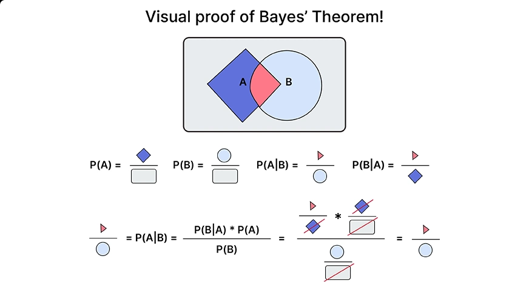

## 🧠 Intuition
Bayes’ Theorem lets you **update your beliefs** when new evidence arrives.  

- **Prior:** What you believed before seeing evidence.  
- **Likelihood:** How consistent the evidence is with your hypothesis.  
- **Posterior:** Updated belief after considering the evidence.  

---

The word **posterior** in probability and statistics refers to the **updated probability of an event after considering new evidence**.  

---

## 📊 Formal Meaning
In **Bayesian statistics**:

\[
P(A|B) \quad \text{is called the posterior probability}
\]

- **Prior** (\(P(A)\)) → your belief about event A before seeing evidence.  
- **Likelihood** (\(P(B|A)\)) → how consistent the evidence B is if A were true.  
- **Posterior** (\(P(A|B)\)) → your new belief about A after incorporating evidence B.  

---

## 🧠 Intuition
Think of it as:  
- **Prior:** “I think there’s a 1% chance someone has the disease.”  
- **Evidence:** “The test result is positive.”  
- **Posterior:** “Given the positive test, I now update my belief — the chance is 16%.”  

So the **posterior** is the probability *after updating with evidence*.  

---

## 🎯 Everyday Analogy
Imagine you’re a detective:  
- **Prior belief:** You think suspect A is unlikely to be guilty.  
- **Evidence:** Fingerprints found at the crime scene.  
- **Posterior belief:** After considering the fingerprints, your belief in suspect A’s guilt increases.  

---

## 🎯 Example
Suppose:  
- 1% of people have a disease → \(P(Disease) = 0.01\).  
- Test is 95% accurate → \(P(Positive|Disease) = 0.95\).  
- False positive rate = 5% → \(P(Positive|NoDisease) = 0.05\).  

Now, if someone tests positive, what’s the chance they actually have the disease?

\[
P(Disease|Positive) = \frac{0.95 \cdot 0.01}{(0.95 \cdot 0.01) + (0.05 \cdot 0.99)}
\]

\[
= \frac{0.0095}{0.0095 + 0.0495} \approx 0.16
\]

So even with a positive test, the chance of having the disease is only **16%**, because the disease is rare.

---

## 🐍 Python Code (No Built‑ins)

```python
def bayes_theorem(prior_a, likelihood_b_given_a, prob_b):
    return (likelihood_b_given_a * prior_a) / prob_b

# Example: disease test
prior_disease = 0.01
likelihood_positive_given_disease = 0.95
prob_positive = (0.95 * 0.01) + (0.05 * 0.99)

posterior = bayes_theorem(prior_disease, likelihood_positive_given_disease, prob_positive)
print("P(Disease | Positive):", posterior)
```

---

## 🔎 Output
- **P(Disease | Positive) ≈ 0.16**  
Meaning: Even with a positive test, the probability is only 16% because the disease is rare.

---

## 🎯 Example
Conditional probability:
“Given a card is a face card, what’s the chance it’s red?” → direct calculation.

Bayes’ Theorem:
“Given a positive medical test, what’s the chance the person has the disease?”
Here, you don’t know  𝑃(𝐷𝑖𝑠𝑒𝑎𝑠𝑒∣𝑃𝑜𝑠𝑖𝑡𝑖𝑣𝑒) directly, but you know:
- Prior probability of disease
- Likelihood of a positive test if disease is present
- Probability of a positive test overall Bayes’ Theorem combines these to give the posterior probability.

# Independent Event and Mutually Exclusive Events

Let’s carefully distinguish **independent events** and **mutually exclusive events** — two concepts that often get confused but are actually very different.

---

## 🎲 Independent Events
- **Definition:** Two events are independent if the occurrence of one does **not affect** the probability of the other.  
- **Formula:**  
  \[
  P(A \cap B) = P(A) \cdot P(B)
  \]
- **Example:**  
  - Tossing a coin and rolling a die.  
    - Probability of heads = 0.5  
    - Probability of rolling a 4 = 1/6  
    - Probability of both = \(0.5 \times \frac{1}{6} = \frac{1}{12}\).  
  The coin toss doesn’t influence the die roll → independent.

---

## 🚫 Mutually Exclusive Events
- **Definition:** Two events are mutually exclusive if they **cannot happen at the same time**.  
- **Formula:**  
  \[
  P(A \cap B) = 0
  \]
- **Example:**  
  - Drawing a single card:  
    - Event A = card is a heart  
    - Event B = card is a spade  
    - You can’t draw one card that is both a heart and a spade → mutually exclusive.

---

## 🔑 Key Difference
| Aspect | Independent Events | Mutually Exclusive Events |
|--------|--------------------|---------------------------|
| Relationship | One event does not affect the other | Events cannot occur together |
| Formula | \(P(A \cap B) = P(A) \cdot P(B)\) | \(P(A \cap B) = 0\) |
| Example | Coin toss & die roll | Drawing a heart vs spade in one card |

---

## 🧠 Intuition
- **Independent:** Events can both happen, but they don’t influence each other.  
- **Mutually exclusive:** Events cannot both happen at all.  

👉 Important: Mutually exclusive events are **not independent** (except in trivial cases). If two events can’t occur together, knowing one occurred completely determines the other didn’t — so they are dependent.

---

# Law Of Total Probability

The **Law of Total Probability** is a fundamental rule in probability theory that helps you compute the probability of an event by breaking it down across all possible scenarios (or partitions of the sample space).  

---

## 📊 Formal Definition
Suppose the sample space is divided into mutually exclusive and exhaustive events \(B_1, B_2, \dots, B_n\).  
Then for any event \(A\):

\[
P(A) = \sum_{i=1}^{n} P(A|B_i) \cdot P(B_i)
\]

- \(B_1, B_2, \dots, B_n\) → a complete set of scenarios (they cover all possibilities and don’t overlap).  
- \(P(A|B_i)\) → probability of \(A\) given scenario \(B_i\).  
- \(P(B_i)\) → probability of scenario \(B_i\).  

---

## 🧠 Intuition
It says: *“To find the probability of A, consider all the different ways A can happen, weighted by how likely each scenario is.”*  

Think of it as **assembling the whole probability from its parts**.

---

## 🎯 Example: Medical Test
- Population split:  
  - 1% have the disease (\(B_1\))  
  - 99% don’t have the disease (\(B_2\))  

- Probability of a positive test:  
  - If diseased: \(P(Positive|B_1) = 0.95\)  
  - If healthy: \(P(Positive|B_2) = 0.05\)  

By the law of total probability:

\[
P(Positive) = P(Positive|Disease) \cdot P(Disease) + P(Positive|NoDisease) \cdot P(NoDisease)
\]

\[
= (0.95 \cdot 0.01) + (0.05 \cdot 0.99) = 0.059
\]

So overall, **5.9% of tests are positive**.

---

## 🔑 Why It Matters
- It’s the **foundation for Bayes’ Theorem** (since Bayes needs \(P(B)\), which often comes from this law).  
- Used in risk analysis, machine learning, and decision theory.  
- Helps when probabilities are easier to compute in parts than directly.  

---

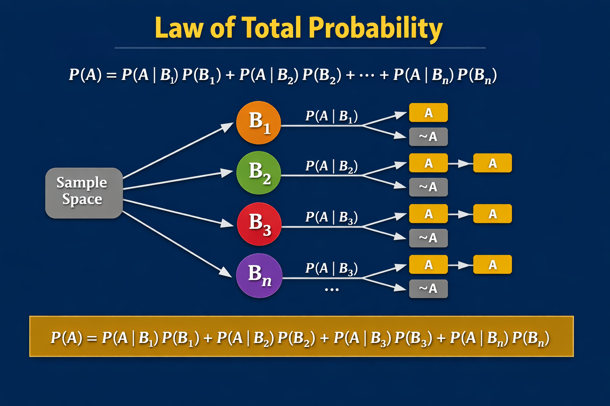

Here’s the diagram you asked for — it shows the **Law of Total Probability** visually, with the sample space split into partitions \(B_1, B_2, B_3, \dots, B_n\), and each branch leading to outcomes \(A\) or \(\neg A\). At the bottom, the formula is summarized as the weighted sum of all scenarios.  

---

## 🧠 How to Read This Diagram
- The **sample space** is divided into mutually exclusive events \(B_1, B_2, B_3, \dots, B_n\).  
- From each partition, you branch into two outcomes: \(A\) (event happens) or \(\neg A\) (event does not happen).  
- Each branch has a conditional probability \(P(A|B_i)\) or \(P(\neg A|B_i)\).  
- To get the total probability of \(A\), you **add up all the weighted contributions**:  
  \[
  P(A) = P(A|B_1)P(B_1) + P(A|B_2)P(B_2) + \dots + P(A|B_n)P(B_n)
  \]

---

Here’s how **Bayes’ Theorem** connects directly to the **Law of Total Probability** — they’re two sides of the same reasoning process.

---

## 🔗 Relationship Between the Two

Bayes’ Theorem:
\[
P(A|B) = \frac{P(B|A) \cdot P(A)}{P(B)}
\]

But notice that \(P(B)\) — the denominator — is often **hard to compute directly**.  
That’s where the **Law of Total Probability** comes in:

\[
P(B) = \sum_{i=1}^{n} P(B|A_i) \cdot P(A_i)
\]

So Bayes’ Theorem actually *depends* on the Law of Total Probability to find \(P(B)\).  
It’s like the law provides the “normalizing factor” that makes all probabilities add up correctly.

---

## 🧠 Intuitive Connection
Imagine you’re diagnosing a disease based on a test result:
- You want \(P(Disease|Positive)\) → Bayes’ Theorem.
- But to compute it, you need \(P(Positive)\) → Law of Total Probability.

You calculate \(P(Positive)\) by considering **all possible causes** of a positive result:
- Positive because of disease  
- Positive because of false alarm  

Then plug that into Bayes’ formula to get the **posterior probability**.

---

## 🎯 Summary
| Concept | Purpose | Formula |
|----------|----------|----------|
| **Law of Total Probability** | Breaks down overall probability into parts | \(P(B) = \sum P(B|A_i)P(A_i)\) |
| **Bayes’ Theorem** | Updates belief using evidence | \(P(A|B) = \frac{P(B|A)P(A)}{P(B)}\) |

Together, they form the backbone of **statistical inference** — one decomposes probabilities, the other reverses and updates them.

---

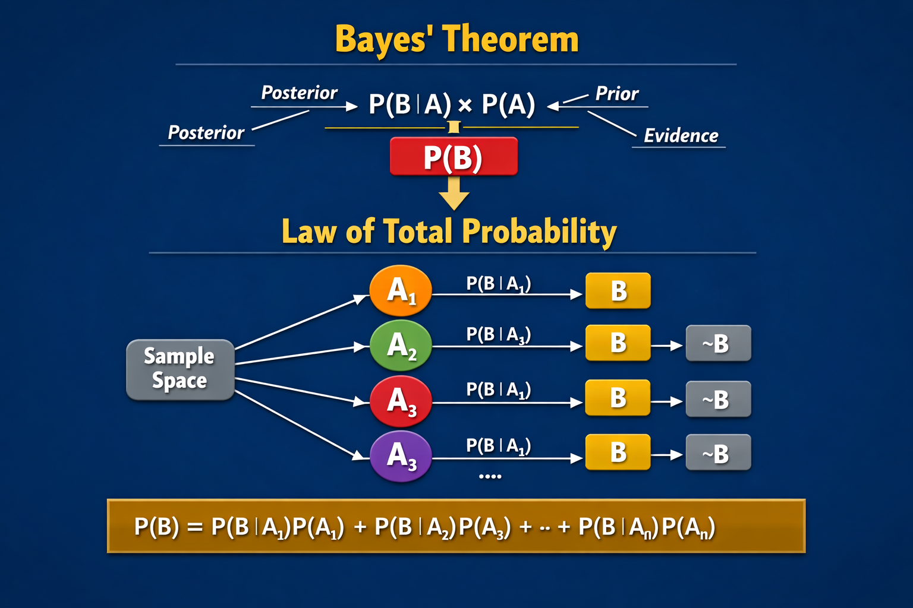

Here’s the combined visual you asked for — it shows how **Bayes’ Theorem** and the **Law of Total Probability** fit together beautifully.  

At the top, Bayes’ Theorem highlights the four components:  
- **Prior** (\(P(A)\)) — your initial belief  
- **Likelihood** (\(P(B|A)\)) — how consistent the evidence is with that belief  
- **Evidence** (\(P(B)\)) — the overall probability of observing the evidence  
- **Posterior** (\(P(A|B)\)) — your updated belief after seeing the evidence  

Then, the lower section illustrates how the **Law of Total Probability** expands \(P(B)\) into all possible causes or partitions (\(A_1, A_2, A_3, \dots, A_n\)).  

So, the law provides the denominator for Bayes’ Theorem — the “normalizing” term that ensures all probabilities sum to 1.  

In short:  
- **Law of Total Probability** → breaks down evidence across all scenarios.  
- **Bayes’ Theorem** → uses that breakdown to update beliefs rationally.  

# What is Center Limit Theory

The **Central Limit Theorem (CLT)** is one of the most powerful and beautiful results in statistics — it explains *why so many real‑world phenomena follow a normal (bell‑shaped) distribution*, even when the underlying data doesn’t.

---

## 📊 Formal Statement
If you take **many independent random samples** from any population (with finite mean and variance), then as the sample size \(n\) grows large:

\[
\text{The distribution of the sample mean } \bar{X} \text{ approaches a normal distribution.}
\]

Mathematically:

\[
\bar{X} \sim N\left(\mu, \frac{\sigma^2}{n}\right)
\]

Where:  
- \(\mu\) = population mean  
- \(\sigma^2\) = population variance  
- \(n\) = sample size  

---

## 🧠 Intuition
Imagine drawing repeated samples from any population — even one that’s skewed or irregular (like income, rainfall, or reaction time).  
Each sample has a mean.  
If you plot those means, the shape of that plot becomes **bell‑shaped** as \(n\) increases.

So, the CLT says: *“No matter what the original distribution looks like, the averages of large samples will behave normally.”*

---

## 🎯 Why It Matters
- It allows us to use **normal‑distribution methods** (z‑scores, confidence intervals, hypothesis tests) even when the population isn’t normal.  
- It’s the foundation of **inferential statistics** — the reason we can make predictions and decisions from sample data.  

---

## 🧩 Example
Suppose you measure the daily number of website visits (which might be skewed).  
If you take 100‑day samples and compute their average visits, those averages will form a nearly normal curve — centered around the true mean visits per day.

---

## 🔑 Key Takeaway
- The CLT connects randomness to order.  
- It explains why the **normal distribution** appears everywhere — in heights, test scores, errors, and averages.  

---

Here’s a visual way to understand the **Central Limit Theorem (CLT)**:

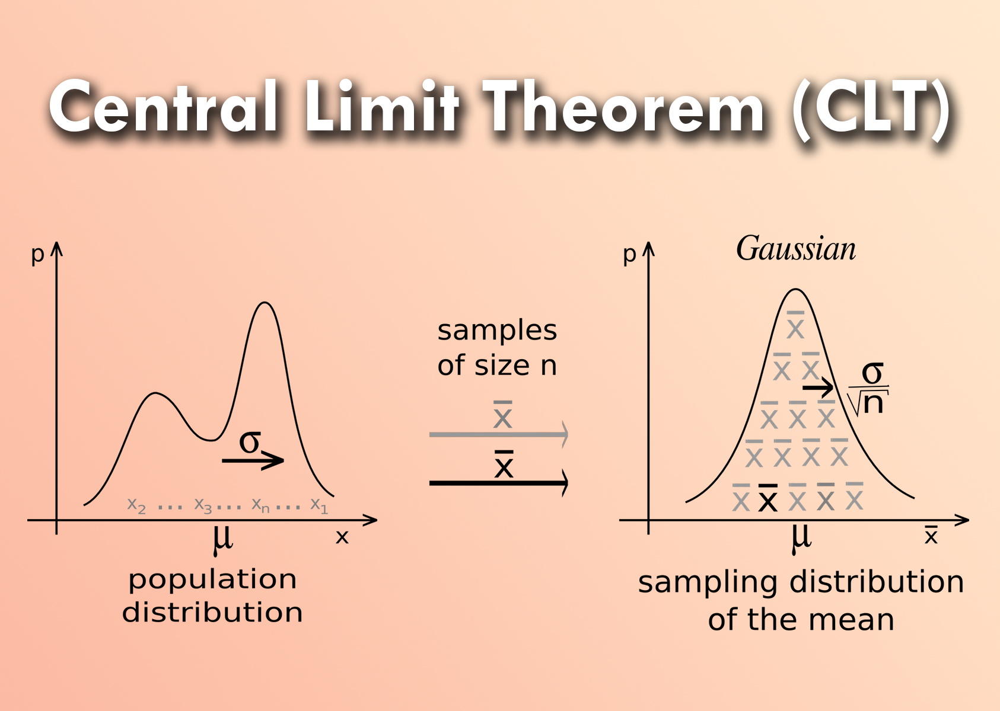

Imagine you start with a population that is **not normal** — maybe it’s skewed, like income distribution or daily website visits.  

- 🎲 **Step 1:** Take a small sample (say, 5 observations) and compute its mean. Do this many times. The distribution of those means looks irregular.  
- 🎲 **Step 2:** Increase the sample size (say, 30 observations each). Now the distribution of sample means starts to smooth out.  
- 🎲 **Step 3:** With large samples (say, 100+ observations), the distribution of sample means becomes **bell‑shaped (normal)**, centered around the true population mean.  

So the CLT shows that **averages of samples tend toward a normal distribution**, no matter how the original data looks — as long as the population has a finite mean and variance.

---

## 🔑 Why This Is Powerful
- It explains why the **normal distribution** appears everywhere in statistics.  
- It allows us to use z‑scores, confidence intervals, and hypothesis tests even when the raw data isn’t normal.  
- It’s the backbone of inferential statistics — turning messy real‑world data into something predictable.

---

# Hypothesis and Hypothesis Testing

A **hypothesis** is essentially an **educated assumption or statement** about a population or process that you want to test using data. It’s the starting point of statistical inference.  

---

## 📊 Formal Meaning
In statistics, a hypothesis is a claim about a population parameter (like mean, proportion, variance).  
We usually set up two competing hypotheses:

- **Null hypothesis (\(H_0\))** → the default assumption, e.g., “There is no effect” or “The mean is equal to 50.”  
- **Alternative hypothesis (\(H_1\))** → the competing claim, e.g., “There is an effect” or “The mean is not equal to 50.”  

---

## 🧠 Intuition
Think of a hypothesis as a **statement you want to check against evidence**:
- In science: “This drug reduces blood pressure.”  
- In business: “Customers prefer option A over option B.”  
- In machine learning: “Feature X improves prediction accuracy.”  

You then collect data and use statistical tests to decide whether the evidence supports or rejects the hypothesis.

---

## 🎯 Example
Suppose a company claims their light bulbs last **1000 hours on average**.  
- \(H_0\): Mean lifespan = 1000 hours (company’s claim).  
- \(H_1\): Mean lifespan ≠ 1000 hours (challenging the claim).  

You test a sample of bulbs, calculate statistics, and decide whether the data supports rejecting \(H_0\).

---

## 🔑 Key Takeaway
- A **hypothesis** is a testable statement about reality.  
- Statistics provides tools (like p‑values, confidence intervals, and test statistics) to evaluate whether data supports or contradicts it.  

---

| Aspect | **Null Hypothesis (**$H_0$**)** | **Alternative Hypothesis (**$H_1$**)** |
| --- | --- | --- |
| Meaning | Default assumption; “no effect” or “no difference” | Competing claim; “there is an effect” or “there is a difference” |
| Purpose | Provides a baseline to test against | Represents what you want to prove or detect |
| Example (Light bulb lifespan) | $H_0$: Mean lifespan = 1000 hours | $H_1$: Mean lifespan ≠ 1000 hours |
| Example (New drug) | $H_0$: Drug has no effect on blood pressure | $H_1$: Drug lowers blood pressure |
| Relationship | Always tested first; assumed true until evidence suggests otherwise | Accepted if evidence strongly contradicts $H_0$ |
| Decision | “Fail to reject $H_0$” if data doesn’t show strong evidence | “Reject $H_0$” in favor of $H_1$ if data supports it |

## Hypothesis Testing
Yes — **hypothesis testing** is a formal statistical procedure used to decide whether data provides enough evidence to reject a hypothesis. It’s the practical application of the null and alternative hypotheses we just discussed.  

---

## 📊 What Hypothesis Testing Is
Hypothesis testing is a **decision-making framework**:
1. **Formulate hypotheses**  
   - Null hypothesis (\(H_0\)): the default claim (no effect, no difference).  
   - Alternative hypothesis (\(H_1\)): the challenger (there is an effect or difference).  

2. **Collect data**  
   - Gather a sample from the population.  

3. **Compute a test statistic**  
   - A number that measures how far the sample result is from what \(H_0\) predicts.  
   - Examples: z‑score, t‑statistic, chi‑square statistic.  

4. **Find the p‑value**  
   - The probability of seeing data this extreme if \(H_0\) were true.  

5. **Make a decision**  
   - If p‑value < significance level (e.g., 0.05), reject \(H_0\).  
   - Otherwise, fail to reject \(H_0\).  

---

## 🧠 Intuition
It’s like a courtroom trial:  
- \(H_0\) = “The defendant is innocent.”  
- Evidence (data) is presented.  
- If the evidence is strong enough, you reject innocence (reject \(H_0\)) in favor of guilt (\(H_1\)).  
- If not, you keep the default assumption (fail to reject \(H_0\)).  

---

## 🎯 Example
A company claims their bulbs last **1000 hours**.  
- \(H_0\): Mean lifespan = 1000 hours.  
- \(H_1\): Mean lifespan ≠ 1000 hours.  
You test 50 bulbs, compute the sample mean and standard deviation, run a t‑test, and check the p‑value.  
- If p < 0.05 → reject \(H_0\) (the claim is false).  
- If p ≥ 0.05 → fail to reject \(H_0\) (no strong evidence against the claim).  

---

# Null Hypothesis Vs Alternative Hypothesis 

**Null Hypothesis (\(H_0\))** and **Alternative Hypothesis (\(H_1\))**, two pillars of hypothesis testing.  

---

## 🎯 1. **Null Hypothesis (\(H_0\))**
- **Definition:** The default assumption — there is *no effect*, *no difference*, or *no relationship*.  
- **Purpose:** It represents the status quo or baseline claim you test against.  
- **Example:**  
  - A company claims their bulbs last 1000 hours.  
    \[
    H_0: \mu = 1000
    \]
  - Meaning: The average lifespan is 1000 hours (no change).  

---

## ⚡ 2. **Alternative Hypothesis (\(H_1\) or \(H_a\))**
- **Definition:** The competing claim — there *is* an effect, difference, or relationship.  
- **Purpose:** It’s what you want to prove or find evidence for.  
- **Example:**  
  - You suspect the bulbs last less than 1000 hours.  
    \[
    H_1: \mu < 1000
    \]
  - Meaning: The average lifespan is less than 1000 hours.  

---

## 🧠 Types of Alternative Hypotheses
| Type | Symbolic Form | Example | Meaning |
|------|----------------|----------|----------|
| **Two-tailed** | \(H_1: \mu \neq \mu_0\) | \(H_1: \mu \neq 1000\) | Tests for any difference (higher or lower). |
| **Left-tailed** | \(H_1: \mu < \mu_0\) | \(H_1: \mu < 1000\) | Tests if mean is smaller. |
| **Right-tailed** | \(H_1: \mu > \mu_0\) | \(H_1: \mu > 1000\) | Tests if mean is larger. |

---

## 🧩 Decision Logic
1. Assume \(H_0\) is true.  
2. Collect data and compute a test statistic.  
3. If evidence (p‑value) is strong enough → **Reject \(H_0\)** in favor of \(H_1\).  
4. If not → **Fail to reject \(H_0\)** (no strong evidence against it).  

---

## 🔑 Key Takeaway
- \(H_0\): “Nothing unusual is happening.”  
- \(H_1\): “Something has changed.”  
- Hypothesis testing is about deciding which statement the data supports.  

---

# Likelihood

**Likelihood** in probability and statistics refers to how **probable the observed evidence is, given a particular hypothesis or parameter value**.  

---

## 📊 Formal Meaning
If you have data \(D\) and a hypothesis/parameter \(\theta\), the likelihood is:

\[
L(\theta | D) = P(D | \theta)
\]

- \(P(D|\theta)\) → the probability of observing the data \(D\) if the hypothesis \(\theta\) were true.  
- Notice: likelihood is not the same as probability of the hypothesis itself — it’s the probability of the **data given the hypothesis**.

---

## 🧠 Intuition
- **Probability:** “If the coin is fair, what’s the chance of getting 3 heads in 5 flips?”  
- **Likelihood:** “Given I observed 3 heads in 5 flips, how likely is it that the coin is fair?”  

So probability predicts outcomes, while likelihood evaluates hypotheses against observed outcomes.

---

## 🎯 Example
Suppose you flip a coin 10 times and get 7 heads.  
- Hypothesis 1: Coin is fair (\(\theta = 0.5\)).  
- Hypothesis 2: Coin is biased (\(\theta = 0.7\)).  

The likelihood compares:  
\[
L(0.5|Data) = P(7 \text{ heads} | \theta=0.5)
\]  
\[
L(0.7|Data) = P(7 \text{ heads} | \theta=0.7)
\]  

Whichever hypothesis gives a higher likelihood is more consistent with the observed data.

---

## 🔑 Role in Bayes’ Theorem
In Bayesian inference:  
- **Prior** = belief before evidence.  
- **Likelihood** = how well the evidence fits the hypothesis.  
- **Posterior** = updated belief after combining prior and likelihood.  

---

# Probability Distribution

A **Probability Distribution** is a mathematical function that describes how probabilities are assigned to different possible outcomes of a random variable. It tells you *how likely each outcome is*.

---

## 📊 Types of Probability Distributions

### 1. **Discrete Probability Distribution**
- Deals with variables that take **specific values** (like counts).
- Examples:
  - **Binomial distribution** → number of successes in repeated trials.
  - **Poisson distribution** → number of events in a fixed time/space.
- Represented by a **probability mass function (PMF)**.

\[
P(X = x) = f(x)
\]

---

### 2. **Continuous Probability Distribution**
- Deals with variables that can take **any value in a range**.
- Examples:
  - **Normal (Gaussian) distribution** → bell curve.
  - **Exponential distribution** → time between events.
- Represented by a **probability density function (PDF)**.

\[
P(a \leq X \leq b) = \int_a^b f(x) \, dx
\]

---

## 🧠 Intuition
Think of a probability distribution as a **map of uncertainty**:
- For discrete variables → it’s like a bar chart of probabilities.  
- For continuous variables → it’s like a smooth curve showing density.  

---

## 🎯 Real-Life Examples
- Rolling a die → discrete uniform distribution (each face has probability \(1/6\)).  
- Heights of people → approximately normal distribution.  
- Number of customer arrivals per hour → Poisson distribution.  

---

| Distribution | Type | Formula / PMF/PDF | Typical Use Case |
| --- | --- | --- | --- |
| **Bernoulli** | Discrete | $P(X=1)=p,\\; P(X=0)=1-p$ | Single trial with success/failure (coin flip, yes/no outcome). |
| **Binomial** | Discrete | $P(X=k)=\\binom{n}{k}p^k(1-p)^{n-k}$ | Number of successes in $n$ independent Bernoulli trials (e.g., 10 coin flips). |
| **Poisson** | Discrete | $P(X=k)=\\frac{\\lambda^k e^{-\\lambda}}{k!}$ | Count of events in fixed time/space (e.g., arrivals per hour, emails per day). |
| **Normal (Gaussian)** | Continuous | $f(x)=\\frac{1}{\\sigma\\sqrt{2\\pi}} e^{-\\frac{(x-\\mu)^2}{2\\sigma^2}}$ | Natural phenomena: heights, test scores, measurement errors. |
| **Uniform** | Continuous | $f(x)=\\frac{1}{b-a},\\; a \\leq x \\leq b$ | Equal probability for all values in an interval (random number generator). |
| **Exponential** | Continuous | $f(x)=\\lambda e^{-\\lambda x},\\; x \\geq 0$ | Time until next event (waiting times, reliability analysis). |


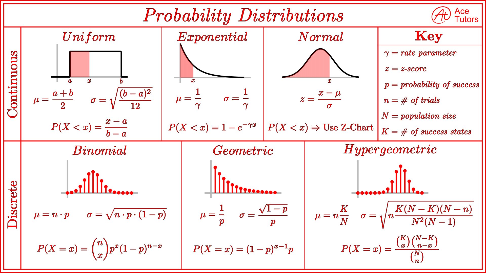

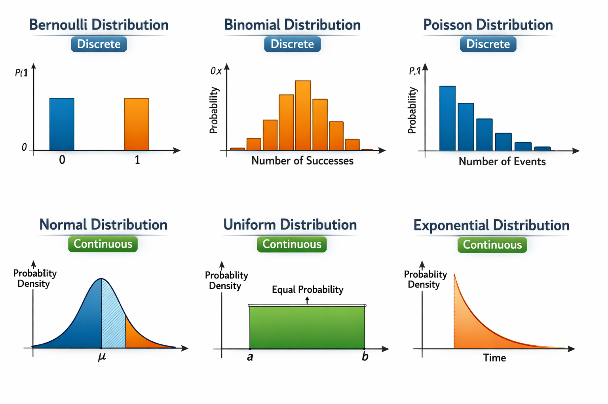

Here’s the visualization you asked for — it shows **both distribution types (Discrete vs Continuous)** along with **plotting examples** for each of the six key probability distributions.  

🔹 **Top row (Discrete distributions):**  
- **Bernoulli** → two bars (0 and 1 outcomes).  
- **Binomial** → bar chart shaped like a small bell (success counts).  
- **Poisson** → bars decreasing as event counts increase.  

🔹 **Bottom row (Continuous distributions):**  
- **Normal** → bell curve centered at mean.  
- **Uniform** → flat rectangle (equal probability across interval).  
- **Exponential** → curve starting high and decaying quickly.  

## 🧠 Intuition
- **Bernoulli** → one coin flip.  
- **Binomial** → many coin flips.  
- **Poisson** → how many arrivals happen in a fixed time.  
- **Normal** → the bell curve, averages and natural variation.  
- **Uniform** → everything equally likely.  
- **Exponential** → waiting time until the next event.  

---

## 🎯 Quick Real-Life Examples
- Bernoulli: Did the machine fail today? (Yes/No)  
- Binomial: How many machines fail in a week?  
- Poisson: How many calls arrive at a call center per hour?  
- Normal: Distribution of exam scores in a class.  
- Uniform: Randomly picking a number between 1 and 10.  
- Exponential: Time until the next customer arrives.  

---

## 1. 🎲 **Bernoulli Distribution**
- **Type:** Discrete  
- **Formula (PMF):**  
  \[
  P(X=1)=p,\quad P(X=0)=1-p
  \]  
- **Meaning:** Models a single trial with two outcomes: success (1) or failure (0).  
- **Example:** Tossing a coin once (success = heads).  

---

## 2. 🎯 **Binomial Distribution**
- **Type:** Discrete  
- **Formula (PMF):**  
  \[
  P(X=k)=\binom{n}{k}p^k(1-p)^{n-k}
  \]  
- **Meaning:** Number of successes in \(n\) independent Bernoulli trials.  
- **Example:** Number of heads in 10 coin flips.  

---

## 3. 📞 **Poisson Distribution**
- **Type:** Discrete  
- **Formula (PMF):**  
  \[
  P(X=k)=\frac{\lambda^k e^{-\lambda}}{k!}
  \]  
- **Meaning:** Models the count of events in a fixed interval (time/space), when events occur independently at a constant average rate.  
- **Example:** Number of customer calls per hour at a call center.  

---

## 4. 🔔 **Normal (Gaussian) Distribution**
- **Type:** Continuous  
- **Formula (PDF):**  
  \[
  f(x)=\frac{1}{\sigma\sqrt{2\pi}} e^{-\frac{(x-\mu)^2}{2\sigma^2}}
  \]  
- **Meaning:** Bell‑shaped curve, symmetric around mean \(\mu\). Spread determined by \(\sigma\).  
- **Example:** Human heights, exam scores, measurement errors.  

---

## 5. 📏 **Uniform Distribution**
- **Type:** Continuous  
- **Formula (PDF):**  
  \[
  f(x)=\frac{1}{b-a},\quad a \leq x \leq b
  \]  
- **Meaning:** Every value in the interval \([a,b]\) is equally likely.  
- **Example:** Random number generator between 1 and 10.  

---

## 6. ⏳ **Exponential Distribution**
- **Type:** Continuous  
- **Formula (PDF):**  
  \[
  f(x)=\lambda e^{-\lambda x},\quad x \geq 0
  \]  
- **Meaning:** Models the time until the next event occurs, given events happen at a constant rate.  
- **Example:** Waiting time until the next bus arrives.  

---

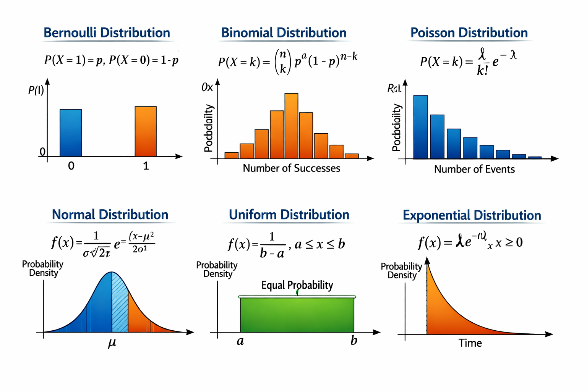

## 🔑 Big Picture
- **Bernoulli** → one trial (yes/no).  
- **Binomial** → many trials (count successes).  
- **Poisson** → count events in time/space.  
- **Normal** → bell curve, natural variation.  
- **Uniform** → equal chance for all values.  
- **Exponential** → waiting time until next event.  

# PDF and PMF

**PMF** and **PDF** are two fundamental ways to describe how probabilities are distributed, depending on whether the random variable is **discrete** or **continuous**.  

---

## 🎲 **PMF — Probability Mass Function**
- **Used for:** **Discrete** random variables (those that take specific, countable values).  
- **Definition:** 

  \[
  P(X = x) = f(x)
  \]
  It gives the probability that the random variable \(X\) takes the exact value \(x\).  
- **Properties:** 

  - \(0 \leq P(X=x) \leq 1\)  
  - \(\sum_x P(X=x) = 1\)  
- **Example:**  
  For a fair die,  
  \[
  P(X=x) = \frac{1}{6}, \quad x = 1,2,3,4,5,6
  \]

  Each outcome has equal probability.  

---

## 📈 **PDF — Probability Density Function**
- **Used for:** **Continuous** random variables (those that can take any value in a range).  
- **Definition:**  
  \[
  f(x) = \frac{d}{dx}P(X \leq x)
  \]
  It describes the *density* of probability at each point, not the probability itself.  
- **Properties:**  
  - \(f(x) \geq 0\)  
  - \(\int_{-\infty}^{\infty} f(x)\,dx = 1\)  
- **Example:**  
  For a normal distribution,  
  \[
  f(x) = \frac{1}{\sigma\sqrt{2\pi}} e^{-\frac{(x-\mu)^2}{2\sigma^2}}
  \]
  The area under the curve between two points gives the probability that \(X\) lies in that interval.  

---

## 🧠 Key Difference

| Feature | PMF | PDF |
|----------|-----|-----|
| Variable type | Discrete | Continuous |
| Gives | Probability of exact value | Probability density (area gives probability) |
| Sum/Integral | Sum of probabilities = 1 | Integral of density = 1 |
| Example | Coin toss, dice roll | Height, weight, temperature |

---

👉 In short:  
- **PMF** → “Probability at a point.”  
- **PDF** → “Probability density across a range.”  

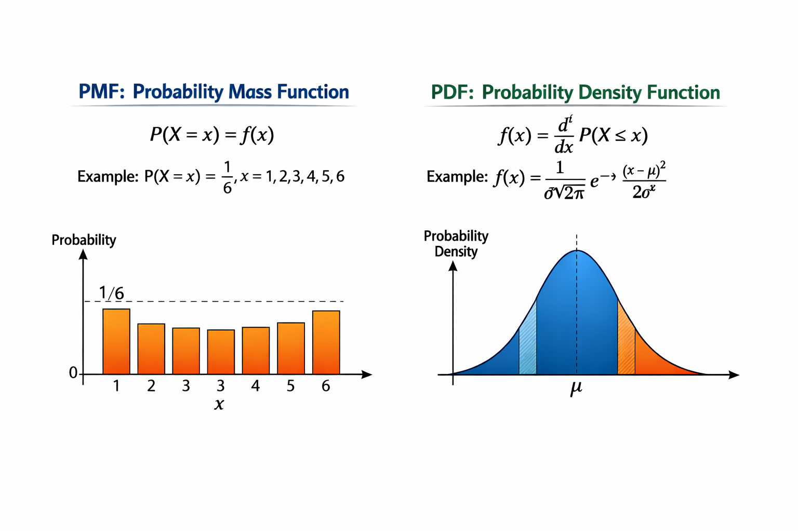

# Hypothesis Testing

### 🎯 What is Hypothesis Testing?
Hypothesis testing is a statistical method used to make decisions about a population based on sample data.
It helps us decide whether to accept or reject a claim (hypothesis) about the population.

| Test | Used For | Key Formula / Concept | Typical Conditions |
| --- | --- | --- | --- |
| **Z‑Test** | Tests population mean when **population variance (σ²)** is known and sample size is large ($n > 30$). | $Z = \\frac{\\bar{X} - \\mu}{\\sigma / \\sqrt{n}}$ | Normal distribution, known σ. |
| **T‑Test** | Tests population mean when **σ is unknown** and sample size is small ($n < 30$). | $t = \\frac{\\bar{X} - \\mu}{s / \\sqrt{n}}$ | Student’s t‑distribution, unknown σ. |
| **P‑Value Test** | Not a separate test — it’s a **decision metric** used in all tests. | Compare p‑value with significance level (α). | If $p < α$, reject $H_0$. |
| **Chi‑Square Test (χ²)** | Tests relationships between **categorical variables** or goodness‑of‑fit. | $χ² = \\sum \\frac{(O - E)^2}{E}$ | Used for frequencies and independence. |
| **ANOVA (Analysis of Variance)** | Compares **means of 3 or more groups**. | Based on F‑statistic: $F = \\frac{\\text{Between‑group variance}}{\\text{Within‑group variance}}$ | Used when comparing multiple samples. |
| **F‑Test** | Compares **variances** of two populations. | $F = \\frac{s_1^2}{s_2^2}$ | Used before ANOVA or variance equality tests. |

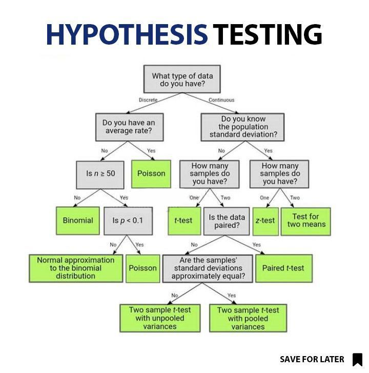


# **Parametric vs Non‑Parametric Tests**

---

## 📊 Parametric Tests
- **Definition:** Tests that assume the data follows a specific distribution (usually **Normal distribution**) and rely on parameters like mean (\(\mu\)) and variance (\(\sigma^2\)).  
- **Key Assumptions:**  
  - Data is normally distributed.  
  - Variances are equal (homoscedasticity).  
  - Observations are independent.  
- **Examples:**  
  - **Z‑Test** → mean comparison (large sample, known σ).  
  - **T‑Test** → mean comparison (small sample, unknown σ).  
  - **ANOVA (F‑Test)** → comparing means across 3+ groups.  
  - **Regression analysis** → testing relationships between variables.  
- **Advantages:** More powerful if assumptions hold.  
- **Limitations:** Misleading if assumptions are violated.  

---

## 📈 Non‑Parametric Tests
- **Definition:** Tests that do **not assume a specific distribution**; they work on ranks, medians, or categorical data.  
- **Key Features:**  
  - Useful when data is skewed or not normal.  
  - Often based on **ordinal data** or ranks.  
- **Examples:**  
  - **Chi‑Square Test** → independence or goodness‑of‑fit for categorical data.  
  - **Mann‑Whitney U Test** → compare medians of two independent groups.  
  - **Wilcoxon Signed‑Rank Test** → compare paired samples.  
  - **Kruskal‑Wallis Test** → non‑parametric alternative to ANOVA.  
- **Advantages:** Robust, fewer assumptions.  
- **Limitations:** Less powerful than parametric tests if data is actually normal.  

---

## 🧩 Big Picture
| Category | Assumptions | Examples | Data Type |
|----------|-------------|----------|-----------|
| **Parametric** | Normal distribution, equal variance | Z‑Test, T‑Test, ANOVA, F‑Test | Continuous (interval/ratio) |
| **Non‑Parametric** | No distribution assumption | Chi‑Square, Mann‑Whitney, Wilcoxon, Kruskal‑Wallis | Ordinal, categorical, skewed continuous |

---

## 🔑 Takeaway
- Use **parametric tests** when assumptions about normality and variance hold → more statistical power.  
- Use **non‑parametric tests** when data is categorical, ordinal, or violates parametric assumptions → more robust.  

---

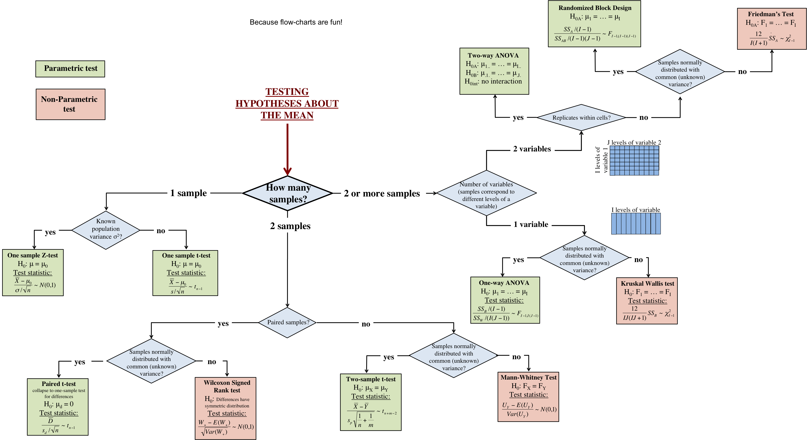

# Random Variable VS Discrete Random Variable

## 🎲 Random Variable
- **Definition:** A random variable is a function that assigns numerical values to the outcomes of a random experiment.  
- **Types:**  
  1. **Discrete Random Variable** → takes countable values (like integers).  
  2. **Continuous Random Variable** → takes values from an interval (uncountably infinite).  

Think of it as a bridge between the **random experiment** (like tossing a die) and the **mathematical world** (numbers we can analyze).  

---

## 🔢 Discrete Random Variable
- **Definition:** A random variable that can take only **finite or countably infinite values**.  
- **Probability described by:** **PMF (Probability Mass Function)**.  
- **Examples:**  
  - Rolling a die → outcomes {1,2,3,4,5,6}.  
  - Number of heads in 10 coin flips → values {0,1,2,…,10}.  
  - Number of customer arrivals in an hour (Poisson).  

### Formula (PMF):  
\[
P(X=x) = f(x), \quad \sum_x P(X=x) = 1
\]  

---

## 📈 Continuous Random Variable
- **Definition:** A random variable that can take **any value in a continuous range**.  
- **Probability described by:** **PDF (Probability Density Function)**.  
- **Examples:**  
  - Height of students.  
  - Time taken for a bus to arrive.  
  - Temperature readings.  

### Formula (PDF):  
\[
P(a \leq X \leq b) = \int_a^b f(x)\,dx
\]  

---

## 🧩 Big Picture
| Type | Values | Probability Function | Example |
|------|--------|----------------------|---------|
| **Discrete RV** | Countable (finite or infinite) | PMF | Dice roll, coin flips |
| **Continuous RV** | Any value in interval | PDF | Height, time, weight |

---

👉 In short:  
- **Random Variable** = numerical representation of experiment outcomes.  
- **Discrete Random Variable** = countable outcomes (uses PMF).  
- **Continuous Random Variable** = uncountable outcomes (uses PDF). 
---

## 🎲 Types of Random Variables
Random variables are classified based on the kind of values they can take:

1. **Discrete Random Variable**  
   - Takes **countable values** (finite or infinite).  
   - Probability described by **PMF (Probability Mass Function)**.  
   - Examples: Dice roll, number of heads in coin flips, number of arrivals in an hour.  

2. **Continuous Random Variable**  
   - Takes **uncountably infinite values** within an interval.  
   - Probability described by **PDF (Probability Density Function)**.  
   - Examples: Height, weight, time, temperature.  

---

## 🔢 Types of Discrete Random Variables
Within discrete random variables, we have several important distributions:

1. **Bernoulli Random Variable**  
   - Two outcomes: success (1) or failure (0).  
   - Example: Coin toss.  

2. **Binomial Random Variable**  
   - Number of successes in \(n\) Bernoulli trials.  
   - Example: Number of heads in 10 coin flips.  

3. **Poisson Random Variable**  
   - Counts number of events in a fixed interval (time/space).  
   - Example: Number of calls arriving per hour.  

4. **Discrete Uniform Random Variable**  
   - All outcomes equally likely.  
   - Example: Rolling a fair die (\(P(X=x)=1/6\)).  

---

## 🧩 Big Picture
| Category | Random Variable Type | Distribution Examples |
|----------|----------------------|-----------------------|
| **Discrete** | Countable outcomes | Bernoulli, Binomial, Poisson, Discrete Uniform |
| **Continuous** | Any value in interval | Normal, Exponential, Continuous Uniform |

# Central Limit Theoram

The **Central Limit Theorem (CLT)** is one of the most important results in statistics — it explains why the **Normal distribution** shows up everywhere.  

---

## 🎯 Statement of CLT
The Central Limit Theorem says:  
- If you take **many independent random samples** from any population (with finite mean and variance),  
- And compute their **sample means**,  
- Then as the sample size \(n\) grows large, the distribution of those sample means will **approximate a Normal distribution**, regardless of the population’s original distribution.  

---

## 🧩 Formal Expression
Let \(X_1, X_2, \dots, X_n\) be i.i.d. random variables with mean \(\mu\) and variance \(\sigma^2\).  
Define the sample mean:  
\[
\bar{X} = \frac{1}{n}\sum_{i=1}^n X_i
\]  

Then, as \(n \to \infty\):  
\[
\frac{\bar{X} - \mu}{\sigma / \sqrt{n}} \;\;\to\;\; N(0,1)
\]  
That is, the standardized sample mean converges to the **Standard Normal distribution**.  

---

## 📊 Why It Matters
- **Foundation of hypothesis testing**: Z‑tests, t‑tests, confidence intervals rely on CLT.  
- **Practical use**: Even if data is skewed (like income, waiting times), the distribution of averages tends to be Normal.  
- **Real world**: Explains why measurement errors, exam scores, and sampling distributions often look bell‑shaped.  

---

## 🔑 Key Takeaway
- CLT bridges **any distribution → Normal distribution of sample means** (when \(n\) is large).  
- It’s the reason the Normal curve is so central in statistics.  

---

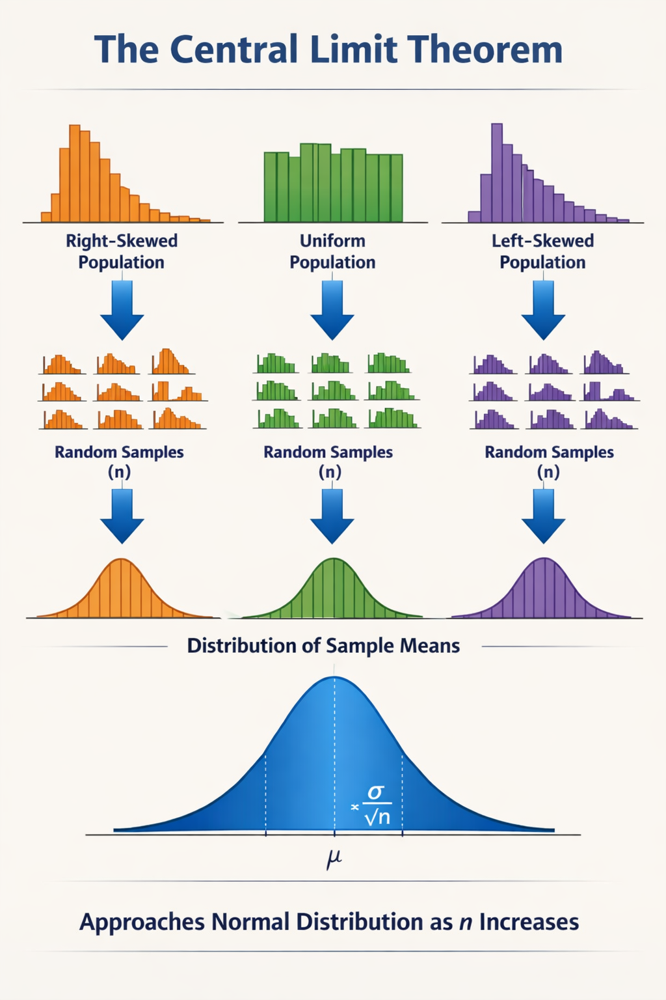


# 🎯 What Is a Confidence Interval?
A **Confidence Interval** gives a range of values that is likely to contain the **true population parameter** (like mean or proportion).  
It expresses **uncertainty** in estimation — instead of saying “the mean is 50,” we say “the mean is between 48 and 52 with 95% confidence.”  

---

## 🧩 Formula for Confidence Interval of Mean

### 1. **When population standard deviation (σ) is known (Z‑based CI):**
\[
\text{CI} = \bar{X} \pm Z_{\alpha/2} \cdot \frac{\sigma}{\sqrt{n}}
\]

### 2. **When σ is unknown (T‑based CI):**
\[
\text{CI} = \bar{X} \pm t_{\alpha/2,\,df} \cdot \frac{s}{\sqrt{n}}
\]

Where:  
- \(\bar{X}\) = sample mean  
- \(n\) = sample size  
- \(\sigma\) or \(s\) = population or sample standard deviation  
- \(Z_{\alpha/2}\) or \(t_{\alpha/2,df}\) = critical value from Z or t distribution  
- \(\alpha\) = significance level (e.g., 0.05 for 95% confidence)  

---

## 📊 Example
Suppose sample mean = 100, \(s = 10\), \(n = 25\), and confidence level = 95%.  
\[
t_{0.025,24} \approx 2.064
\]
\[
\text{CI} = 100 \pm 2.064 \cdot \frac{10}{\sqrt{25}} = 100 \pm 4.13
\]
So the **95% CI** is **(95.87, 104.13)**.  

Interpretation: We are 95% confident that the true population mean lies between 95.87 and 104.13.  

---

## 🔑 Key Insights
- **Higher confidence level → wider interval.**  
- **Larger sample size → narrower interval.**  
- **CI depends on variability and sample size.**  

---

## 🧠 Connection to CLT
The **Central Limit Theorem** ensures that the sampling distribution of the mean is approximately Normal, allowing us to use Z or t values to construct confidence intervals.  

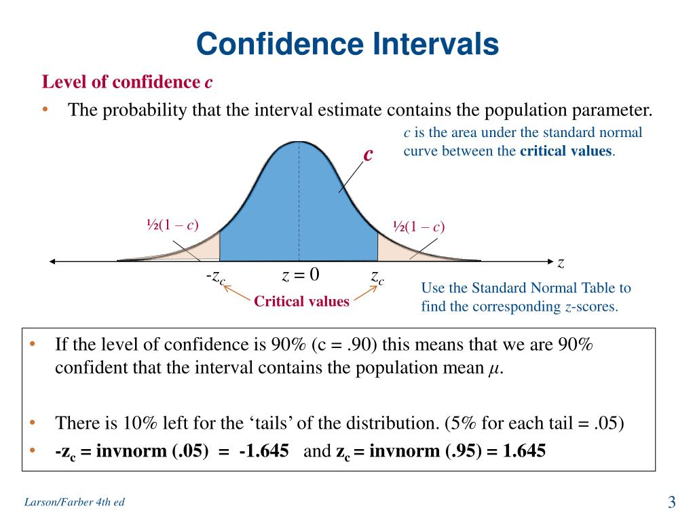

# Margin Of Error

**Margin of Error (MoE)** — it’s the companion concept to **Confidence Interval** and tells you how much your sample estimate might differ from the true population value.  

---

## 🎯 What Is Margin of Error?
The **Margin of Error** quantifies the **maximum expected difference** between the sample statistic (like sample mean or proportion) and the true population parameter.  
It defines the “plus‑minus” range around your estimate.  

Example:  
> A survey reports that 60% of people prefer product A, with a margin of error of ±3%.  
> This means the true proportion likely lies between **57% and 63%**.

---

## 🧩 Formula

### 1. **For Mean (Z‑based):**
\[
\text{MoE} = Z_{\alpha/2} \cdot \frac{\sigma}{\sqrt{n}}
\]

### 2. **For Mean (T‑based):**
\[
\text{MoE} = t_{\alpha/2,\,df} \cdot \frac{s}{\sqrt{n}}
\]

### 3. **For Proportion:**
\[
\text{MoE} = Z_{\alpha/2} \cdot \sqrt{\frac{p(1-p)}{n}}
\]

Where:  
- \(Z_{\alpha/2}\) or \(t_{\alpha/2,df}\) = critical value for confidence level  
- \(\sigma\) or \(s\) = standard deviation  
- \(n\) = sample size  
- \(p\) = sample proportion  

---

## 📊 Relationship to Confidence Interval
\[
\text{Confidence Interval} = \text{Sample Estimate} \pm \text{Margin of Error}
\]

So, the **Margin of Error** is the “half‑width” of the confidence interval.  

---

## 🔑 Key Insights
- Larger sample size → smaller margin of error.  
- Higher confidence level → larger margin of error.  
- More variability → larger margin of error.  

---

## 🧠 Example
If sample mean = 100, \(s = 10\), \(n = 25\), and confidence level = 95%:  
\[
t_{0.025,24} = 2.064
\]
\[
\text{MoE} = 2.064 \cdot \frac{10}{\sqrt{25}} = 4.13
\]
So the confidence interval is \(100 \pm 4.13 = (95.87, 104.13)\).  

---

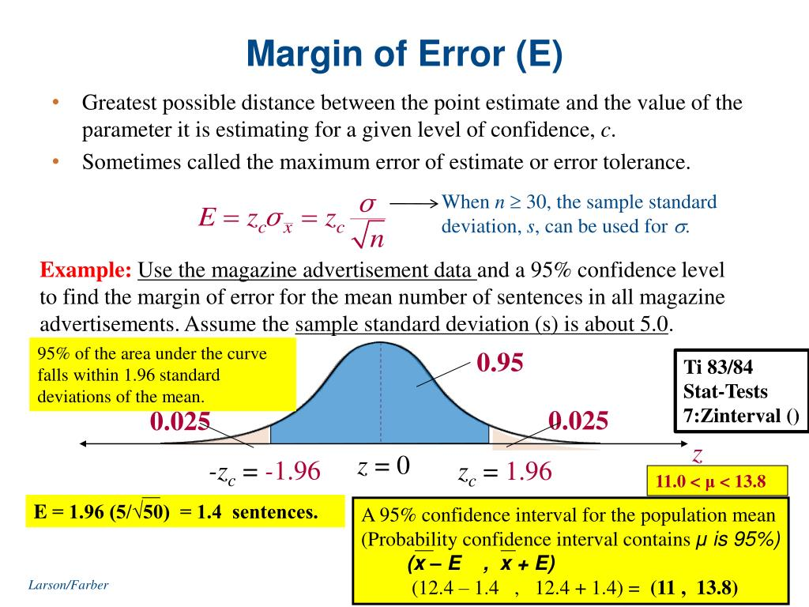