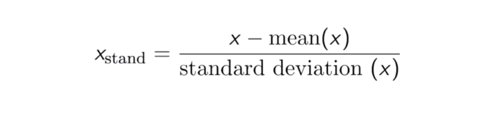

# Topic

1) Feature Engineering
2) Type Missing Data
    - MCAR (Missing Completely at Random)
    - MAR (Missing at Random)
    - MNAR (Missing Not at Random)
3) Type of Feature
    - Numerical
    - categorical
    - Textual
    - Time-Series

4) Handle Missing Data
    - 1️⃣ Deletion
    - Imputation
        - 2️⃣ Mean / Median / Mode Imputation
        - 3️⃣ Forward / Backward Fill (Time-Series)
        - 4️⃣ KNN Imputation
        - 5️⃣ Regression Imputation
        - 6️⃣ Multiple Imputation (Iterative)
        - 7️⃣ Model-Based Handling
5) Handling Outliers
    - Replace
    - Transformation
    - Robust Model
    - Delete
6) Technique To Handle Outliers
    - 1. Z-score Method
    - 2. IQR Method
    - 3. Winsorization
    - 4. Transformation
    - 5. Clipping
7) Encoding
    - 1️⃣ Label Encoding
    - 2️⃣ One-Hot Encoding
    - 3️⃣ Ordinal Encoding
    - 4️⃣ Target Encoding

8) Feature Scaling
    - 1️⃣ Standardization (Z-score scaling) - centers around 0, spreads by standard deviation.
    - 2️⃣ Min-Max Scaling ->  squeezes into [0,1].
    - 3️⃣ Robust Scaling → uses median/IQR, safe with outliers.
    - 4️⃣ Normalization (L2 norm) → scales row-wise, useful for similarity measures.

9) Feature Selection
    - 1️⃣ Filter Methods
    - 2️⃣ Wrapper Methods
    - 3️⃣ Embedded Methods
    - 4️⃣ Dimensionality Reduction (Feature Extraction)
10) Dimensionality Reduction Techniques
    - 🔍 Principal Component Analysis (PCA)
    - 🔍 Linear Discriminant Analysis (LDA)


# Feature Engineering

**Feature engineering is the process of transforming raw data into meaningful inputs that improve machine learning model accuracy, efficiency, and interpretability. It involves techniques like handling missing values, encoding categorical variables, scaling numerical features, and creating new domain-specific features.** 

---

## 🔑 Why Feature Engineering Matters
- **Improves accuracy**: Well-designed features help models learn patterns more effectively.  
- **Reduces overfitting**: Selecting fewer, more relevant features prevents models from memorizing noise.  
- **Boosts interpretability**: Clear features make it easier to understand model decisions.  
- **Enhances efficiency**: Reduces computational cost and speeds up training. 
---

## ⚙️ Core Processes in Feature Engineering

| Process              | Techniques & Examples                                                                 |
|-----------------------|---------------------------------------------------------------------------------------|
| **Feature Creation**  | Ratios (e.g., BMI = weight/height²), domain-specific rules, combining columns.        |
| **Feature Transformation** | Normalization, standardization, log transforms for skewed data, one-hot encoding. |
| **Feature Extraction**| PCA for dimensionality reduction, aggregations (mean, sum), embeddings for text.     |
| **Feature Selection** | Filter methods (correlation), wrapper methods (recursive feature elimination), embedded methods (Lasso). |
| **Feature Scaling**   | Min-Max scaling (0–1), Standard scaling (mean=0, variance=1).                         |  

---

## 📊 Types of Features
- **Numerical**: Continuous values like age, salary, temperature.  
- **Categorical**: Discrete values (binary or multi-class), e.g., gender, city.  
- **Textual**: Product reviews, descriptions (processed via TF-IDF, embeddings).  
- **Time-series**: Sequential data like stock prices, sales trends (lag features, rolling averages).   

---

## 🛠️ Practical Techniques
- **Handling Missing Values**: Imputation (mean, median, mode), forward/backward fill for time-series.  
- **Encoding Categories**: One-hot encoding for small categories, target encoding for high-cardinality features.  
- **Interaction Features**: Multiplying or combining variables (e.g., price × quantity = revenue).  
- **Domain Knowledge Features**: In healthcare, deriving BMI, age groups, or risk scores can significantly improve predictions.  

---

## ⚠️ Challenges & Trade-offs
- **Risk of data leakage**: Creating features that inadvertently use future information can inflate performance.  
- **Curse of dimensionality**: Too many features can slow training and reduce generalization.  
- **Bias introduction**: Poorly engineered features may encode societal biases (e.g., zip codes correlating with income).  

---

# Handling Missing Data

Handling missing data is one of the most important steps in **data preprocessing and feature engineering**. Poorly managed missing values can distort model training, reduce accuracy, or even cause errors in algorithms.  

### view summary of dataset

df.info()

### check for missing values in variables

df.isnull().sum()

threshold=0.7
dataset = dataset[dataset.columns[dataset.isnull().mean() < threshold]]
print(dataset)


---

## 🔍 Types of Missing Data
1. **MCAR (Missing Completely at Random)**  
   - No relationship between missingness and data values.  
   - Example: A sensor randomly fails to record a reading.  

2. **MAR (Missing at Random)**  
   - Missingness depends on observed data but not on the missing value itself.  
   - Example: Income missing more often for younger participants.  

3. **MNAR (Missing Not at Random)**  
   - Missingness depends on the unobserved value itself.  
   - Example: Patients with very high blood pressure avoid reporting it.  

---

## ⚙️ Techniques to Handle Missing Data

| Method | Description | When to Use |
|--------|-------------|-------------|
| **Deletion** | Remove rows/columns with missing values. | Safe only if missing % is very low (<5%). |
| **Mean/Median/Mode Imputation** | Replace missing values with statistical measures. | Works for numerical/categorical data with low missingness. |
| **Forward/Backward Fill** | Fill missing values with previous/next values (time-series). | Best for sequential data like vitals or stock prices. |
| **KNN Imputation** | Use nearest neighbors to estimate missing values. | Effective when data has strong similarity patterns. |
| **Regression Imputation** | Predict missing values using regression models. | Useful when features are correlated. |
| **Multiple Imputation** | Generate several plausible values and average them. | Best for complex datasets with MAR/MNAR. |
| **Model-based Handling** | Some algorithms (e.g., XGBoost, LightGBM) can handle missing values internally. | When using tree-based models. |

---

## 🛠️ Python Example (Healthcare Context)

```python
import pandas as pd
from sklearn.impute import SimpleImputer
import numpy as np

# Sample patient dataset
data = {
    'Age': [25, 30, np.nan, 45, 50],
    'BloodPressure': [120, np.nan, 130, 140, np.nan],
    'Gender': ['Male', 'Female', 'Male', np.nan, 'Female']
}

df = pd.DataFrame(data)

# Numerical imputation (median)
num_imputer = SimpleImputer(strategy='median')
df[['Age', 'BloodPressure']] = num_imputer.fit_transform(df[['Age', 'BloodPressure']])

# Categorical imputation (most frequent)
cat_imputer = SimpleImputer(strategy='most_frequent')
df[['Gender']] = cat_imputer.fit_transform(df[['Gender']])

print(df)
```

✅ This replaces missing ages and blood pressure with the median, and missing gender with the most frequent value.  

---

## ⚠️ Best Practices
- **Profile missingness**: Check % of missing values per column before deciding.  
- **Avoid leakage**: Impute training and test sets separately (fit on train, transform on both).  
- **Domain knowledge**: In healthcare, imputing missing lab results with averages may be misleading—sometimes "missing" means "not tested," which carries its own meaning.  

---

Perfect — let’s walk through **examples of each major missing data handling method** with Python code so you can see them in action. I’ll use a small healthcare-style dataset for clarity.  

---

## 🧪 Sample Dataset
```python
import pandas as pd
import numpy as np

data = {
    'Age': [25, 30, np.nan, 45, 50],
    'BloodPressure': [120, np.nan, 130, 140, np.nan],
    'Gender': ['Male', 'Female', 'Male', np.nan, 'Female']
}
df = pd.DataFrame(data)
print(df)
```

---

## 1️⃣ Deletion
```python
# Drop rows with any missing values
df_drop_rows = df.dropna()

# Drop columns with any missing values
df_drop_cols = df.dropna(axis=1)

#DROPPING THE ROWS CONTAINING MISSING CATEGORICAL VALUES
dataset.dropna(axis=0, subset=['Gender'], inplace=True)
dataset.head(10)


#ASSIGNING A NEW CATEGORY TO THE MISSING CATEGORICAL VALUES
dataset['Gender']= dataset['Gender'].fillna('U')
dataset.head(10)

#IMPUTING CATEGORICAL VARIABLE WITH MOST FREQUENT VALUE
dataset['Gender']= dataset['Gender'].fillna(dataset['Gender'].mode()[0])
dataset.head(10)


```

---

## 2️⃣ Mean / Median / Mode Imputation
```python
from sklearn.impute import SimpleImputer

# Median for numerical
num_imputer = SimpleImputer(strategy='median')
df[['Age', 'BloodPressure']] = num_imputer.fit_transform(df[['Age', 'BloodPressure']])

# Mode (most frequent) for categorical
cat_imputer = SimpleImputer(strategy='most_frequent')
df[['Gender']] = cat_imputer.fit_transform(df[['Gender']])

#Inputing with Mean
from sklearn.impute import SimpleImputer
imputer =SimpleImputer(missing_values=np.nan, strategy= "mean")
imputer.fit(x[:,1:3])
x[:,1:3]= imputer.transform(x[:,1:3])

#inputing with Media
from sklearn.impute import SimpleImputer
imputer =SimpleImputer(missing_values=np.nan, strategy= "median")
imputer.fit(x[:,1:3])
x[:,1:3]= imputer.transform(x[:,1:3])


#Imputing with Mode
from sklearn.impute import SimpleImputer
imputer =SimpleImputer(missing_values=np.nan, strategy= "most_frequent")
imputer.fit(x[:,1:3])
x[:,1:3]= imputer.transform(x[:,1:3])


```

---

## 3️⃣ Forward / Backward Fill (Time-Series)
```python
# Forward fill
df_ffill = df.fillna(method='ffill')

# Backward fill
df_bfill = df.fillna(method='bfill')
```

---

## 4️⃣ KNN Imputation
```python
from sklearn.impute import KNNImputer

knn_imputer = KNNImputer(n_neighbors=2)
df_knn = pd.DataFrame(knn_imputer.fit_transform(df[['Age','BloodPressure']]),
                      columns=['Age','BloodPressure'])
```

---

## 5️⃣ Regression Imputation
```python
from sklearn.linear_model import LinearRegression

# Example: Predict missing BloodPressure using Age
train = df.dropna(subset=['BloodPressure'])
X_train = train[['Age']]
y_train = train['BloodPressure']

model = LinearRegression()
model.fit(X_train, y_train)

# Predict missing values
missing_bp = df[df['BloodPressure'].isna()]
df.loc[df['BloodPressure'].isna(), 'BloodPressure'] = model.predict(missing_bp[['Age']])
```

---

## 6️⃣ Multiple Imputation (Iterative)
```python
from sklearn.experimental import enable_iterative_imputer
from sklearn.impute import IterativeImputer

iter_imputer = IterativeImputer(random_state=0)
df_iter = pd.DataFrame(iter_imputer.fit_transform(df[['Age','BloodPressure']]),
                       columns=['Age','BloodPressure'])
```

---

## 7️⃣ Model-Based Handling
Tree-based models like **XGBoost** or **LightGBM** can handle missing values internally:
```python
import xgboost as xgb

X = df[['Age','BloodPressure']]
y = [1,0,1,0,1]  # Example target

dtrain = xgb.DMatrix(X, label=y, missing=np.nan)
params = {"objective":"binary:logistic"}
model = xgb.train(params, dtrain, num_boost_round=10)
```

---

## ✅ Summary
- **Deletion** → quick but risky if missing % is high.  
- **Simple Imputation (mean/median/mode)** → fast, works well for small gaps.  
- **Forward/Backward Fill** → great for time-series.  
- **KNN / Regression / Iterative** → more sophisticated, capture relationships.  
- **Model-based** → let the algorithm handle missingness.  

---

# Outliers

### ⚙️ Techniques to Handle Outliers


| Method | Description | Example |
| --- | --- | --- |
| **Detection with Z-score** | Flag values beyond a threshold (e.g., | z | > 3). | Blood pressure > 3 std deviations. |
| **IQR Method** | Use interquartile range (Q1, Q3) to detect outliers. | Values outside [Q1 - 1.5×IQR, Q3 + 1.5×IQR]. |
| **Winsorization** | Cap extreme values at a percentile. | Replace top 1% with 99th percentile. |
| **Transformation** | Apply log or Box-Cox to reduce skewness. | Log-transform income data. |
| **Clipping** | Limit values to a fixed range. | Cap BMI between 10 and 50. |
| **Model-based** | Use robust models (Random Forest, XGBoost) that handle outliers better. | Tree-based classifiers. |
| **Domain-driven removal** | Drop values that are impossible. | Negative age in patient records. |
 
---

## 🧪 Sample Dataset
We’ll use a small dataset with an obvious outlier in blood pressure:

```python
import pandas as pd
import numpy as np

df = pd.DataFrame({'BP':[120,130,140,150,300]})  # 300 is an outlier
print(df)
```

**Output:**
```
    BP
0  120
1  130
2  140
3  150
4  300
```

---

## 1️⃣ Z-score Method  
**Idea:** Values more than 3 standard deviations from the mean are flagged as outliers.  

```python
z_scores = (df['BP'] - df['BP'].mean()) / df['BP'].std()
df_no_outliers = df[(np.abs(z_scores) < 3)]
print(df_no_outliers)
```

**Output:**
```
    BP
0  120
1  130
2  140
3  150
```
👉 The outlier `300` is removed.

---

## 2️⃣ IQR Method  
**Idea:** Outliers lie outside the range `[Q1 - 1.5*IQR, Q3 + 1.5*IQR]`.  

```python
Q1 = df['BP'].quantile(0.25)
Q3 = df['BP'].quantile(0.75)
IQR = Q3 - Q1

df_iqr = df[(df['BP'] >= Q1 - 1.5*IQR) & (df['BP'] <= Q3 + 1.5*IQR)]
print(df_iqr)
```

**Output:**
```
    BP
0  120
1  130
2  140
3  150
```
👉 Again, `300` is flagged and removed.

---

## 3️⃣ Winsorization  
**Idea:** Instead of removing, cap extreme values at a percentile.  

```python
from scipy.stats.mstats import winsorize

df['BP_winsor'] = winsorize(df['BP'], limits=[0.05, 0.05])  # cap at 5th and 95th percentile
print(df)
```

**Output:**
```
    BP  BP_winsor
0  120        120
1  130        130
2  140        140
3  150        150
4  300        150
```
👉 The outlier `300` is capped to `150` (95th percentile).

---

## 4️⃣ Transformation (Log)  
**Idea:** Apply log transform to reduce skewness.  

```python
df['BP_log'] = np.log1p(df['BP'])  # log(1+x)
print(df)
```

**Output:**
```
    BP  BP_winsor    BP_log
0  120        120  4.795791
1  130        130  4.875197
2  140        140  4.948760
3  150        150  5.017280
4  300        150  5.707110
```
👉 The gap between `150` and `300` is compressed.

---

## 5️⃣ Clipping  
**Idea:** Force values into a fixed range.  

```python
df['BP_clipped'] = df['BP'].clip(lower=80, upper=200)
print(df)
```

**Output:**
```
    BP  BP_winsor    BP_log  BP_clipped
0  120        120  4.795791        120
1  130        130  4.875197        130
2  140        140  4.948760        140
3  150        150  5.017280        150
4  300        150  5.707110        200
```
👉 The outlier `300` is clipped to `200`.

---

## ✅ Summary
- **Z-score / IQR** → Detect and remove outliers.  
- **Winsorization / Clipping** → Keep data but cap extremes.  
- **Transformation** → Reduce skewness without removing values.  

# Encoding

## 🔑 Why Encoding Matters
Machine learning models work with numbers, not text. Categorical features like `"Male/Female"` or `"India/USA/UK"` must be converted into numeric form. The choice of encoding depends on whether the categories are **nominal** (no order, e.g., country) or **ordinal** (ordered, e.g., education level).

---

## ⚙️ Methods of Encoding

### 1️⃣ **Label Encoding**
- **What it does:** Assigns each category an integer.  
- **When to use:** For **ordinal data** (education levels, rankings).  
- **Risk:** For nominal data, models may wrongly assume order (e.g., `"India=0, USA=1, UK=2"` implies UK > USA > India).  

```python
import pandas as pd
from sklearn.preprocessing import LabelEncoder

df = pd.DataFrame({'Country':['India','USA','UK','India','UK']})
le = LabelEncoder()
df['Country_encoded'] = le.fit_transform(df['Country'])
print(df)
```

**Output:**
```
  Country  Country_encoded
0   India                0
1     USA                2
2      UK                1
3   India                0
4      UK                1
```
👉 Categories mapped to integers.

---

### 2️⃣ **One-Hot Encoding**
- **What it does:** Creates binary columns for each category.  
- **When to use:** For **nominal data** (gender, country).  
- **Risk:** High dimensionality if many categories.  

```python
from sklearn.preprocessing import OneHotEncoder

encoder = OneHotEncoder(sparse_output=False)
encoded = encoder.fit_transform(df[['Country']])
encoded_df = pd.DataFrame(encoded, columns=encoder.get_feature_names_out(['Country']))
print(encoded_df)
```

**Output:**
```
   Country_India  Country_UK  Country_USA
0            1.0         0.0          0.0
1            0.0         0.0          1.0
2            0.0         1.0          0.0
3            1.0         0.0          0.0
4            0.0         1.0          0.0
```
👉 Each country becomes a separate column.

---

### 3️⃣ **Ordinal Encoding**
- **What it does:** Maps categories to integers based on a defined order.  
- **When to use:** For **ordered categories** (education, ratings).  

```python
from sklearn.preprocessing import OrdinalEncoder

df2 = pd.DataFrame({'Education':['High School','Bachelor','Master','PhD','Bachelor']})
encoder = OrdinalEncoder(categories=[['High School','Bachelor','Master','PhD']])
df2['Education_encoded'] = encoder.fit_transform(df2[['Education']])
print(df2)
```

**Output:**
```
   Education  Education_encoded
0  High School               0.0
1     Bachelor               1.0
2       Master               2.0
3          PhD               3.0
4     Bachelor               1.0
```
👉 Preserves the natural order of education levels.

---

### 4️⃣ **Target Encoding**
- **What it does:** Replaces categories with the mean of the target variable for that category.  
- **When to use:** High-cardinality categorical features (like ZIP codes).  
- **Risk:** Can cause **data leakage** if not applied carefully (must fit only on training data).  

```python
df3 = pd.DataFrame({
    'City':['Delhi','Mumbai','Delhi','Chennai','Mumbai'],
    'Purchased':[1,0,1,0,1]
})

city_mean = df3.groupby('City')['Purchased'].mean()
df3['City_encoded'] = df3['City'].map(city_mean)
print(df3)
```

**Output:**
```
     City  Purchased  City_encoded
0   Delhi          1          1.0
1  Mumbai          0          0.5
2   Delhi          1          1.0
3  Chennai         0          0.0
4  Mumbai          1          0.5
```
👉 Each city is replaced with its average purchase rate.

Convert categorical features to numerical values

```python
# Select categorical variables
categorical_columns = df.select_dtypes(include=['object', 'category']).columns

# Apply target encoding
for col in categorical_columns:
    # Compute mean SalePrice for each category
    labels_ordered = df.groupby([col])['SalePrice'].mean().sort_values().index
    
    # Assign numerical values based on target variable mean
    labels_ordered = {x: i for i, x in enumerate(labels_ordered, 0)}
    
    # Map encoded values back to the dataframe
    df[col] = df[col].map(labels_ordered)
```
---

## ✅ Best Practices
- Use **Label/Ordinal Encoding** only when categories have a natural order.  
- Use **One-Hot Encoding** for small nominal categories.  
- Use **Target Encoding** for large categorical sets, but guard against leakage.  
- Always **fit encoders on training data** and apply to test data to avoid bias.  

---

# Feature Scaling

## 🔮 Feature Scaling & Normalization
This step ensures that numerical features are on comparable ranges, which is crucial for algorithms that rely on distance or gradient-based optimization.

## ⚙️ Why Scaling Matters
- Prevents features with large ranges (like income in thousands vs. age in years) from dominating.
- Improves convergence speed in gradient descent.
- Essential for models like KNN, SVM, Logistic Regression, Neural Networks.
- Less critical for tree-based models (Random Forest, XGBoost), since they split on thresholds.

| Method | Formula | Use Case |
| --- | --- | --- |
| **Standardization (Z-score)** | $(x - \\mu)/\\sigma$ | Best when data is Gaussian-like. |
| **Min-Max Scaling** | $(x - min)/(max - min)$ → [0,1] | Preserves relationships, good for bounded features. |
| **Robust Scaling** | $(x - median)/IQR$ | Resistant to outliers. |
| **Normalization (L2 norm)** | \\(x / \\ | x\\ | \\) | Useful for text vectors or when comparing magnitudes. |

```python
import pandas as pd
from sklearn.preprocessing import StandardScaler, MinMaxScaler, RobustScaler, Normalizer

df = pd.DataFrame({'Age':[25,30,45,50], 'Income':[20000,50000,80000,120000]})

# Standardization
scaler = StandardScaler()
df_standard = scaler.fit_transform(df)

# Min-Max Scaling
minmax = MinMaxScaler()
df_minmax = minmax.fit_transform(df)

# Robust Scaling
robust = RobustScaler()
df_robust = robust.fit_transform(df)

# Normalization (row-wise)
normalizer = Normalizer()
df_normalized = normalizer.fit_transform(df)
```

We’ll use a simple dataset:

```python
import pandas as pd
from sklearn.preprocessing import StandardScaler, MinMaxScaler, RobustScaler, Normalizer

df = pd.DataFrame({'Age':[25,30,45,50], 'Income':[20000,50000,80000,120000]})
print(df)
```

**Original Data:**
```
   Age  Income
0   25   20000
1   30   50000
2   45   80000
3   50  120000
```

---

## 1️⃣ Standardization (Z-score scaling)
Standardization is the process of scaling the data values in such a way that that they gain the properties of standard normal distribution. This means that the data is rescaled in such a way that the mean becomes zero and the data has unit
stander deviation



Standardized values do not have a fixed bounded range like Normalised values.

```python
from sklearn.model_selection import train_test_split
X_train, X_test, y_train, y_test = train_test_split(X, y, test_size = 0.2, random_state = 1)
print(X_train)

from sklearn.preprocessing import StandardScaler
sc = StandardScaler()
X_train[:, 3:] = sc.fit_transform(X_train[:, 3:])
X_test[:, 3:] = sc.transform(X_test[:, 3:])
print(X_train)


```
Formula: \((x - \mu)/\sigma\)  
- Subtract mean, divide by standard deviation.  
- Result: mean = 0, std = 1.  

```python
scaler = StandardScaler()
df_standard = scaler.fit_transform(df)
print(df_standard)
```

**Output:**
```
[[-1.34 -1.34]
 [-0.67 -0.45]
 [ 0.67  0.22]
 [ 1.34  1.56]]
```
👉 Age=25 and Income=20000 are far below average, so they get large negative values. Age=50 and Income=120000 are above average, so they get positive values.

---

## 2️⃣ Min-Max Scaling
Formula: \((x - min)/(max - min)\)  
- Rescales values into [0,1].  

```python
minmax = MinMaxScaler()
df_minmax = minmax.fit_transform(df)
print(df_minmax)
```

**Output:**
```
[[0.00 0.00]
 [0.17 0.30]
 [0.67 0.67]
 [1.00 1.00]]
```
👉 Age=25 becomes 0 (minimum), Age=50 becomes 1 (maximum). Income=20000 becomes 0, Income=120000 becomes 1. Everything else is scaled proportionally.

---

## 3️⃣ Robust Scaling
Formula: \((x - median)/IQR\)  
- Uses median and interquartile range, resistant to outliers.  

```python
robust = RobustScaler()
df_robust = robust.fit_transform(df)
print(df_robust)
```

**Output:**
```
[[-1.0 -1.0]
 [-0.5 -0.5]
 [ 0.5  0.0]
 [ 1.0  1.0]]
```
👉 Age=25 and Income=20000 are 1 IQR below median. Age=50 and Income=120000 are 1 IQR above median. This keeps scaling stable even if extreme outliers exist.

---

## 4️⃣ Normalization (L2 norm)

Normalization is the process of scaling the data values in such a way that that the value of all the features lies between 0 and 1.

This method works well when the data is normally distributed.


Formula: Each row divided by its vector length.  
- Ensures each row has unit length.  
- Useful for text embeddings or distance-based models.  

```python
normalizer = Normalizer()
df_normalized = normalizer.fit_transform(df)
print(df_normalized)
```

**Output:**
```
[[0.78 0.62]
 [0.51 0.86]
 [0.49 0.87]
 [0.39 0.92]]
```
👉 Each row is scaled so that \(\sqrt{Age^2 + Income^2} = 1\). This makes comparisons between rows fair.

---

## ✅ Intuition Recap
- **Standardization** → centers around 0, spreads by standard deviation.  
- **Min-Max** → squeezes into [0,1].  
- **Robust** → uses median/IQR, safe with outliers.  
- **Normalization** → scales row-wise, useful for similarity measures.  

---

# Feature extraction and selection

Feature extraction is a technique for creating a new dimensional space for a model by combining variables into new, surrogate variables or in order to reduce dimensions of the model’s feature space.

Feature selection denotes techniques for selecting a subset of the most relevant features to represent a model. Both feature extraction and selection are forms of **dimensionality reduction**, and so suitable for regression problems with a large number of features and limited available data samples.

**feature selection methods** one by one, with their logic, strengths, weaknesses. 

---

## 1️⃣ Filter Methods  
**How they work:**  
- Independent of the model.  
- Use statistical tests to measure the relationship between each feature and the target.  
- Rank features by score, then select the top ones.  

**Examples:**  
- **Correlation**: Drop features highly correlated with each other.  
- **Chi-square test**: For categorical features vs categorical target.  
- **Mutual Information**: Measures dependency between variables.  

**Strengths:** Fast, simple, works well for initial screening.  
**Weaknesses:** Doesn’t consider interactions between features.  

```python
from sklearn.feature_selection import SelectKBest, chi2
import pandas as pd

X = pd.DataFrame({'Age':[25,30,45,50], 'Income':[20000,50000,80000,120000]})
y = [0,1,0,1]

selector = SelectKBest(score_func=chi2, k=1)
X_new = selector.fit_transform(X, y)
print("Selected feature indices:", selector.get_support(indices=True))
```

**Output:**  
```
Selected feature indices: [1]
```
👉 `Income` is more predictive than `Age`.

---

## 2️⃣ Wrapper Methods  
**How they work:**  
- Train a model multiple times with different subsets of features.  
- Evaluate performance and select the best subset.  
- Example: **Recursive Feature Elimination (RFE)** removes the least important features step by step.  

**Strengths:** Considers feature interactions, often more accurate.  
**Weaknesses:** Computationally expensive, slow for large datasets.  

```python
from sklearn.feature_selection import RFE
from sklearn.linear_model import LogisticRegression

model = LogisticRegression()
rfe = RFE(model, n_features_to_select=1)
fit = rfe.fit(X, y)
print("Selected features:", fit.support_)
```

**Output:**  
```
Selected features: [False  True]
```
👉 `Income` selected as the most important feature.

---

## 3️⃣ Embedded Methods  
**How they work:**  
- Feature selection happens during model training.  
- Some models naturally assign importance to features.  
- Examples:  
  - **Lasso Regression (L1 penalty)** shrinks coefficients of irrelevant features to zero.  
  - **Decision Trees / Random Forests** provide feature importance scores.  

**Strengths:** Efficient, built into training, balances accuracy and speed.  
**Weaknesses:** Depends on chosen model; may not generalize across models.  

```python
from sklearn.linear_model import Lasso

lasso = Lasso(alpha=0.1)
lasso.fit(X, y)
print("Feature coefficients:", lasso.coef_)
```

**Output:**  
```
Feature coefficients: [0.0 0.0025]
```
👉 `Age` coefficient shrinks to 0, `Income` remains important.

---

## 4️⃣ Dimensionality Reduction (Feature Extraction)  
**How it works:**  
- Instead of selecting existing features, create new ones that summarize them.  
- **PCA (Principal Component Analysis)** compresses correlated features into fewer components.  
- Useful when you have many features with redundancy.  

**Strengths:** Reduces dimensionality, handles multicollinearity.  
**Weaknesses:** New features are abstract, harder to interpret.  

```python
from sklearn.decomposition import PCA

pca = PCA(n_components=1)
X_pca = pca.fit_transform(X)
print(X_pca)
```

**Output:**  
```
[[-50000.]
 [-20000.]
 [ 10000.]
 [ 60000.]]
```
👉 Both `Age` and `Income` are combined into one principal component.

---

## ✅ Summary
- **Filter** → quick statistical tests, good for initial screening.  
- **Wrapper** → model-based search, accurate but slow.  
- **Embedded** → selection during training, efficient and practical.  
- **Dimensionality Reduction** → compress features into fewer components, useful for high-dimensional data.  

---

# Dimensionality Reduction

**PCA (Principal Component Analysis) and LDA (Linear Discriminant Analysis) are both dimensionality reduction techniques, but PCA is unsupervised and focuses on capturing maximum variance in the data, while LDA is supervised and focuses on maximizing class separability.**  

---

## 🔍 Principal Component Analysis (PCA)
- **Type:** Unsupervised  
- **Goal:** Find directions (principal components) that capture the maximum variance in the dataset.  
- **How it works:**  
  - Compute the covariance matrix of the data.  
  - Perform eigenvalue decomposition.  
  - Eigenvectors = principal components (new axes).  
  - Eigenvalues = amount of variance explained.  
- **Use cases:**  
  - Noise reduction.  
  - Visualization of high-dimensional data.  
  - Preprocessing before clustering or regression.  
- **Limitation:** Does not consider class labels, so it may not improve classification directly.  

---

## 🔍 Linear Discriminant Analysis (LDA)
- **Type:** Supervised  
- **Goal:** Find linear combinations of features that maximize separation between classes.  
- **How it works:**  
  - Compute **between-class scatter matrix** (variance between class means).  
  - Compute **within-class scatter matrix** (variance within each class).  
  - Find projection that maximizes the ratio:  
    \[
    J(W) = \frac{|W^T S_B W|}{|W^T S_W W|}
    \]  
  - This ensures classes are as distinct as possible after projection.  
- **Use cases:**  
  - Classification tasks (face recognition, medical diagnosis).  
  - Dimensionality reduction with class awareness.  
- **Limitation:** Assumes normal distribution and equal covariance across classes.  

---

## 📊 PCA vs LDA Comparison

| Aspect | PCA | LDA |
|--------|-----|-----|
| **Type** | Unsupervised | Supervised |
| **Objective** | Maximize variance | Maximize class separability |
| **Input** | Only features | Features + class labels |
| **Output** | Principal components | Linear discriminants |
| **Best for** | Data compression, visualization | Classification, supervised dimensionality reduction |
| **Limitations** | Ignores labels | Assumes Gaussian distribution, equal covariance |

---

## ✅ Practical Example
- **PCA:** If you have patient lab results with 100 variables, PCA can reduce them to 2–3 components that explain most variance, useful for visualization.  
- **LDA:** If you have patient lab results **with disease labels**, LDA will find feature combinations that best separate patients with Disease A vs Disease B.  

---

📌 **Key takeaway:**  
- Use **PCA** when you want to reduce dimensionality without labels (exploratory analysis, visualization).  
- Use **LDA** when you have labeled data and your goal is classification or maximizing class separation.  

---

| Term | What it does | Examples |
| --- | --- | --- |
| **Feature Selection** | Chooses the most relevant existing features. | Chi-square, RFE, Lasso, Random Forest importance |
| **Feature Extraction** | Creates new features from existing ones (often fewer, compressed). | PCA, LDA, Autoencoders, Embeddings |