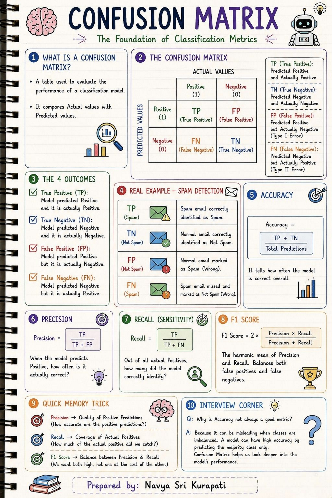
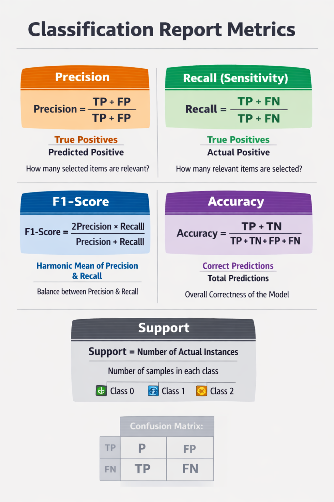
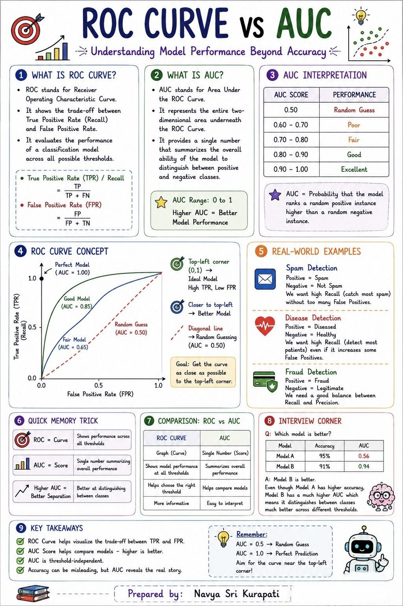

# Topic

1) Evaluation Metrics
2) Confusion Metrics
    - True Positives (Actual Positive:1 and Predict Positive:1)
    - True Negatives (Actual Negative:0 and Predict Negative:0)
    - False Positives (Actual Negative:0 but Predict Positive:1)  `(Type I error)`
    - False Negatives (Actual Positive:1 but Predict Negative:0)  `(Type II error)`
3) Classification Report
    - Accuracy
    - Precision
    - Recall (Sensitivity)
    - F1-Scores
4) Core Regression Metrics
    - 1. Mean Absolute Error (MAE)
    - 2. Mean Squared Error (MSE)
    - 3. Root Mean Squared Error (RMSE)
    - 4. R² (Coefficient of Determination)
    - 5. Adjusted R²


# Evaluation Metrics
**Evaluation metrics in machine learning are quantitative measures used to assess how well a model performs, and the choice of metric depends on the type of task (classification, regression, clustering). For Ravi’s context—AI/ML engineering and healthcare pipelines—the most relevant metrics include accuracy, precision, recall, F1-score, ROC-AUC for classification, and RMSE, MAE, R² for regression.**  

---

## 🔑 Categories of Evaluation Metrics

### 1. **Classification Metrics**
- **Accuracy**: Ratio of correct predictions to total predictions.  
  - Formula: \(\text{Accuracy} = \frac{\text{Correct Predictions}}{\text{Total Predictions}}\)  
  - ⚠️ Misleading for imbalanced datasets.  
- **Precision**: Fraction of predicted positives that are truly positive.  
  - Formula: \(\frac{TP}{TP+FP}\)  
  - Useful when false positives are costly (e.g., misdiagnosing healthy patients).  
- **Recall (Sensitivity)**: Fraction of actual positives correctly identified.  
  - Formula: \(\frac{TP}{TP+FN}\)  
  - Critical when missing positives is dangerous (e.g., cancer detection).  
- **F1-Score**: Harmonic mean of precision and recall.  
  - Formula: \(2 \cdot \frac{Precision \cdot Recall}{Precision + Recall}\)  
  - Balances false positives and false negatives.  
- **ROC-AUC**: Measures ability to distinguish between classes across thresholds.  
  - AUC close to 1 = excellent classifier.  

---

### 2. **Regression Metrics**
- **Mean Absolute Error (MAE)**: Average absolute difference between predicted and actual values.  
  - Intuitive, less sensitive to outliers.  
- **Mean Squared Error (MSE)**: Average squared difference.  
  - Penalizes large errors more heavily.  
- **Root Mean Squared Error (RMSE)**: Square root of MSE.  
  - Same unit as target variable, widely used in forecasting.  
- **R² (Coefficient of Determination)**: Proportion of variance explained by the model.  
  - Adjusted R² accounts for number of predictors.  

---

### 3. **Other Metrics**
- **Log Loss**: Penalizes incorrect classifications with probability scores.  
- **Confusion Matrix**: Tabular summary of TP, FP, TN, FN.  
- **Cross-Validation Scores**: Ensures generalization by testing across folds.  
- **Clustering Metrics**: Silhouette Score, Davies–Bouldin Index, Adjusted Rand Index.  

---

## 📊 Comparison Table

| Task Type       | Metric        | Best Use Case |
|-----------------|---------------|---------------|
| Classification  | Accuracy      | Balanced datasets |
| Classification  | Precision     | High cost of false positives |
| Classification  | Recall        | High cost of false negatives |
| Classification  | F1-Score      | Imbalanced datasets |
| Classification  | ROC-AUC       | Ranking/class separation |
| Regression      | MAE           | Robust to outliers |
| Regression      | RMSE          | Penalizes large errors |
| Regression      | R²            | Variance explained |
| Clustering      | Silhouette    | Cluster separation quality |

---

## ⚠️ Key Considerations
- **Healthcare pipelines**: Recall and F1-score are critical (missing malignant cases is worse than false alarms).  
- **Model comparison**: Use ROC-AUC and cross-validation for robust evaluation.  
- **Regression in recommendations**: RMSE and R² are most informative.  
- **Imbalanced datasets**: Accuracy alone is misleading—prefer precision, recall, and F1.  

---

# Confusion matrix


A confusion matrix is a tool for summarizing the performance of a classification algorithm. A confusion matrix will give us a clear picture of classification model performance and the types of errors produced by the model. It gives us a summary of correct and incorrect predictions broken down by each category. The summary is represented in a tabular form.


Four types of outcomes are possible while evaluating a classification model performance. These four outcomes are described below:-


**True Positives (TP)** – True Positives occur when we predict an observation belongs to a certain class and the observation actually belongs to that class.


**True Negatives (TN)** – True Negatives occur when we predict an observation does not belong to a certain class and the observation actually does not belong to that class.


**False Positives (FP)** – False Positives occur when we predict an observation belongs to a    certain class but the observation actually does not belong to that class. This type of error is called **Type I error.**


**False Negatives (FN)** – False Negatives occur when we predict an observation does not belong to a certain class but the observation actually belongs to that class. This is a very serious error and it is called **Type II error.**


These four outcomes are summarized in a confusion matrix given below.

```python
# Print the Confusion Matrix and slice it into four pieces

from sklearn.metrics import confusion_matrix

cm = confusion_matrix(y_test, y_pred)

print('Confusion matrix\n\n', cm)

print('\nTrue Positives(TP) = ', cm[0,0])

print('\nTrue Negatives(TN) = ', cm[1,1])

print('\nFalse Positives(FP) = ', cm[0,1])

print('\nFalse Negatives(FN) = ', cm[1,0])

# Confusion matrix

#  [[5999 1408]
#  [ 465 1897]]

# True Positives(TP) =  5999

# True Negatives(TN) =  1897

# False Positives(FP) =  1408

# False Negatives(FN) =  465
```

The confusion matrix shows `5999 + 1897 = 7896 correct predictions` and `1408 + 465 = 1873 incorrect predictions`.


In this case, we have


- `True Positives` (Actual Positive:1 and Predict Positive:1) - 5999


- `True Negatives` (Actual Negative:0 and Predict Negative:0) - 1897


- `False Positives` (Actual Negative:0 but Predict Positive:1) - 1408 `(Type I error)`


- `False Negatives` (Actual Positive:1 but Predict Negative:0) - 465 `(Type II error)`

# Classification Report


**Classification report** is another way to evaluate the classification model performance. It displays the  **precision**, **recall**, **f1** and **support** scores for the model.

A **classification report** is a structured summary of key metrics (precision, recall, F1-score, and support) for each class in a classification problem. It’s widely used in scikit-learn (`sklearn.metrics.classification_report`) to quickly evaluate model performance across multiple classes.  

---

## 📑 Components of a Classification Report

- **Precision**: How many predicted positives are correct.  
- **Recall**: How many actual positives are correctly identified.  
- **F1-Score**: Harmonic mean of precision and recall.  
- **Support**: Number of true instances for each class in the dataset.  

---

## 🔧 Example in Python (scikit-learn)

```python
from sklearn.metrics import classification_report
from sklearn.datasets import load_iris
from sklearn.model_selection import train_test_split
from sklearn.linear_model import LogisticRegression

# Load dataset
X, y = load_iris(return_X_y=True)
X_train, X_test, y_train, y_test = train_test_split(X, y, test_size=0.3, random_state=42)

# Train model
model = LogisticRegression(max_iter=200)
model.fit(X_train, y_train)

# Predictions
y_pred = model.predict(X_test)

# Classification report
print(classification_report(y_test, y_pred))
```

---

## 📊 Sample Output

```
              precision    recall  f1-score   support

           0       1.00      1.00      1.00        16
           1       0.95      0.95      0.95        20
           2       0.96      0.96      0.96        14

    accuracy                           0.97        50
   macro avg       0.97      0.97      0.97        50
weighted avg       0.97      0.97      0.97        50
```

---

## 🧠 Why It’s Useful
- **Per-class breakdown**: Shows how well the model performs on each class (important for imbalanced datasets).  
- **Macro vs Weighted averages**:  
  - *Macro avg*: Treats all classes equally.  
  - *Weighted avg*: Accounts for class imbalance by weighting by support.  
- **Quick diagnostic**: Helps identify if the model favors one class over another.  

---

## 🟩 Confusion Matrics
- **Purpose**:  
- Gives raw numbers (how many true positives, false negatives, etc.).  
- Helps you see specific misclassifications.  
- **Limitation**:  
- Doesn’t directly show precision, recall, or F1-score—you need to calculate them from the matrix.


---

## 🟩 Classification Report
- **What it is**: A summary of **metrics derived from the confusion matrix**.  
- **Includes**:  
- Precision, Recall, F1-score for each class.  
- Support (number of samples per class).  
- Macro and weighted averages.  
- **Purpose**:  
- Provides a quick, interpretable overview of model performance.  
- Especially useful for multi-class problems.  
- **Limitation**:  
- Doesn’t show the raw counts of misclassifications—only the derived metrics.

---



## 📊 Side-by-Side Comparison

| Aspect                | Confusion Matrix | Classification Report |
|-----------------------|------------------|------------------------|
| Format                | Table of counts (TP, FP, TN, FN) | Table of metrics (precision, recall, F1, support) |
| Granularity           | Raw numbers      | Derived statistics |
| Best for              | Spotting misclassification patterns | Summarizing per-class performance |
| Example Output        | 2×2 or n×n matrix | Text table with metrics |

---

## 🧠 Healthcare Example (Benign vs Malignant)
- **Confusion Matrix**: Shows how many malignant cases were missed (FN) and how many benign cases were wrongly flagged (FP).  
- **Classification Report**: Converts those counts into precision, recall, and F1-score—making it easier to compare models or thresholds.  

---

👉 Think of the **confusion matrix as the raw ingredients**, while the **classification report is the cooked meal**—metrics derived and ready for interpretation.  

# Classification Accuracy VS Classification Error

## 🎯 **Classification Accuracy**
- **Definition**: The proportion of correctly classified samples out of all samples.  
- **Formula**:  
`
  \[
  \text{Accuracy} = \frac{TP + TN}{TP + TN + FP + FN}
  \]
`
- **Interpretation**:  
  - Measures how often the classifier is right.  
  - High accuracy means most predictions match actual labels.  
- **Use Case**:  
  - Works well for balanced datasets.  
  - In healthcare, it tells how often the model correctly identifies both benign and malignant cases.

---

```python
# print classification accuracy

classification_accuracy = (TP + TN) / float(TP + TN + FP + FN)

print('Classification accuracy : {0:0.4f}'.format(classification_accuracy))

```

## ⚠️ **Classification Error (Misclassification Rate)**
- **Definition**: The proportion of incorrectly classified samples out of all samples.  
- **Formula**:  
  \[
  \text{Error Rate} = \frac{FP + FN}{TP + TN + FP + FN}
  \]
- **Interpretation**:  
  - Measures how often the classifier is wrong.  
  - It’s simply the complement of accuracy.  
  - \(\text{Error Rate} = 1 - \text{Accuracy}\)

---

```python
# print classification error

classification_error = (FP + FN) / float(TP + TN + FP + FN)

print('Classification error : {0:0.4f}'.format(classification_error))

```

## 📊 Example
Suppose:
- TP = 90, TN = 80, FP = 20, FN = 10  
- Total = 200  

Then:
- **Accuracy** = \((90 + 80)/200 = 0.85\)  
- **Error Rate** = \((20 + 10)/200 = 0.15\)  
- ✅ They always add up to 1.

---

## 🧠 Key Insight
- **Accuracy** tells you how *right* your model is.  
- **Error rate** tells you how *wrong* it is.  
- In imbalanced datasets (like cancer detection), accuracy can be misleading — a model predicting “benign” for all cases might still have high accuracy but terrible recall for malignant cases.

---

# Precision

**Precision** can be defined as the percentage of correctly predicted positive outcomes out of all the predicted positive outcomes. It can be given as the ratio of true positives (TP) to the sum of true and false positives (TP + FP). 

So, **Precision** identifies the proportion of correctly predicted positive outcome. It is more concerned with the positive class than the negative class.

Mathematically, precision can be defined as the ratio of `TP to (TP + FP)`.

```python
# print precision score

precision = TP / float(TP + FP)

print('Precision : {0:0.4f}'.format(precision))

```

# Recall or True Positive Rate
Recall can be defined as the percentage of correctly predicted positive outcomes out of all the actual positive outcomes.
It can be given as the ratio of true positives (TP) to the sum of true positives and false negatives (TP + FN). **Recall** is also called **Sensitivity**.

**Recall** identifies the proportion of correctly predicted actual positives.

Mathematically, recall can be given as the ratio of `TP to (TP + FN)`.

```python
recall = TP / float(TP + FN)

print('Recall or Sensitivity : {0:0.4f}'.format(recall))
```

# False Positive Rate

```python
false_positive_rate = FP / float(FP + TN)
print('False Positive Rate : {0:0.4f}'.format(false_positive_rate))
```

# Specificity

```python
specificity = TN / (TN + FP)

print('Specificity : {0:0.4f}'.format(specificity))
```

# f1-score


**f1-score** is the weighted harmonic mean of precision and recall. The best possible **f1-score** would be 1.0 and the worst 
would be 0.0.  **f1-score** is the harmonic mean of precision and recall. So, **f1-score** is always lower than accuracy measures as they embed precision and recall into their computation. The weighted average of `f1-score` should be used to 
compare classifier models, not global accuracy.

# 📈 Core Regression Metrics

### 1. **Mean Absolute Error (MAE)**
\[
MAE = \frac{1}{n} \sum_{i=1}^{n} |y_i - \hat{y}_i|
\]
- Average absolute difference between predicted and actual values.  
- Easy to interpret, less sensitive to outliers.  

---

### 2. **Mean Squared Error (MSE)**
\[
MSE = \frac{1}{n} \sum_{i=1}^{n} (y_i - \hat{y}_i)^2
\]
- Penalizes large errors more heavily.  
- Common in optimization and model training.  

---

### 3. **Root Mean Squared Error (RMSE)**
\[
RMSE = \sqrt{MSE}
\]
- Same unit as target variable.  
- Highlights large deviations clearly.  

---

### 4. **R² (Coefficient of Determination)**
\[
R^2 = 1 - \frac{\sum (y_i - \hat{y}_i)^2}{\sum (y_i - \bar{y})^2}
\]
- Measures how much variance in the target is explained by the model.  
- \(R^2 = 1\) → perfect fit; \(R^2 = 0\) → no explanatory power.  

---

### 5. **Adjusted R²**
\[
R^2_{adj} = 1 - (1 - R^2) \cdot \frac{n - 1}{n - p - 1}
\]
- Adjusts for number of predictors \(p\).  
- Prevents overfitting when adding irrelevant features.  

---

## 🧠 Healthcare Example
Predicting **hospital stay duration**:
- MAE → average deviation in days.  
- RMSE → penalizes large prediction errors (e.g., predicting 20 days instead of 5).  
- R² → how well model explains variation in stay duration.  

---

## 📊 Example Dataset
Suppose we have actual vs predicted hospital stay durations (in days):

| Patient | Actual (\(y\)) | Predicted (\(\hat{y}\)) |
|---------|----------------|--------------------------|
| 1       | 3              | 2                        |
| 2       | 5              | 4                        |
| 3       | 7              | 6                        |
| 4       | 10             | 8                        |

---

## 🧮 Step-by-Step Calculations

### 1. **Errors**
\[
e_i = y_i - \hat{y}_i
\]
- Patient 1: \(3 - 2 = 1\)  
- Patient 2: \(5 - 4 = 1\)  
- Patient 3: \(7 - 6 = 1\)  
- Patient 4: \(10 - 8 = 2\)

---

### 2. **Mean Absolute Error (MAE)**
\[
MAE = \frac{|1| + |1| + |1| + |2|}{4} = \frac{5}{4} = 1.25
\]
➡️ On average, predictions are off by **1.25 days**.

---

### 3. **Mean Squared Error (MSE)**
\[
MSE = \frac{1^2 + 1^2 + 1^2 + 2^2}{4} = \frac{7}{4} = 1.75
\]
➡️ Squared errors penalize larger mistakes more.

---

### 4. **Root Mean Squared Error (RMSE)**
\[
RMSE = \sqrt{1.75} \approx 1.32
\]
➡️ Same unit as target (days), easier to interpret.

---

### 5. **R² (Coefficient of Determination)**
\[
R^2 = 1 - \frac{\sum (y_i - \hat{y}_i)^2}{\sum (y_i - \bar{y})^2}
\]

- Mean of actuals: \(\bar{y} = (3+5+7+10)/4 = 6.25\)  
- Numerator (Residual Sum of Squares): \((1^2 + 1^2 + 1^2 + 2^2) = 7\)  
- Denominator (Total Sum of Squares):  
  \((3-6.25)^2 + (5-6.25)^2 + (7-6.25)^2 + (10-6.25)^2 = 29.5\)  
- \(R^2 = 1 - (7/29.5) \approx 0.76\)

➡️ Model explains **76% of the variance** in hospital stay duration.

---

## ✅ Summary
- **MAE = 1.25**  
- **MSE = 1.75**  
- **RMSE ≈ 1.32**  
- **R² ≈ 0.76**  

---

# ROC VS AUC

Let’s clarify the distinction between **ROC** and **AUC** — they’re closely related but not the same thing.  

---

## 📈 ROC (Receiver Operating Characteristic Curve)
- **Definition**: A plot that shows the trade-off between **True Positive Rate (Recall)** and **False Positive Rate** at different classification thresholds.  
- **Axes**:  
  - X-axis → False Positive Rate (FPR = FP / (FP + TN))  
  - Y-axis → True Positive Rate (TPR = Recall = TP / (TP + FN))  
- **Purpose**: Visual tool to understand how well the classifier separates classes across thresholds.  
- **Interpretation**:  
  - A curve closer to the top-left corner indicates better performance.  
  - Diagonal line = random guessing.  

---

## 📐 AUC (Area Under the Curve)
- **Definition**: A single scalar value representing the **area under the ROC curve**.  
- **Range**:  
  - 1.0 → Perfect classifier  
  - 0.5 → Random guessing  
  - <0.5 → Worse than random (model is inverted)  
- **Purpose**: Summarizes ROC curve into one number for easy comparison between models.  
- **Interpretation**:  
  - Higher AUC = better ability to distinguish between classes.  

---

## 🧠 Key Difference
- **ROC** → The curve itself (a visualization of performance across thresholds).  
- **AUC** → The numeric summary of that curve (how much area lies under it).  

👉 Think of ROC as the **graph** and AUC as the **score** derived from that graph.  

---

## ⚕️ Healthcare Example
- In cancer detection:  
  - **ROC Curve** shows how recall vs false alarms change as you adjust the threshold.  
  - **AUC** tells you overall how well the model distinguishes malignant vs benign cases.  



# Deep EVal

**DeepEval** is a modern open‑source framework designed for **evaluating LLMs (Large Language Models)** and AI systems. Since you’re already working with **FastAPI, Azure OpenAI, Agno, ChromaDB, DeepEval, OpenTelemetry, and Docker/Kubernetes**, this fits perfectly into your stack for structured testing and benchmarking.

---

## 🔑 What DeepEval Does
- **Evaluation of LLM outputs**: Automates scoring for correctness, relevance, coherence, and safety.  
- **Custom metrics**: Lets you define domain‑specific evaluation criteria (e.g., healthcare compliance, factual accuracy).  
- **Integration**: Works with Python pipelines, CI/CD workflows, and model deployment environments.  
- **Supports multiple paradigms**:  
  - Generative tasks (summarization, Q&A).  
  - Retrieval‑augmented generation (RAG).  
  - Multi‑agent systems.  

---

## ⚙️ Example Usage in Python
```python
from deepeval import evaluate
from deepeval.metrics import Faithfulness, Relevance

# Example: evaluating a model's response
predicted_output = "The patient should take 500mg of medication X daily."
reference_output = "Recommended dosage is 500mg of medication X once per day."

# Define metrics
metrics = [Faithfulness(), Relevance()]

# Run evaluation
results = evaluate(predicted_output, reference_output, metrics=metrics)

print(results)
```

This would return scores for **faithfulness** (is the answer factually correct?) and **relevance** (is it on-topic and useful?).

---

## 📊 Why It Matters for You
- In **healthcare pipelines**, DeepEval can help ensure outputs are **accurate, safe, and compliant**.  
- In **interview prep**, you can demonstrate knowledge of **evaluation frameworks beyond accuracy/F1**, showing awareness of **LLM‑specific evaluation challenges**.  
- In **production ML systems**, it integrates with monitoring tools (like OpenTelemetry) to track model quality over time.  

---

👉 In short: **Confusion matrix → classification metrics → regression metrics → ROC/AUC → DeepEval** is the natural progression. You’ve now moved from classical ML evaluation into **LLM evaluation frameworks**, which is exactly where the industry is heading.  

Great, let’s go **deep into DeepEval** — both technically and from an **interview perspective**, since this is exactly the kind of advanced topic that can set you apart in AI/ML engineer interviews.

---

## 🔎 DeepEval vs Classical Metrics

| Dimension | Classical ML Metrics | DeepEval (LLM Metrics) |
|-----------|----------------------|-------------------------|
| **Source** | Derived from confusion matrix (TP, FP, TN, FN) | Derived from text outputs of LLMs |
| **Focus** | Accuracy, Precision, Recall, F1, RMSE, R² | Faithfulness, Relevance, Coherence, Safety |
| **Data Type** | Structured labels, numeric predictions | Natural language responses, multi-turn dialogue |
| **Evaluation** | Statistical formulas | Semantic similarity, factual grounding, human-like judgment |
| **Example** | Cancer detection → Recall | Medical chatbot → Faithfulness (is advice factually correct?) |

---

## 📑 DeepEval Core Metrics

1. **Faithfulness**  
   - Checks if the model’s output is factually correct relative to source/context.  
   - Interview angle: *“How do you ensure an LLM doesn’t hallucinate?”* → Mention faithfulness scoring.

2. **Relevance**  
   - Measures if the response is on-topic and useful.  
   - Interview angle: *“How do you evaluate retrieval-augmented generation (RAG)?”* → Relevance is key.

3. **Coherence**  
   - Evaluates logical flow and readability.  
   - Interview angle: *“How do you measure conversational quality?”* → Coherence metric.

4. **Safety**  
   - Detects harmful, biased, or unsafe outputs.  
   - Interview angle: *“How do you guardrail LLMs in healthcare?”* → Safety evaluation.

---

## ⚙️ Example Workflow

```python
from deepeval import evaluate
from deepeval.metrics import Faithfulness, Relevance, Coherence, Safety

predicted = "Patient should take 500mg of X daily."
reference = "Recommended dosage is 500mg of X once per day."

metrics = [Faithfulness(), Relevance(), Coherence(), Safety()]
results = evaluate(predicted, reference, metrics=metrics)

print(results)
```

Output might look like:
```
Faithfulness: 0.95
Relevance: 0.90
Coherence: 0.92
Safety: 1.00
```

---

## 🎤 Interview Perspective

### Common Questions
- **“How do you evaluate LLMs differently from classical ML models?”**  
  → Answer: Classical metrics rely on confusion matrix; LLMs need semantic metrics like faithfulness, relevance, coherence, safety.

- **“What’s the challenge with evaluating generative models?”**  
  → Answer: Outputs are open-ended, so accuracy alone doesn’t work. Need human-like judgment metrics.

- **“How would you evaluate a healthcare chatbot?”**  
  → Answer: Use DeepEval faithfulness (medical facts), relevance (patient query), safety (no harmful advice).

- **“How do you integrate evaluation into production?”**  
  → Answer: Combine DeepEval with monitoring tools (OpenTelemetry) to track LLM quality continuously.

---

## 🧠 Key Takeaway for You
- **Classical ML** → Precision, Recall, F1, RMSE, R².  
- **LLM Evaluation (DeepEval)** → Faithfulness, Relevance, Coherence, Safety.  
- **Interview Edge** → Show awareness that evaluation has evolved: *“Accuracy isn’t enough for LLMs — we need semantic and safety metrics, and frameworks like DeepEval provide that.”*

---

# Coherence

**Coherence** in the context of LLM evaluation refers to how logically consistent, fluent, and well‑structured the model’s output is. It’s about whether the response “makes sense” as a whole, not just whether it contains the right facts.  

---

## 🔎 What Coherence Means
- **Logical flow** → Ideas follow naturally without contradictions.  
- **Readability** → Grammatically correct, easy to understand.  
- **Consistency** → No sudden topic shifts or conflicting statements.  
- **Contextual fit** → Response aligns with the conversation history.  

---

## 📊 Example

**User Question:** *“Explain the difference between precision and recall.”*  

- **Coherent Answer:**  
  “Precision measures how many of the predicted positives are correct, while recall measures how many of the actual positives are captured. For example, in cancer detection, precision ensures fewer false alarms, while recall ensures fewer missed cases.”  
  → Clear, logically structured, no contradictions.  

- **Incoherent Answer:**  
  “Precision is about positives. Recall is also about positives. Sometimes they are the same. Cancer detection is important. Recall is precision.”  
  → Disjointed, repetitive, contradictory.  

---

## 🎤 Interview Perspective
When asked *“What is coherence in LLM evaluation?”*, you can say:  
- *“Coherence measures whether the model’s response is logically consistent, fluent, and contextually appropriate. Unlike precision or recall, which are statistical, coherence is semantic and qualitative. It’s critical in conversational AI, summarization, and healthcare chatbots where clarity and logical flow matter as much as factual correctness.”*  

👉 Bonus point: Mention that frameworks like **DeepEval** provide automated coherence scoring, but **human evaluation** is often used as the gold standard because coherence can be subjective.

---

## 🧠 Key Takeaway
- **Classical ML** → Coherence isn’t a metric (we care about accuracy, recall, etc.).  
- **LLMs** → Coherence is essential because outputs are natural language.  
- **Interview edge** → Show you understand that evaluation has shifted from *numbers* to *semantics and safety*.  

---